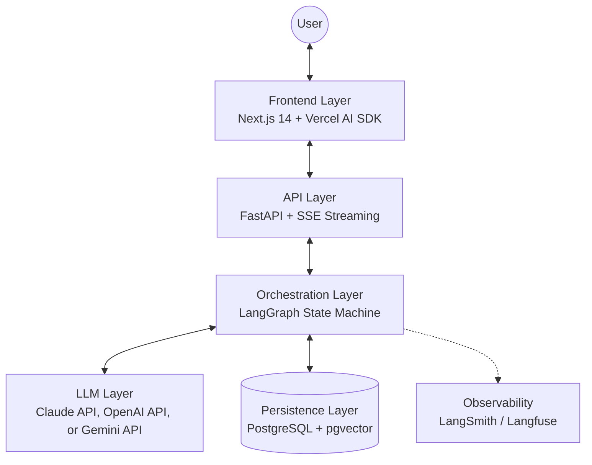

# SOLVER

**Structured Reasoning Workflow Engine**

> *A deterministic supervisor for stochastic agents.*

SOLVER is an orchestration layer for agentic work. It executes a structured, human-in-the-loop reasoning workflow that converts an **unstructured problem statement** into **versioned, traceable, verifiable artifacts**.

Unlike standard agent frameworks that optimize for speed and autonomy, SOLVER optimizes for **rigor, traceability, and human oversight**.

> **MVP Scope:** Steps 1–3 (Problem Definition → Requirements → Objectives) with two-pass execution, persistence, gates, audit, and streaming.

---

## Why SOLVER Exists

Most agent frameworks optimize for tool-calling and autonomy. SOLVER optimizes for **reliable knowledge production**:

| Other Frameworks | SOLVER |
|------------------|--------|
| Method and content interleaved | **Separate method from content** (two-pass execution) |
| Agent self-validates | **Human approval gates** before advancing |
| State in conversation | **Persistent artifacts** (stateless LLM; durable DB) |
| Freeform outputs | **Schema-conformant** and audit-friendly |
| Implicit reasoning | **Full traceability** across steps and revisions |

### The Trust Problem

LLMs can generate convincing text claiming "I've verified this" or "This is ready for the next step." SOLVER creates a **Trust Boundary**:

| LLM Can Influence | LLM Cannot Influence |
|-------------------|----------------------|
| Artifact content | State transitions |
| Reasoning text | Gate approvals |
| Clarification questions | Step advancement |
| Revision attempts | Workflow completion |

Even if the LLM outputs "I approve this," the system ignores it. Only external API calls from authenticated actors advance the workflow.

---

## Core Concepts

### Instance Hierarchy

| Instance | Name | Role |
|----------|------|------|
| **0** | Universal Methodology | Defines the 10-step process + schemas + "4 Documents" scaffold |
| **1** | SOLVER Software | Implements Instance 0 as executable runtime (this repo) |
| **N** | Domain Specialization | Adds domain schemas/templates without changing core |

### Two-Pass Execution Model

Every step executes in two passes:

**Pass 1 — Methodology Generation**

For each step, SOLVER generates four methodology documents and refines them through V1 → V2 → V3:

| Document | Purpose |
|----------|---------|
| **Data Sheet** | Input/output contracts, schemas, validation rules |
| **To Do List** | Task decomposition, checkpoints, validation hooks |
| **Guidance** | Context, principles, anti-patterns, quality criteria |
| **Detailed Procedure** | State machine, algorithms, decision logic, gates |

**Pass 2 — Supervised Execution**

SOLVER applies the step's V3 methodology to produce the deliverable artifact, then **interrupts** for human review:

| Action | Effect |
|--------|--------|
| **Approve** | Advance to next step |
| **Revise** | Re-run step with feedback |
| **Message** | Record commentary without changing state |

### Ten-Step Workflow

Currently only Steps 1 - 3 are implemented in the SOLVER engine, which is sufficient to define the objectives and start the BUILD PHASE.  Additional steps will be built post-MVP.

```
╔═══════════════════════════════════════════════════════════════════╗
║  DEFINITION PHASE — "What are we solving?"                        ║
╠═══════════════════════════════════════════════════════════════════╣
║  Step 1: Problem Definition    → Scope, constraints, success      ║
║  Step 2: Requirements          → What the solution must do        ║
║  Step 3: Objectives            → What success looks like          ║
╠═══════════════════════════════════════════════════════════════════╣
║  BUILD PHASE — "Build internally and verify"                              ║
╠═══════════════════════════════════════════════════════════════════╣
║  VERIFICATION PHASE — "How will we know it works?"                ║
╠═══════════════════════════════════════════════════════════════════╣
║  Step 4: Verification Design   → Correctness checks               ║
║  Step 5: Validation Design     → Fitness checks                   ║
║  Step 6: Evaluation Criteria   → Success metrics                  ║
║  Step 7: Assessment Protocol   → Measurement process              ║
╠═══════════════════════════════════════════════════════════════════╣
║  EXECUTION PHASE — "Implement for end users and learn"                              ║
╠═══════════════════════════════════════════════════════════════════╣
║  Step 8: Implementation        → Build the solution               ║
║  Step 9: Reflection            → Assess results                   ║
║  Step 10: Resolution           → Conclude with findings           ║
╚═══════════════════════════════════════════════════════════════════╝
```

---

## MVP Scope (Steps 1–3)

### Step 1 Output: `ProblemDefinitionPackage`
Canonical problem statement, stakeholders, constraints (hard/soft), scope (in/out), success criteria, assumptions, and handoff to requirements.

### Step 2 Output: `RequirementsPackage`
Functional (FR), non-functional (NFR), constraint (CR), and interface (IR) requirements with traceability to Step 1, coverage analysis, and verification methods.

### Step 3 Output: `ObjectivesPackage`
Capability (CAP), quality (QUAL), compliance (COMP), and interface (INTF) objectives with success criteria, key results, trace map to requirements, and success framework (minimum viable / target / aspirational).

---

## Reasoning Visibility

SOLVER does **not** depend on hidden model internals. "Visibility" means:

- Outputs are stored and reviewable
- Governing methodology is linked to each artifact
- Trace links connect artifacts across steps
- Verification hooks and evidence pointers are explicit
- Approvals/revisions are recorded in audit logs

The system is designed for **stateless LLM interaction**; reasoning is made auditable through persistent, reviewable artifacts rather than model introspection.

---

## Architecture



| Layer | Technology | Role |
|-------|------------|------|
| Frontend | Next.js 14+, Vercel AI SDK, assistant-ui | User interface, SSE client |
| API | FastAPI, Python 3.11+ | REST endpoints, SSE streaming |
| Orchestration | LangGraph 1.0+ | State machine, interrupts, checkpointing |
| Persistence | PostgreSQL + pgvector | Artifacts, audit logs, embeddings |
| LLM | Claude API, OpenAI API, or Gemini API | Agent reasoning and generation |
| Observability | LangSmith / Langfuse | Tracing, debugging, cost tracking |

---

## Project Structure

```
solver-engine/
├── docs/
│   └── spec/
│       ├── 0_Document-Type-Specifications-v2.1.1.md  # Governance framework
│       ├── 1_SOLVER-README-v1.0.md                   # Project orientation
│       ├── 2_SOLVER-Design-Intent-v1.1.md          # Why² — Design rationale
│       ├── 3_SOLVER-Architectural-Contract-v3.4.md # Why — Invariants
│       ├── 4_SOLVER-Technical-Spec-V2.8.0.md       # What — Schemas, endpoints
│       ├── 5_SOLVER-Development-Directive-v1.5.md  # How — Phases, gates
│       └── 6_SOLVER-Change-Management-v2.0.md      # Process — Change control
├── apps/
│   ├── api/                    # FastAPI backend
│   │   ├── domain/             # Pure domain models
│   │   ├── application/        # Use cases / services
│   │   ├── infrastructure/     # DB, LLM adapters
│   │   ├── tests/              # API tests (pytest)
│   │   └── routes/             # REST routes
│   └── web/                    # Next.js frontend (future)
├── packages/
│   ├── contracts/              # Shared schemas
│   └── instance_packs/
│       └── instance_0/         # Seed methodology pack
├── infra/
│   ├── docker/
│   │   └── docker-compose.yml
│   └── db/
│       └── migrations/
├── tests/
│   ├── unit/
│   ├── integration/
│   └── e2e/
└── tools/                      # Validation scripts
```

---

Checkpoint persistence uses a custom saver aligned to the current schema; see `docs/spec/DECISIONS.md` (Decision #5).

## API Overview

All endpoints under `/api/v1`.

### REST Endpoints

Endpoints listed here `docs/spec/4_SOLVER-Technical-Spec-V2.8.0.md`.

### SSE Stream

`GET /workflows/{id}/stream?from_sequence=N` — Structured events during execution:

Events are persisted to the database with monotonic sequence numbers. The `from_sequence` parameter enables reliable reconnection by replaying only events with `sequence > N`. Late-connecting clients receive the full event history.

---

## Acceptance Gates

MVP is complete when all gates pass.

Approved deviations from gate scenarios (if any) are recorded in `docs/spec/DECISIONS.md`.

---

## Quick Start

### Prerequisites

- Docker & Docker Compose
- Python 3.11+
- Anthropic API key, OpenAI API key, or Google GenAI API key

### Setup

```bash
# Clone and configure
git clone <repo-url> && cd solver-engine
cp apps/api/.env.example apps/api/.env
# Add ANTHROPIC_API_KEY, OPENAI_API_KEY, or GOOGLE_API_KEY to apps/api/.env

# Start database
docker compose -f infra/docker/docker-compose.yml up -d

# Run migrations
make migrate

# Verify database
docker exec solver-db psql -U solver -d solver -c "\dt"
# → 10 tables (9 schema + alembic_version)

# Start API server
make dev-api
# → API available at http://localhost:8000
```

---

## Development

Authority order and change-control are defined in:
- `docs/spec/0_Document-Type-Specifications-v2.1.1.md`


### With AI Coding Agent

The [Development Directive](docs/spec/5_SOLVER-Development-Directive-v1.5.md) provides complete instructions:

"Read docs/spec/5_SOLVER-Development-Directive-v1.5.md in full.
This is your authoritative operating manual."

Work proceeds in packages comprised of deliverables.

### Manual Development

```bash
cd apps/api
pip install -e ".[dev]"
make test    # Run tests
make lint    # Run linting
make dev     # Start dev server
```

### Verification

```bash
make test              # Unit tests
make e2e               # End-to-end gate checks (starts local SSE server; requires database running)
make test-gates        # Gate enforcement tests
make test-recovery     # Restart/resume tests
python tools/validate_schemas.py   # Schema validation
```

---

## Documentation

| Document | Purpose |
|----------|---------|
| [CLAUDE.md](CLAUDE.md) | Claude Code development guide |
| [AGENTS.md](AGENTS.md) | Repo-level instructions for AI coding agents |
| [Document-Type Specifications](docs/spec/0_Document-Type-Specifications-v2.1.1.md) | Documentation governance model |
| [SOLVER README](docs/spec/1_SOLVER-README-v1.0.md) | Conceptual navigation |
| [Design Intent](docs/spec/2_SOLVER-Design-Intent-v1.1.md) | Why² — Design rationale |
| [Architectural Contract](docs/spec/3_SOLVER-Architectural-Contract-v3.4.md) | Why — Invariants, constraints |
| [Technical Spec](docs/spec/4_SOLVER-Technical-Spec-V2.8.0.md) | What — Schemas, endpoints |
| [Development Directive](docs/spec/5_SOLVER-Development-Directive-v1.5.md) | How — Phases, packages, gates |
| [Change Management](docs/spec/6_SOLVER-Change-Management-v2.0.md) | Governance — change control |

---

## Status

**MVP Focus:** Steps 1–3 with two-pass workflow, persistence, gates, streaming, and auditability

Deferred items are tracked in `docs/spec/DECISIONS.md`.

---

## License

TBD

---

*SOLVER: Because some problems are too important for "trust me, I'm an AI."*
