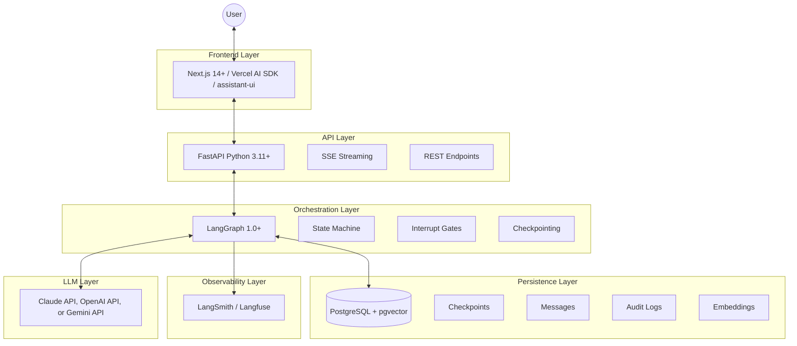
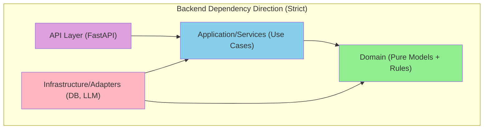
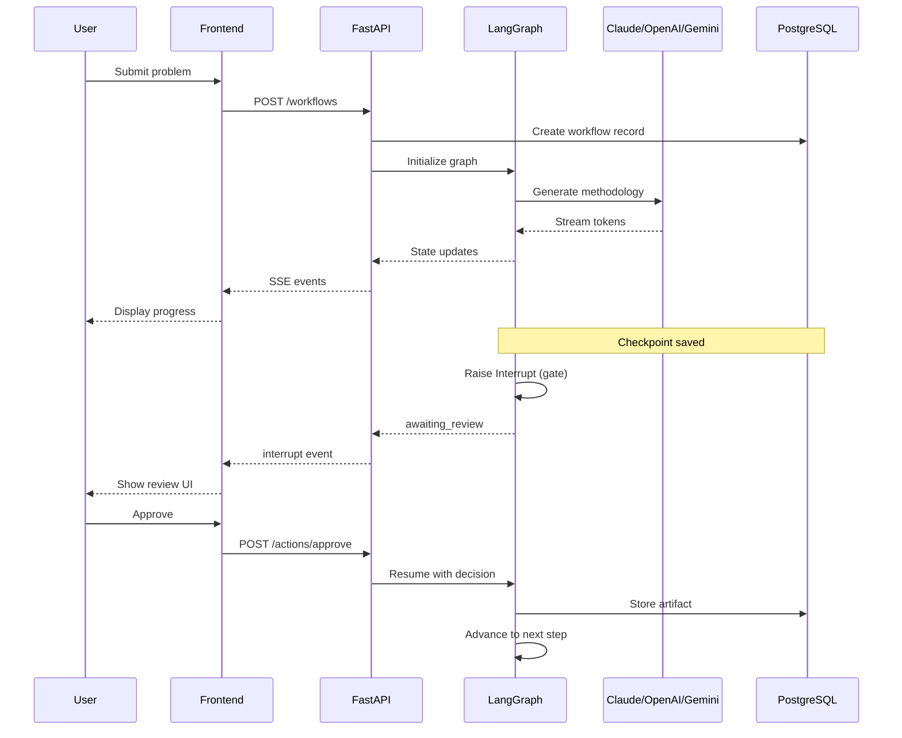
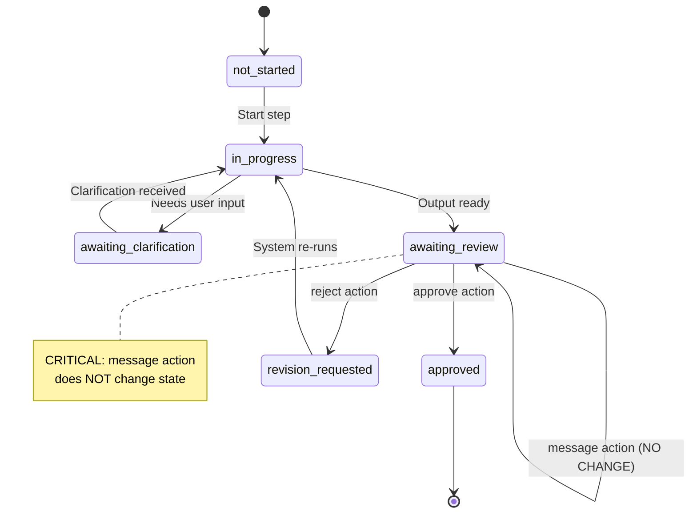
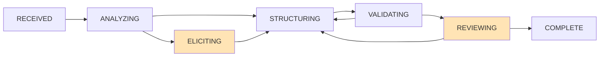
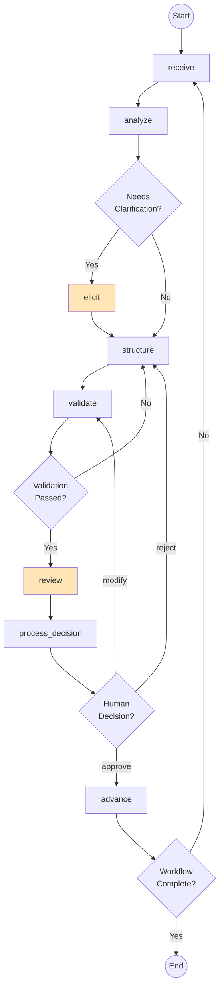

# SOLVER Technical Specification V2.2
## Consolidated Implementation Guide (Steps 1-3 MVP)

**Purpose:** Implementation-ready specification for building SOLVER, merging contract definitions with executable code.

**Target Audience:** AI coding agents and developers implementing the system.

---

## 0. Why V2.2 (Changes from V2.1)

V2.2 adds four improvements for implementation clarity:

1. **Executive Summary** — Problem/Solution/Stakeholders orientation
2. **Mermaid Diagrams** — Renderable architecture and state machine diagrams
3. **Test Scenario Format** — Acceptance gates as executable test sequences
4. **Execution Roadmap** — 4-phase build order for the coding agent

All technical specifications from V2.1 are preserved.

---

## 0.5 Executive Summary

### The Problem

The **Structured Reasoning Workflow** (Instance 0) defines a rigorous 10-step, 2-pass methodology for high-stakes problem solving. It specifies:

- Methodology generation before execution (Pass 1 → Pass 2)
- Mandatory human approval gates at every Pass 2 step
- Full traceability from problem → requirements → objectives
- V1 → V2 → V3 document iteration for methodology refinement

However, this methodology currently exists only as **abstract specification**. There is no executable software artifact that:

- Enforces the strict state transitions
- Manages the V1 → V3 document iteration
- Physically imposes the mandatory human approval gates
- Persists state for recovery and audit

### The Solution

**SOLVER** is the concrete software implementation of Instance 0. It is a **Reasoning Engine** that:

- Orchestrates an LLM (Claude, OpenAI, or Gemini) through the 10-step workflow
- Enforces that no step advances without explicit human validation
- Persists all state, artifacts, and decisions for full auditability
- Provides real-time streaming UI for human oversight

### Core Stakeholders

| Stakeholder | Role | Primary Concern |
|-------------|------|-----------------|
| **Operator (Human)** | Provides problem, makes Go/No-Go decisions | Control and oversight |
| **Agent (LLM)** | Executes reasoning, generates artifacts | Clear methodology and context |
| **Architect (SOLVER)** | Enforces Instance 0 constraints | Correctness and recoverability |

### Success Definition

SOLVER is successful when:

1. A human can start a workflow with a problem statement
2. The system generates Pass 1 methodology (V1 → V2 → V3)
3. The system generates Pass 2 artifacts with mandatory human gates
4. The human can approve, reject, or request revision at each gate
5. All state survives system restart
6. Full audit trail is reconstructable

---

## 1. MVP Scope (Steps 1-3 Only)

### 1.1 In Scope

| Component | Description |
|-----------|-------------|
| Step 1 | Problem Definition — complete implementation |
| Step 2 | Requirements — complete implementation |
| Step 3 | Objectives — complete implementation |
| Pass 1 | Methodology generation (V1→V2→V3, 4 docs per step) |
| Pass 2 | Artifact production with human approval gates |
| Persistence | Full state recovery, audit trail, traceability |
| API | REST + SSE for interactive review flow |

### 1.2 Out of Scope (This Version)

| Component | Status |
|-----------|--------|
| Steps 4-10 | Scaffolded as stubs, not implemented |
| External actions | No autonomous real-world actions |
| Auth/SSO/billing | Deferred (identity hooks exist) |
| Multi-tenant | Deferred |
| Model training | Not applicable |

### 1.3 Acceptance Gates (MVP Exit Criteria)

| Gate | Criterion |
|------|-----------|
| **A** | Step 1-3 Pass 1 methodology exists (V1/V2/V3, all 4 docs per step) |
| **B** | Step 1-3 Pass 2 produces stored packages with correct schema keys and trace links |
| **C** | Pass 2 cannot advance without `approve`; `revise` loops work; `message` doesn't bypass gating |
| **D** | Restart + resume works mid-step and at `awaiting_review` with no lost artifacts |
| **E** | REST endpoints + SSE streaming support the full interactive review flow |
| **F** | Audit log reconstructs the full run timeline; artifacts are versioned deterministically |

---

## 2. Architecture Overview

### 2.1 Technology Stack (Committed)



### 2.2 Clean Architecture Layers



**Rule:** Domain models never import from infrastructure. Infrastructure adapts to domain interfaces.

### 2.3 Request Flow



---

## 3. Instance Model (0 / 1 / N)

### 3.1 Instance Definitions

| Instance | Name | Role | Created |
|----------|------|------|---------|
| 0 | Universal Method | Defines schemas, contracts, gates, validation rules, 4-doc methodology | Once |
| 1 | SOLVER Software | Implements Instance 0 as executable system | Once |
| N (N≥2) | Domain Specialization | Extends Instance 0 with domain schemas/templates/checks | Per domain |

### 3.2 Instance Pack Mechanism

An **InstancePack** is a versioned bundle containing:

```yaml
InstancePack:
  manifest:
    name: string                    # e.g., "healthcare-clinical-trials"
    version: string                 # Semantic version
    core_schema_version: string     # Compatible SOLVER version
    parent_instance: 0 | 1
    
  schemas:
    step_1_extensions: JSONSchema   # Additional fields for Problem Definition
    step_2_extensions: JSONSchema   # Additional requirement categories
    step_3_extensions: JSONSchema   # Additional objective categories
    
  templates:
    methodology_seeds: map          # Pre-built document templates
    checklists: map                 # Domain-specific checklists
    
  validators:
    custom_rules: list              # Domain-specific validation rules
    
  ui_hints:                         # Optional
    step_labels: map
    field_descriptions: map
```

**Compatibility Rule:** Extensions may add optional fields, never remove or rename core fields.

### 3.3 Instance 0 Seed Pack

Instance 0 methodology ships with SOLVER:

```
packages/instance_packs/instance_0/
├── manifest.yaml
├── schemas/
│   ├── problem_definition_package.json
│   ├── requirements_package.json
│   └── objectives_package.json
├── templates/
│   ├── data_sheet_template.md
│   ├── todo_list_template.md
│   ├── guidance_template.md
│   └── detailed_procedure_template.md
└── validators/
    └── core_validation_rules.yaml
```

---

## 4. Workflow Model

### 4.1 Pass Types

| Pass | Name | Mode | Output | Gate |
|------|------|------|--------|------|
| `definition` | Pass 1 | Configurable | Methodology V1→V2→V3 | Policy-based |
| `execution` | Pass 2 | Supervised | Artifact package | Human required |

### 4.2 Step Numbers (MVP)

| Step | Name | Pass 2 Artifact | Status |
|------|------|-----------------|--------|
| 1 | Problem Definition | `ProblemDefinitionPackage` | Implemented |
| 2 | Requirements | `RequirementsPackage` | Implemented |
| 3 | Objectives | `ObjectivesPackage` | Implemented |
| 4-10 | (Reserved) | — | Scaffolded only |

### 4.3 Methodology Documents (Pass 1)

Each step produces 4 documents, each iterated V1→V2→V3:

| Document | Purpose |
|----------|---------|
| DataSheet | Input/output contracts, schemas, validation rules |
| ToDoList | Phased tasks, checkpoints, validation hooks |
| Guidance | Context, principles, anti-patterns, quality criteria |
| DetailedProcedure | State machine, algorithms, decision logic, gates |

### 4.4 Gate Policies

```yaml
GatePolicies:
  pass_2_gates: always_required    # HARD REQUIREMENT: Cannot advance without approval
  
  pass_1_gate_policy:
    type: enum
    values: [none, per_step, end_of_pass]
    default: per_step              # Recommended for interactive mode
    
  policy_behaviors:
    none: "Fully autonomous, no gates"
    per_step: "Human approval after each step's V3"
    end_of_pass: "Human approval only after Step 10 Pass 1"
```

---

## 5. Artifact Schemas (Step 1-3 Packages)

### 5.1 Step 1: ProblemDefinitionPackage

```yaml
ProblemDefinitionPackage:
  # Metadata
  package_id: string              # UUID
  workflow_id: string
  instance_id: string
  step_number: 1
  version: integer                # Revision number
  created_at: datetime
  
  # Core content
  title: string
  
  canonical_problem_definition:
    statement: string
    interpretation_notes: [string]
    
  background: [string]
  
  stakeholders:
    - id: string                  # SH-001, SH-002, ...
      name_or_group: string
      role: string
      needs: [string]
      concerns: [string]
      impact: string
      
  constraints:
    hard:
      - id: string                # HC-001, HC-002, ...
        statement: string
        rationale: string
    soft:
      - id: string                # SC-001, SC-002, ...
        statement: string
        rationale: string
        
  scope:
    in:
      - id: string                # IN-001, IN-002, ...
        item: string
    out:
      - id: string                # OUT-001, OUT-002, ...
        item: string
        rationale: string
        
  success_criteria:
    - id: string                  # CRT-001, CRT-002, ...
      metric_or_signal: string
      target: string
      how_verified: string
      
  assumptions:
    - id: string                  # ASM-001, ASM-002, ...
      statement: string
      rationale: string
      risk_if_wrong: string
      
  open_questions:
    required_to_proceed:
      - id: string                # OQ-001, OQ-002, ...
        question: string
    nice_to_have: [string]
    
  integration_points:
    - id: string                  # IP-001, IP-002, ...
      description: string
      components: [string]
      
  # Instance 1 software-specific extension
  software_extension:
    baseline_commitments: [string]
    system_actors: [string]
    execution_semantics: [string]
    state_model_notes: [string]
    interfaces: [string]
    persistence_observability: [string]
    
  # Handoff to Step 2
  step2_handoff:
    requirement_themes: [string]
    nfr_watchouts: [string]
    dependencies_to_capture: [string]
```

### 5.2 Step 2: RequirementsPackage

```yaml
RequirementsPackage:
  # Metadata
  package_id: string
  workflow_id: string
  instance_id: string
  step_number: 2
  version: integer
  created_at: datetime
  
  # Overview
  overview:
    summary: string
    boundaries: [string]
    total_requirements: integer
    priority_distribution:
      must: integer
      should: integer
      could: integer
      
  # Requirements
  requirements:
    - id: string                  # FR-001, NFR-001, CR-001, IR-001
      category: FR | NFR | CR | IR
      priority: must | should | could
      statement: string
      rationale: string
      
      source:
        type: stakeholder | constraint | scope | success_criterion | assumption | integration_point
        id: string                # Reference to Step 1 element
        aspect: string            # need, concern, item, etc.
        
      component: [string]         # Affected technology components
      
      testability:
        method: demonstration | test | inspection | analysis
        description: string
        
      trace:
        stakeholders: [string]    # SH-xxx IDs
        constraints: [string]     # HC-xxx, SC-xxx IDs
        scope_in: [string]        # IN-xxx IDs
        success_criteria: [string] # CRT-xxx IDs
        integration_points: [string] # IP-xxx IDs
        
  # Coverage map (Step 1 → Step 2 traceability)
  coverage_map:
    - source_type: string         # stakeholder, constraint, scope, etc.
      source_id: string
      requirement_ids: [string]
      coverage_note: string
      
  # Conflicts and tradeoffs
  conflicts_tradeoffs:
    - conflict: string
      impacted_requirement_ids: [string]
      proposed_resolution: string
      
  # Open questions
  open_questions:
    required_to_finalize: [string]
    deferred: [string]
    
  # Handoff to Step 3
  step3_handoff:
    objective_mapping_rules: [string]
    objective_seeds:
      primary_from_must: [string]
      secondary_from_should: [string]
      tertiary_from_could: [string]
```

### 5.3 Step 3: ObjectivesPackage

```yaml
ObjectivesPackage:
  # Metadata
  package_id: string
  workflow_id: string
  instance_id: string
  step_number: 3
  version: integer
  created_at: datetime
  
  # Overview
  overview:
    intent: string
    measurement_principles: [string]
    boundaries: [string]
    total_objectives: integer
    consolidation_ratio: float    # requirements / objectives
    
  # Objectives
  objectives:
    - id: string                  # CAP-001, QUAL-001, COMP-001, INTF-001
      category: CAP | QUAL | COMP | INTF
      tier: primary | secondary | tertiary
      statement: string           # "X is achieved"
      rationale: string
      owner_type: process | user | system
      
      linked_requirements: [string]  # FR-xxx, NFR-xxx, etc.
      consolidated: boolean
      
      success_criteria:
        definition: string
        verification:
          method: demonstration | test | inspection | analysis
          description: string
          evidence_artifacts: [string]
        metric: string | null
        threshold: string | null
        
      component: [string]
      acceptance_criteria: [string]  # CRT-xxx links
      
  # Success framework
  success_framework:
    minimum_viable:
      description: "Must achieve for system to be viable"
      objectives: [string]        # Primary objective IDs
      requirement_coverage: [string]
      
    target:
      description: "Expected full success state"
      objectives: [string]        # Primary + secondary IDs
      requirement_coverage: [string]
      
    aspirational:
      description: "Exceeds expectations"
      objectives: [string]        # All objective IDs
      requirement_coverage: [string]
      
  # Trace map (Step 2 → Step 3 traceability)
  trace_map:
    - objective_id: string
      requirement_ids: [string]
      consolidated: boolean
      
  # Backward traceability (requirement → objective)
  backward_trace:
    - requirement_id: string
      objective_id: string
      
  # Risks and tradeoffs
  risks_tradeoffs:
    - risk: string
      related_objectives: [string]
      related_requirements: [string]
      monitoring_signal: string
      mitigation_hint: string
      
  # Open questions
  open_questions:
    required_to_finalize: [string]
    deferred: [string]
    
  # Handoff to Step 4
  step4_handoff:
    sequencing_notes: [string]
    acceptance_gates: [string]
    dependencies_to_plan: [string]
```

---

## 6. State Machine

### 6.1 Step Status (Coarse-Grained, External)

```python
class StepStatus(str, Enum):
    NOT_STARTED = "not_started"
    IN_PROGRESS = "in_progress"
    AWAITING_CLARIFICATION = "awaiting_clarification"
    AWAITING_REVIEW = "awaiting_review"
    APPROVED = "approved"
    REVISION_REQUESTED = "revision_requested"
```

### 6.2 Step Phase (Fine-Grained, Internal)

```python
class StepPhase(str, Enum):
    RECEIVED = "received"
    ANALYZING = "analyzing"
    ELICITING = "eliciting"
    STRUCTURING = "structuring"
    VALIDATING = "validating"
    REVIEWING = "reviewing"
    COMPLETE = "complete"
```

### 6.3 Status Transitions



### 6.4 Phase Flow



### 6.5 Critical Rule: Message Does Not Unpause

**HARD REQUIREMENT:** If status is `awaiting_review`, a `message` action:
- Records the message in conversation history
- Does NOT change the status
- Does NOT resume graph execution
- Human must explicitly `approve`, `reject`, or `modify` to change state

### 6.6 Phase-to-Status Mapping

| Phase | Status |
|-------|--------|
| `received` | `in_progress` |
| `analyzing` | `in_progress` |
| `eliciting` | `awaiting_clarification` |
| `structuring` | `in_progress` |
| `validating` | `in_progress` |
| `reviewing` | `awaiting_review` |
| `complete` | `approved` |

---

## 7. Database Schema (PostgreSQL)

### 7.1 Extensions

```sql
CREATE EXTENSION IF NOT EXISTS "uuid-ossp";
CREATE EXTENSION IF NOT EXISTS "pgcrypto";
CREATE EXTENSION IF NOT EXISTS "vector";
```

### 7.2 Enums

```sql
CREATE TYPE pass_type AS ENUM ('definition', 'execution');

CREATE TYPE step_name AS ENUM (
    'problem_definition',
    'requirements',
    'objectives',
    'verification_design',
    'validation_design',
    'evaluation_criteria',
    'assessment_protocol',
    'implementation',
    'reflection',
    'resolution'
);

CREATE TYPE step_status AS ENUM (
    'not_started',
    'in_progress',
    'awaiting_clarification',
    'awaiting_review',
    'approved',
    'revision_requested'
);

CREATE TYPE step_phase AS ENUM (
    'received',
    'analyzing',
    'eliciting',
    'structuring',
    'validating',
    'reviewing',
    'complete'
);

CREATE TYPE workflow_status AS ENUM ('active', 'paused', 'completed', 'abandoned');

CREATE TYPE instance_type AS ENUM ('universal', 'implementation', 'domain');

CREATE TYPE gate_policy AS ENUM ('none', 'per_step', 'end_of_pass');

CREATE TYPE document_type AS ENUM ('data_sheet', 'todo_list', 'guidance', 'detailed_procedure');

CREATE TYPE document_version AS ENUM ('v1', 'v2', 'v3');

CREATE TYPE message_role AS ENUM ('user', 'assistant', 'system');

CREATE TYPE human_action AS ENUM ('approve', 'reject', 'modify', 'message');

CREATE TYPE requirement_category AS ENUM ('FR', 'NFR', 'CR', 'IR');

CREATE TYPE objective_category AS ENUM ('CAP', 'QUAL', 'COMP', 'INTF');
```

### 7.3 Core Tables

```sql
-- ============================================================================
-- INSTANCES: Instance 0/1/N hierarchy
-- ============================================================================
CREATE TABLE instances (
    id                  UUID PRIMARY KEY DEFAULT uuid_generate_v4(),
    instance_number     INTEGER NOT NULL UNIQUE,
    instance_type       instance_type NOT NULL,
    parent_instance_id  UUID REFERENCES instances(id),
    name                VARCHAR(255) NOT NULL,
    description         TEXT,
    pass_1_gate_policy  gate_policy NOT NULL DEFAULT 'per_step',
    pack_manifest       JSONB,                    -- InstancePack manifest
    created_at          TIMESTAMPTZ NOT NULL DEFAULT NOW(),
    
    CONSTRAINT valid_instance_hierarchy CHECK (
        (instance_number = 0 AND instance_type = 'universal' AND parent_instance_id IS NULL) OR
        (instance_number = 1 AND instance_type = 'implementation') OR
        (instance_number >= 2 AND instance_type = 'domain')
    )
);

-- Seed Instance 0
INSERT INTO instances (instance_number, instance_type, name, description)
VALUES (0, 'universal', 'Universal Methodology', 'Domain-agnostic structured reasoning protocol');

-- ============================================================================
-- WORKFLOWS: Master workflow record
-- ============================================================================
CREATE TABLE workflows (
    id                  UUID PRIMARY KEY DEFAULT uuid_generate_v4(),
    workflow_id         VARCHAR(255) UNIQUE NOT NULL,
    thread_id           VARCHAR(255) UNIQUE NOT NULL,
    instance_id         UUID NOT NULL REFERENCES instances(id),
    
    original_problem    TEXT NOT NULL,
    domain              VARCHAR(255),
    
    current_pass        pass_type NOT NULL DEFAULT 'definition',
    current_step        step_name NOT NULL DEFAULT 'problem_definition',
    current_step_number INTEGER NOT NULL DEFAULT 1,
    status              workflow_status NOT NULL DEFAULT 'active',
    
    pass_1_gate_policy  gate_policy NOT NULL DEFAULT 'per_step',
    
    created_by          VARCHAR(255) NOT NULL,
    last_actor_id       VARCHAR(255) NOT NULL,
    created_at          TIMESTAMPTZ NOT NULL DEFAULT NOW(),
    updated_at          TIMESTAMPTZ NOT NULL DEFAULT NOW(),
    completed_at        TIMESTAMPTZ
);

CREATE INDEX idx_workflows_thread ON workflows(thread_id);
CREATE INDEX idx_workflows_instance ON workflows(instance_id);
CREATE INDEX idx_workflows_status ON workflows(status);

-- ============================================================================
-- STEP_EXECUTIONS: Per-step state
-- ============================================================================
CREATE TABLE step_executions (
    id                  UUID PRIMARY KEY DEFAULT uuid_generate_v4(),
    workflow_id         UUID NOT NULL REFERENCES workflows(id) ON DELETE CASCADE,
    
    pass_type           pass_type NOT NULL,
    step_name           step_name NOT NULL,
    step_number         INTEGER NOT NULL,
    
    status              step_status NOT NULL DEFAULT 'not_started',
    phase               step_phase NOT NULL DEFAULT 'received',
    
    latest_artifact_id  UUID,                     -- References artifacts.id
    human_feedback      TEXT,
    clarification_request JSONB,
    
    validation_status   VARCHAR(20),
    validation_errors   JSONB DEFAULT '[]',
    validation_warnings JSONB DEFAULT '[]',
    
    started_at          TIMESTAMPTZ,
    completed_at        TIMESTAMPTZ,
    
    turn_count          INTEGER NOT NULL DEFAULT 0,
    total_tokens        INTEGER NOT NULL DEFAULT 0,
    
    UNIQUE(workflow_id, pass_type, step_name)
);

CREATE INDEX idx_steps_workflow ON step_executions(workflow_id);
CREATE INDEX idx_steps_status ON step_executions(status);

-- ============================================================================
-- ARTIFACTS: Pass 1 methodology + Pass 2 packages
-- ============================================================================
CREATE TABLE artifacts (
    id                  UUID PRIMARY KEY DEFAULT uuid_generate_v4(),
    workflow_id         UUID NOT NULL REFERENCES workflows(id) ON DELETE CASCADE,
    
    pass_type           pass_type NOT NULL,
    step_name           step_name NOT NULL,
    step_number         INTEGER NOT NULL,
    
    artifact_type       VARCHAR(50) NOT NULL,     -- 'methodology_doc' or 'step_package'
    
    -- For methodology docs
    document_type       document_type,
    document_version    document_version,
    content_markdown    TEXT,
    
    -- For step packages
    package_type        VARCHAR(50),              -- 'ProblemDefinitionPackage', etc.
    content_jsonb       JSONB,
    revision            INTEGER NOT NULL DEFAULT 1,
    
    -- Schema validation
    schema_version      VARCHAR(20),
    validation_status   VARCHAR(20),
    
    created_at          TIMESTAMPTZ NOT NULL DEFAULT NOW(),
    
    CONSTRAINT valid_artifact_type CHECK (
        (artifact_type = 'methodology_doc' AND document_type IS NOT NULL AND document_version IS NOT NULL) OR
        (artifact_type = 'step_package' AND package_type IS NOT NULL AND content_jsonb IS NOT NULL)
    )
);

CREATE INDEX idx_artifacts_workflow ON artifacts(workflow_id);
CREATE INDEX idx_artifacts_step ON artifacts(step_name);

-- ============================================================================
-- TRACEABILITY_LINKS: Forward/backward trace relationships
-- ============================================================================
CREATE TABLE traceability_links (
    id                  UUID PRIMARY KEY DEFAULT uuid_generate_v4(),
    workflow_id         UUID NOT NULL REFERENCES workflows(id) ON DELETE CASCADE,
    
    from_step           INTEGER NOT NULL,
    from_type           VARCHAR(50) NOT NULL,     -- 'stakeholder', 'requirement', etc.
    from_id             VARCHAR(20) NOT NULL,     -- SH-001, FR-001, etc.
    
    to_step             INTEGER NOT NULL,
    to_type             VARCHAR(50) NOT NULL,
    to_id               VARCHAR(20) NOT NULL,
    
    link_type           VARCHAR(50) NOT NULL,     -- 'derives', 'achieves', 'traces_to'
    consolidated        BOOLEAN NOT NULL DEFAULT FALSE,
    
    created_at          TIMESTAMPTZ NOT NULL DEFAULT NOW(),
    
    UNIQUE(workflow_id, from_id, to_id, link_type)
);

CREATE INDEX idx_trace_workflow ON traceability_links(workflow_id);
CREATE INDEX idx_trace_from ON traceability_links(from_id);
CREATE INDEX idx_trace_to ON traceability_links(to_id);

-- ============================================================================
-- MESSAGES: Conversation history
-- ============================================================================
CREATE TABLE messages (
    id                  UUID PRIMARY KEY DEFAULT uuid_generate_v4(),
    workflow_id         UUID NOT NULL REFERENCES workflows(id) ON DELETE CASCADE,
    step_execution_id   UUID NOT NULL REFERENCES step_executions(id) ON DELETE CASCADE,
    
    role                message_role NOT NULL,
    content             TEXT NOT NULL,
    metadata            JSONB NOT NULL DEFAULT '{}',
    
    input_tokens        INTEGER,
    output_tokens       INTEGER,
    
    created_at          TIMESTAMPTZ NOT NULL DEFAULT NOW(),
    embedding           vector(1536)
);

CREATE INDEX idx_messages_workflow ON messages(workflow_id);
CREATE INDEX idx_messages_step ON messages(step_execution_id);
CREATE INDEX idx_messages_embedding ON messages USING ivfflat (embedding vector_cosine_ops) WITH (lists = 100);

-- ============================================================================
-- AUDIT_LOG: Immutable event record
-- ============================================================================
CREATE TABLE audit_log (
    id                  UUID PRIMARY KEY DEFAULT uuid_generate_v4(),
    workflow_id         UUID NOT NULL REFERENCES workflows(id) ON DELETE CASCADE,
    
    event_type          VARCHAR(50) NOT NULL,
    actor_id            VARCHAR(255) NOT NULL,
    
    pass_type           pass_type,
    step_name           step_name,
    step_number         INTEGER,
    
    from_status         step_status,
    to_status           step_status,
    from_phase          step_phase,
    to_phase            step_phase,
    
    artifact_id         UUID,
    details             JSONB NOT NULL DEFAULT '{}',
    
    created_at          TIMESTAMPTZ NOT NULL DEFAULT NOW()
);

CREATE INDEX idx_audit_workflow ON audit_log(workflow_id);
CREATE INDEX idx_audit_event ON audit_log(event_type);
CREATE INDEX idx_audit_created ON audit_log(created_at);

-- ============================================================================
-- CHECKPOINTS: LangGraph state persistence
-- ============================================================================
CREATE TABLE checkpoints (
    thread_id           VARCHAR(255) NOT NULL,
    checkpoint_id       VARCHAR(255) NOT NULL,
    parent_checkpoint_id VARCHAR(255),
    checkpoint          JSONB NOT NULL,
    metadata            JSONB NOT NULL DEFAULT '{}',
    created_at          TIMESTAMPTZ NOT NULL DEFAULT NOW(),
    PRIMARY KEY (thread_id, checkpoint_id)
);

CREATE INDEX idx_checkpoints_thread ON checkpoints(thread_id);

CREATE TABLE checkpoint_writes (
    thread_id           VARCHAR(255) NOT NULL,
    checkpoint_id       VARCHAR(255) NOT NULL,
    task_id             VARCHAR(255) NOT NULL,
    idx                 INTEGER NOT NULL,
    channel             VARCHAR(255) NOT NULL,
    value               JSONB,
    PRIMARY KEY (thread_id, checkpoint_id, task_id, idx)
);
```

### 7.4 Audit Trigger

```sql
CREATE OR REPLACE FUNCTION record_step_audit()
RETURNS TRIGGER AS $$
BEGIN
    IF OLD.status IS DISTINCT FROM NEW.status OR OLD.phase IS DISTINCT FROM NEW.phase THEN
        INSERT INTO audit_log (
            workflow_id, event_type, actor_id,
            pass_type, step_name, step_number,
            from_status, to_status, from_phase, to_phase
        )
        SELECT 
            NEW.workflow_id, 'state_change',
            (SELECT last_actor_id FROM workflows WHERE id = NEW.workflow_id),
            NEW.pass_type, NEW.step_name, NEW.step_number,
            OLD.status, NEW.status, OLD.phase, NEW.phase;
    END IF;
    RETURN NEW;
END;
$$ LANGUAGE plpgsql;

CREATE TRIGGER step_audit_trigger
AFTER UPDATE ON step_executions
FOR EACH ROW EXECUTE FUNCTION record_step_audit();
```

---

## 8. LangGraph Implementation

### 8.1 State Models

```python
# backend/domain/state.py
"""Domain models - no external dependencies."""

from enum import Enum
from typing import Optional, Dict, List, Any
from dataclasses import dataclass, field
from datetime import datetime

class PassType(str, Enum):
    DEFINITION = "definition"
    EXECUTION = "execution"

class StepName(str, Enum):
    PROBLEM_DEFINITION = "problem_definition"
    REQUIREMENTS = "requirements"
    OBJECTIVES = "objectives"
    # Steps 4-10 scaffolded but not implemented
    VERIFICATION_DESIGN = "verification_design"
    VALIDATION_DESIGN = "validation_design"
    EVALUATION_CRITERIA = "evaluation_criteria"
    ASSESSMENT_PROTOCOL = "assessment_protocol"
    IMPLEMENTATION = "implementation"
    REFLECTION = "reflection"
    RESOLUTION = "resolution"

class StepStatus(str, Enum):
    NOT_STARTED = "not_started"
    IN_PROGRESS = "in_progress"
    AWAITING_CLARIFICATION = "awaiting_clarification"
    AWAITING_REVIEW = "awaiting_review"
    APPROVED = "approved"
    REVISION_REQUESTED = "revision_requested"

class StepPhase(str, Enum):
    RECEIVED = "received"
    ANALYZING = "analyzing"
    ELICITING = "eliciting"
    STRUCTURING = "structuring"
    VALIDATING = "validating"
    REVIEWING = "reviewing"
    COMPLETE = "complete"

class HumanAction(str, Enum):
    APPROVE = "approve"
    REJECT = "reject"
    MODIFY = "modify"
    MESSAGE = "message"

class GatePolicy(str, Enum):
    NONE = "none"
    PER_STEP = "per_step"
    END_OF_PASS = "end_of_pass"

STEP_NUMBERS = {
    StepName.PROBLEM_DEFINITION: 1,
    StepName.REQUIREMENTS: 2,
    StepName.OBJECTIVES: 3,
    StepName.VERIFICATION_DESIGN: 4,
    StepName.VALIDATION_DESIGN: 5,
    StepName.EVALUATION_CRITERIA: 6,
    StepName.ASSESSMENT_PROTOCOL: 7,
    StepName.IMPLEMENTATION: 8,
    StepName.REFLECTION: 9,
    StepName.RESOLUTION: 10,
}

@dataclass
class ClarificationQuestion:
    question: str
    context: str
    impact_if_unresolved: str

@dataclass
class ValidationResult:
    passed: bool
    errors: List[Dict[str, Any]] = field(default_factory=list)
    warnings: List[Dict[str, Any]] = field(default_factory=list)

@dataclass
class StepState:
    step_name: StepName
    step_number: int
    pass_type: PassType
    status: StepStatus = StepStatus.NOT_STARTED
    phase: StepPhase = StepPhase.RECEIVED
    
    output: Optional[Dict[str, Any]] = None
    human_feedback: Optional[str] = None
    clarification_request: Optional[List[ClarificationQuestion]] = None
    clarification_response: Optional[Dict[str, str]] = None
    validation_result: Optional[ValidationResult] = None
    
    started_at: Optional[datetime] = None
    completed_at: Optional[datetime] = None

@dataclass
class WorkflowState:
    """LangGraph state object."""
    workflow_id: str
    thread_id: str
    instance_id: str
    instance_number: int
    
    gate_policy: GatePolicy
    
    current_pass: PassType
    current_step: StepName
    
    original_problem: str
    domain: Optional[str] = None
    
    step_state: StepState = None
    
    methodology: Dict[str, Dict[str, Any]] = field(default_factory=dict)
    artifacts: Dict[str, Dict[str, Any]] = field(default_factory=dict)
    
    messages: List[Dict[str, Any]] = field(default_factory=list)
    
    human_decision: Optional[HumanAction] = None
    human_feedback: Optional[str] = None
    human_modifications: Optional[Dict[str, Any]] = None
    
    last_actor_id: str = "system"
    created_at: datetime = field(default_factory=datetime.utcnow)
    updated_at: datetime = field(default_factory=datetime.utcnow)
```

### 8.2 Graph Definition

```python
# backend/orchestration/graph.py
"""LangGraph workflow definition."""

from typing import Literal
from langgraph.graph import StateGraph, END
from langgraph.checkpoint.postgres import PostgresSaver
from langgraph.types import interrupt

from domain.state import (
    WorkflowState, StepPhase, StepStatus, PassType, StepName,
    HumanAction, GatePolicy, STEP_NUMBERS
)

def create_graph(checkpointer: PostgresSaver) -> StateGraph:
    """Create the SOLVER workflow graph."""
    
    graph = StateGraph(WorkflowState)
    
    # Add nodes
    graph.add_node("receive", receive_node)
    graph.add_node("analyze", analyze_node)
    graph.add_node("elicit", elicit_node)
    graph.add_node("structure", structure_node)
    graph.add_node("validate", validate_node)
    graph.add_node("review", review_node)
    graph.add_node("process_decision", process_decision_node)
    graph.add_node("advance", advance_node)
    
    # Entry point
    graph.set_entry_point("receive")
    
    # Edges
    graph.add_edge("receive", "analyze")
    
    graph.add_conditional_edges(
        "analyze",
        lambda s: "elicit" if s.step_state.phase == StepPhase.ELICITING else "structure",
        {"elicit": "elicit", "structure": "structure"}
    )
    
    graph.add_edge("elicit", "structure")
    graph.add_edge("structure", "validate")
    
    graph.add_conditional_edges(
        "validate",
        lambda s: "review" if s.step_state.validation_result.passed else "structure",
        {"review": "review", "structure": "structure"}
    )
    
    graph.add_edge("review", "process_decision")
    
    graph.add_conditional_edges(
        "process_decision",
        route_after_decision,
        {"advance": "advance", "structure": "structure", "validate": "validate", "end": END}
    )
    
    graph.add_conditional_edges(
        "advance",
        lambda s: "end" if is_workflow_complete(s) else "receive",
        {"end": END, "receive": "receive"}
    )
    
    return graph.compile(checkpointer=checkpointer)

def route_after_decision(state: WorkflowState) -> Literal["advance", "structure", "validate", "end"]:
    if state.human_decision == HumanAction.APPROVE:
        return "advance"
    elif state.human_decision == HumanAction.REJECT:
        return "structure"
    elif state.human_decision == HumanAction.MODIFY:
        return "validate"
    return "end"

def is_workflow_complete(state: WorkflowState) -> bool:
    # MVP: Complete after Step 3 Pass 2
    return (
        state.current_pass == PassType.EXECUTION and
        state.current_step == StepName.OBJECTIVES and
        state.step_state.status == StepStatus.APPROVED
    )
```

### 8.3 Graph Visualization



### 8.4 Node Implementations

```python
# backend/orchestration/nodes.py
"""LangGraph node implementations."""

from datetime import datetime
from langgraph.types import interrupt
from domain.state import (
    WorkflowState, StepPhase, StepStatus, PassType, StepName,
    HumanAction, GatePolicy, STEP_NUMBERS, StepState
)

async def receive_node(state: WorkflowState) -> WorkflowState:
    state.step_state.phase = StepPhase.RECEIVED
    state.step_state.status = StepStatus.IN_PROGRESS
    state.step_state.started_at = datetime.utcnow()
    return state

async def analyze_node(state: WorkflowState) -> WorkflowState:
    state.step_state.phase = StepPhase.ANALYZING
    
    # Check if clarification needed (implementation calls LLM)
    needs_clarification = await check_sufficiency(state)
    
    if needs_clarification:
        state.step_state.phase = StepPhase.ELICITING
        state.step_state.status = StepStatus.AWAITING_CLARIFICATION
    else:
        state.step_state.phase = StepPhase.STRUCTURING
    
    return state

async def elicit_node(state: WorkflowState) -> WorkflowState:
    """Raise interrupt for clarification."""
    interrupt({
        "gate_type": "clarification",
        "questions": [q.__dict__ for q in state.step_state.clarification_request],
        "step_name": state.current_step.value,
        "pass_type": state.current_pass.value
    })
    
    # Resumed after clarification received
    state.step_state.phase = StepPhase.STRUCTURING
    state.step_state.status = StepStatus.IN_PROGRESS
    return state

async def structure_node(state: WorkflowState) -> WorkflowState:
    state.step_state.phase = StepPhase.STRUCTURING
    
    # Generate output (implementation calls LLM with methodology)
    output = await generate_step_output(state)
    state.step_state.output = output
    
    state.step_state.phase = StepPhase.VALIDATING
    return state

async def validate_node(state: WorkflowState) -> WorkflowState:
    state.step_state.phase = StepPhase.VALIDATING
    
    result = await validate_output(state.current_step, state.step_state.output)
    state.step_state.validation_result = result
    
    if result.passed:
        state.step_state.phase = StepPhase.REVIEWING
        state.step_state.status = StepStatus.AWAITING_REVIEW
    else:
        state.step_state.phase = StepPhase.STRUCTURING
    
    return state

async def review_node(state: WorkflowState) -> WorkflowState:
    """Raise interrupt for human review."""
    
    # Check gate policy for Pass 1
    if state.current_pass == PassType.DEFINITION:
        if state.gate_policy == GatePolicy.NONE:
            state.human_decision = HumanAction.APPROVE
            return state
        elif state.gate_policy == GatePolicy.END_OF_PASS:
            if STEP_NUMBERS[state.current_step] < 10:
                state.human_decision = HumanAction.APPROVE
                return state
    
    # Pass 2 always requires human approval
    interrupt({
        "gate_type": "review",
        "output": state.step_state.output,
        "validation": state.step_state.validation_result.__dict__ if state.step_state.validation_result else None,
        "step_name": state.current_step.value,
        "pass_type": state.current_pass.value
    })
    
    return state

async def process_decision_node(state: WorkflowState) -> WorkflowState:
    if state.human_decision == HumanAction.APPROVE:
        state.step_state.status = StepStatus.APPROVED
        state.step_state.phase = StepPhase.COMPLETE
        state.step_state.completed_at = datetime.utcnow()
        
    elif state.human_decision == HumanAction.REJECT:
        state.step_state.status = StepStatus.REVISION_REQUESTED
        state.step_state.human_feedback = state.human_feedback
        state.step_state.phase = StepPhase.STRUCTURING
        
    elif state.human_decision == HumanAction.MODIFY:
        if state.human_modifications:
            state.step_state.output.update(state.human_modifications)
        state.step_state.phase = StepPhase.VALIDATING
    
    # Clear for next iteration
    state.human_decision = None
    state.human_feedback = None
    state.human_modifications = None
    
    return state

async def advance_node(state: WorkflowState) -> WorkflowState:
    """Advance to next step."""
    # Store artifact
    step_key = state.current_step.value
    if state.current_pass == PassType.DEFINITION:
        state.methodology[step_key] = state.step_state.output
    else:
        state.artifacts[step_key] = state.step_state.output
    
    # Determine next position
    current_num = STEP_NUMBERS[state.current_step]
    
    # MVP: Only Steps 1-3
    if current_num < 3:
        next_step = [k for k, v in STEP_NUMBERS.items() if v == current_num + 1][0]
        state.current_step = next_step
    elif state.current_pass == PassType.DEFINITION:
        # End of Pass 1 Step 3 -> Pass 2 Step 1
        state.current_pass = PassType.EXECUTION
        state.current_step = StepName.PROBLEM_DEFINITION
    # else: workflow complete (handled by conditional edge)
    
    # Reset step state
    state.step_state = StepState(
        step_name=state.current_step,
        step_number=STEP_NUMBERS[state.current_step],
        pass_type=state.current_pass
    )
    
    state.updated_at = datetime.utcnow()
    return state
```

---

## 9. API Endpoints

### 9.1 REST Routes

All endpoints under `/api/v1`.

```python
# backend/api/routes/workflows.py
from fastapi import APIRouter, HTTPException, Depends
from fastapi.responses import StreamingResponse

router = APIRouter(prefix="/api/v1/workflows", tags=["workflows"])

# ─────────────────────────────────────────────────────────────────────────────
# Workflow Lifecycle
# ─────────────────────────────────────────────────────────────────────────────

@router.post("")
async def create_workflow(request: CreateWorkflowRequest):
    """Create new workflow with problem and instance selection."""
    pass

@router.get("/{workflow_id}")
async def get_workflow(workflow_id: str):
    """Get current workflow state and position."""
    pass

@router.post("/{workflow_id}/resume")
async def resume_workflow(workflow_id: str):
    """Resume execution from persisted state (after restart)."""
    pass

# ─────────────────────────────────────────────────────────────────────────────
# Human Actions
# ─────────────────────────────────────────────────────────────────────────────

@router.post("/{workflow_id}/actions/approve")
async def approve_step(workflow_id: str, request: ApproveRequest):
    """
    Approve current step output.
    
    Gate C: Pass 2 requires this to advance.
    """
    pass

@router.post("/{workflow_id}/actions/revise")
async def revise_step(workflow_id: str, request: ReviseRequest):
    """
    Request revision with feedback.
    
    Gate C: Must work for revise loops.
    """
    pass

@router.post("/{workflow_id}/actions/message")
async def send_message(workflow_id: str, request: MessageRequest):
    """
    Send message without state transition.
    
    Gate C: Must NOT bypass gating.
    """
    pass

@router.post("/{workflow_id}/actions/clarify")
async def submit_clarification(workflow_id: str, request: ClarifyRequest):
    """Submit answers to clarification questions."""
    pass

# ─────────────────────────────────────────────────────────────────────────────
# History and Audit
# ─────────────────────────────────────────────────────────────────────────────

@router.get("/{workflow_id}/history")
async def get_history(workflow_id: str):
    """
    Get full workflow history: artifacts + audit trail.
    
    Gate F: Must reconstruct full timeline.
    """
    pass

@router.get("/{workflow_id}/traceability")
async def get_traceability(workflow_id: str):
    """Get traceability links across steps."""
    pass

# ─────────────────────────────────────────────────────────────────────────────
# SSE Streaming
# ─────────────────────────────────────────────────────────────────────────────

@router.get("/{workflow_id}/stream")
async def stream_workflow(workflow_id: str):
    """
    SSE stream for real-time events.
    
    Gate E: Must support full interactive flow.
    """
    return StreamingResponse(
        event_generator(workflow_id),
        media_type="text/event-stream"
    )
```

### 9.2 SSE Event Types

```python
# Semantic event names
SSE_EVENTS = {
    "workflow.started": "Workflow execution began",
    "workflow.completed": "Workflow finished",
    "step.started": "Step execution began",
    "step.awaiting_clarification": "Step needs user input",
    "step.awaiting_review": "Step output ready for approval",
    "step.approved": "Step approved by human",
    "step.revision_requested": "Step revision requested",
    "artifact.delta": "Streaming output chunk",
    "artifact.final": "Final artifact ready",
    "error": "Error occurred",
}

# Event payload schema
@dataclass
class SSEPayload:
    event_id: str
    event_type: str
    workflow_id: str
    instance_id: str
    pass_type: str
    step_number: int
    step_name: str
    timestamp: datetime
    artifact_id: Optional[str] = None
    data: Optional[Dict[str, Any]] = None
```

### 9.3 Endpoint Summary

| Method | Endpoint | Purpose | Gate |
|--------|----------|---------|------|
| POST | `/workflows` | Create workflow | — |
| GET | `/workflows/{id}` | Get state | — |
| POST | `/workflows/{id}/resume` | Resume from checkpoint | D |
| POST | `/workflows/{id}/actions/approve` | Approve step | C |
| POST | `/workflows/{id}/actions/revise` | Request revision | C |
| POST | `/workflows/{id}/actions/message` | Send message (no state change) | C |
| POST | `/workflows/{id}/actions/clarify` | Submit clarification | — |
| GET | `/workflows/{id}/history` | Get history | F |
| GET | `/workflows/{id}/traceability` | Get trace links | B |
| GET | `/workflows/{id}/stream` | SSE stream | E |

---

## 10. Observability

### 10.1 Requirements

| Requirement | Description |
|-------------|-------------|
| Correlation | All traces correlated to `workflow_id` and `step_number` |
| Timing | Record duration of each phase and node |
| Errors | Capture and categorize all errors |
| Tokens | Track input/output tokens and cost |
| Links | Store observability trace IDs in artifacts and audit log |

### 10.2 Adapter Interface

```python
# backend/infrastructure/observability.py
from abc import ABC, abstractmethod

class ObservabilityAdapter(ABC):
    @abstractmethod
    async def start_trace(self, workflow_id: str, step_number: int) -> str:
        """Start a trace, return trace_id."""
        pass
    
    @abstractmethod
    async def end_trace(self, trace_id: str, success: bool):
        """End a trace."""
        pass
    
    @abstractmethod
    async def log_event(self, trace_id: str, event_type: str, data: dict):
        """Log an event within a trace."""
        pass
    
    @abstractmethod
    async def log_error(self, trace_id: str, error: Exception):
        """Log an error."""
        pass

class LangSmithAdapter(ObservabilityAdapter):
    """LangSmith implementation."""
    pass

class LangfuseAdapter(ObservabilityAdapter):
    """Langfuse implementation."""
    pass
```

---

## 11. Repository Structure

```
solver/
├── apps/
│   ├── web/                          # Next.js frontend
│   │   ├── app/
│   │   │   ├── layout.tsx
│   │   │   ├── page.tsx
│   │   │   └── workflow/[id]/
│   │   ├── components/
│   │   │   ├── WorkflowStatus.tsx
│   │   │   ├── StepOutput.tsx
│   │   │   ├── ReviewDialog.tsx
│   │   │   ├── ClarificationDialog.tsx
│   │   │   └── StreamingContent.tsx
│   │   └── lib/
│   │       ├── api.ts
│   │       └── sse.ts
│   │
│   └── api/                          # FastAPI backend
│       ├── main.py
│       ├── dependencies.py
│       ├── routes/
│       │   ├── workflows.py
│       │   └── health.py
│       ├── domain/                   # Pure domain models
│       │   ├── state.py
│       │   ├── artifacts.py
│       │   └── validation.py
│       ├── application/              # Use cases
│       │   ├── workflow_service.py
│       │   ├── artifact_service.py
│       │   └── traceability_service.py
│       ├── infrastructure/           # Adapters
│       │   ├── postgres.py
│       │   ├── llm.py
│       │   └── observability.py
│       └── orchestration/            # LangGraph
│           ├── graph.py
│           ├── nodes.py
│           └── prompts/
│               ├── step_1.py
│               ├── step_2.py
│               └── step_3.py
│
├── packages/
│   ├── contracts/                    # Shared schemas
│   │   ├── problem_definition.schema.json
│   │   ├── requirements.schema.json
│   │   └── objectives.schema.json
│   │
│   ├── instance_packs/
│   │   ├── instance_0/               # Universal methodology
│   │   │   ├── manifest.yaml
│   │   │   ├── schemas/
│   │   │   └── templates/
│   │   └── instance_n_examples/      # Example domain packs
│   │
│   └── shared/                       # Common utilities
│       └── types.py
│
├── infra/
│   ├── db/
│   │   ├── migrations/
│   │   └── seed.sql
│   └── docker/
│       └── docker-compose.yml
│
├── tests/
│   ├── unit/
│   ├── integration/
│   └── e2e/
│
├── pyproject.toml
└── README.md
```

**Dependency Rule:** `packages/contracts` is shared. Domain logic lives in `apps/api/domain`, not in `apps/web`.

---

## 12. Configuration

```python
# apps/api/config.py
from pydantic_settings import BaseSettings
from typing import Optional

class Settings(BaseSettings):
    # PostgreSQL
    postgres_host: str = "localhost"
    postgres_port: int = 5432
    postgres_user: str = "solver"
    postgres_password: str = "solver"
    postgres_db: str = "solver"
    
    @property
    def postgres_url(self) -> str:
        return f"postgresql+asyncpg://{self.postgres_user}:{self.postgres_password}@{self.postgres_host}:{self.postgres_port}/{self.postgres_db}"
    
    # Anthropic
    anthropic_api_key: Optional[str] = None
    anthropic_model: str = "claude-sonnet-4-20250514"

    # OpenAI
    openai_api_key: Optional[str] = None
    openai_model: str = "gpt-4o"

    # Google
    google_api_key: Optional[str] = None
    google_model: str = "gemini-1.5-pro"
    
    # Observability
    observability_provider: Optional[str] = None  # "langsmith" or "langfuse"
    langsmith_api_key: Optional[str] = None
    langfuse_public_key: Optional[str] = None
    langfuse_secret_key: Optional[str] = None
    
    # Workflow defaults
    default_gate_policy: str = "per_step"
    
    # Environment
    environment: str = "development"
    log_level: str = "INFO"
    
    class Config:
        env_file = ".env"

settings = Settings()
```

---

## 13. Docker Compose

```yaml
version: '3.8'

services:
  postgres:
    image: pgvector/pgvector:pg16
    environment:
      POSTGRES_USER: solver
      POSTGRES_PASSWORD: solver
      POSTGRES_DB: solver
    ports:
      - "5432:5432"
    volumes:
      - postgres_data:/var/lib/postgresql/data
      - ./infra/db/seed.sql:/docker-entrypoint-initdb.d/seed.sql
    healthcheck:
      test: ["CMD-SHELL", "pg_isready -U solver"]
      interval: 5s
      timeout: 5s
      retries: 5

  api:
    build:
      context: ./apps/api
    environment:
      POSTGRES_HOST: postgres
      ANTHROPIC_API_KEY: ${ANTHROPIC_API_KEY}
      OPENAI_API_KEY: ${OPENAI_API_KEY}
      GOOGLE_API_KEY: ${GOOGLE_API_KEY}
    ports:
      - "8000:8000"
    depends_on:
      postgres:
        condition: service_healthy
    volumes:
      - ./packages:/app/packages:ro

  web:
    build:
      context: ./apps/web
    environment:
      NEXT_PUBLIC_API_URL: http://localhost:8000
    ports:
      - "3000:3000"
    depends_on:
      - api

volumes:
  postgres_data:
```

---

## 14. Deferred Decisions (Explicit Non-Scope)

These items are intentionally NOT addressed in this MVP:

| Item | Status | Notes |
|------|--------|-------|
| Auth/SSO | Deferred | Identity hooks exist (`created_by`, `actor_id`) |
| Multi-tenant | Deferred | Single-tenant for MVP |
| Steps 4-10 | Scaffolded | Enums defined, nodes stubbed |
| Scaling | Deferred | No performance targets |
| Retention/compliance | Deferred | Audit log exists but no retention policy |
| Multi-LLM | Deferred | Single LLM only (Claude, OpenAI, or Gemini); adapter interface supports expansion |

---

## 15. Execution Roadmap

### Build Order for AI Coding Agent

```mermaid
gantt
    title SOLVER MVP Build Phases
    dateFormat  X
    axisFormat %s
    
    section Phase 1
    Skeleton Setup           :p1, 0, 1
    
    section Phase 2
    Orchestration            :p2, after p1, 2
    
    section Phase 3
    API Implementation       :p3, after p2, 2
    
    section Phase 4
    Verification             :p4, after p3, 1
```



### Phase 1: Skeleton (Foundation)

**Goal:** Runnable backend with database connectivity and basic models.

**Tasks:**
1. Initialize FastAPI project structure per Section 11
2. Set up PostgreSQL with Docker Compose (Section 13)
3. Run database migrations (Section 7)
4. Implement Pydantic state models (Section 8.1)
5. Verify: `docker-compose up` succeeds, `/health` returns 200

**Exit Criteria:**
```bash
curl http://localhost:8000/health
# Returns: {"status": "ok", "database": "connected"}
```

### Phase 2: Orchestration (Core Logic)

**Goal:** LangGraph state machine with interrupt gates.

**Tasks:**
1. Implement `create_graph()` function (Section 8.2)
2. Implement all node functions (Section 8.4)
3. Configure PostgresSaver for checkpointing
4. Implement mock LLM adapter (returns canned responses)
5. Verify: Graph can execute Step 1 and pause at review gate

**Exit Criteria:**
```python
# Graph reaches awaiting_review and stops
state = await graph.ainvoke(initial_state)
assert state.step_state.status == StepStatus.AWAITING_REVIEW
```

### Phase 3: API Implementation (Interface)

**Goal:** Full REST + SSE API for human interaction.

**Tasks:**
1. Implement workflow CRUD endpoints (Section 9.1)
2. Implement human action endpoints (`approve`, `revise`, `message`)
3. Implement SSE streaming with semantic events (Section 9.2)
4. Wire API to LangGraph (resume from interrupt)
5. Verify: Full interactive flow via curl/httpie

**Exit Criteria:**
```bash
# Create workflow
curl -X POST http://localhost:8000/api/v1/workflows \
  -H "Content-Type: application/json" \
  -d '{"problem": "Test problem", "created_by": "test"}'
# Returns workflow_id

# Stream events
curl http://localhost:8000/api/v1/workflows/{id}/stream
# Receives SSE events

# Approve step
curl -X POST http://localhost:8000/api/v1/workflows/{id}/actions/approve
# Workflow advances
```

### Phase 4: Verification (Acceptance)

**Goal:** All 6 acceptance gates pass.

**Tasks:**
1. Run Gate A test (methodology exists)
2. Run Gate B test (packages with traces)
3. Run Gate C test (gating enforcement)
4. Run Gate D test (restart/resume)
5. Run Gate E test (SSE flow)
6. Run Gate F test (audit trail)

**Exit Criteria:** All tests in Appendix A pass.

---

## Appendix A: Acceptance Gate Test Scenarios

### Gate A: Pass 1 Methodology Exists

**Scenario:** Verify all methodology documents are generated.

```
GIVEN a completed Pass 1 workflow
WHEN I query artifacts for methodology documents
THEN I find:
  - 3 steps × 4 document types × 3 versions = 36 documents
  - Each document has valid content
  - Versions are V1, V2, V3 in order
```

**Verification Query:**
```sql
SELECT step_name, document_type, document_version, COUNT(*)
FROM artifacts
WHERE workflow_id = $1 
  AND pass_type = 'definition'
  AND artifact_type = 'methodology_doc'
  AND step_number <= 3
GROUP BY step_name, document_type, document_version
HAVING COUNT(*) = 1;
-- Expected: 36 rows
```

### Gate B: Pass 2 Packages with Traces

**Scenario:** Verify step packages exist with traceability links.

```
GIVEN a completed Step 2 and Step 3 in Pass 2
WHEN I query artifacts and traceability_links
THEN I find:
  - ProblemDefinitionPackage for Step 1
  - RequirementsPackage for Step 2 with traces FROM Step 1 elements
  - ObjectivesPackage for Step 3 with traces FROM Step 2 requirements
  - All trace links are bidirectional queryable
```

**Verification Query:**
```sql
SELECT a.step_name, a.package_type, COUNT(t.id) as trace_count
FROM artifacts a
LEFT JOIN traceability_links t ON t.workflow_id = a.workflow_id 
  AND t.to_step = a.step_number
WHERE a.workflow_id = $1 
  AND a.pass_type = 'execution'
  AND a.artifact_type = 'step_package'
GROUP BY a.step_name, a.package_type;
-- Step 2 and 3 should have trace_count > 0
```

### Gate C: Gating Enforcement

**Scenario C1:** Message does not advance workflow.

```
GIVEN a workflow in awaiting_review status
WHEN I send a message via POST /actions/message
THEN:
  - Message is recorded in conversation history
  - Status remains awaiting_review
  - Workflow does NOT advance to next step
```

**Scenario C2:** Cannot advance without approve.

```
GIVEN a workflow in awaiting_review status
WHEN I attempt to advance without calling /actions/approve
THEN:
  - System rejects the attempt
  - Status remains awaiting_review
  - Error response indicates approval required
```

**Scenario C3:** Revise loops back correctly.

```
GIVEN a workflow in awaiting_review status
WHEN I call POST /actions/revise with feedback
THEN:
  - Status changes to revision_requested
  - Feedback is stored
  - System re-executes step with feedback context
  - Eventually returns to awaiting_review with revised output
```

**Test Code:**
```python
async def test_message_does_not_advance():
    # Setup: Get workflow in awaiting_review
    workflow = await get_workflow(workflow_id)
    assert workflow.step_state.status == StepStatus.AWAITING_REVIEW
    original_step = workflow.current_step
    
    # Action: Send message
    await send_message(workflow_id, "Can you explain this?")
    
    # Verify: Status unchanged, step unchanged
    workflow = await get_workflow(workflow_id)
    assert workflow.step_state.status == StepStatus.AWAITING_REVIEW
    assert workflow.current_step == original_step

async def test_revise_loop():
    # Setup: Get workflow in awaiting_review
    workflow = await get_workflow(workflow_id)
    assert workflow.step_state.status == StepStatus.AWAITING_REVIEW
    
    # Action: Request revision
    await revise_step(workflow_id, feedback="Please add more detail")
    
    # Verify: Status changes, eventually returns to review
    workflow = await get_workflow(workflow_id)
    assert workflow.step_state.status == StepStatus.REVISION_REQUESTED
    
    # Wait for re-execution...
    await wait_for_status(workflow_id, StepStatus.AWAITING_REVIEW)
    
    # Verify: Output is different
    workflow = await get_workflow(workflow_id)
    assert workflow.step_state.human_feedback == "Please add more detail"
```

### Gate D: Restart/Resume

**Scenario:** State survives backend restart.

```
GIVEN a workflow at Step 2 in awaiting_review status
  AND the workflow has artifacts from Step 1
WHEN I kill and restart the backend process
  AND I call POST /workflows/{id}/resume
THEN:
  - Workflow state is fully restored
  - Current step is still Step 2
  - Status is still awaiting_review
  - Step 1 artifacts are intact
  - Conversation history is preserved
```

**Test Code:**
```python
async def test_resume_from_checkpoint():
    # Setup: Create workflow, advance to Step 2
    workflow = await create_workflow(problem="Test")
    await advance_through_step_1(workflow.workflow_id)
    
    # Capture state before restart
    pre_restart = await get_workflow(workflow.workflow_id)
    assert pre_restart.current_step == StepName.REQUIREMENTS
    original_artifacts = pre_restart.artifacts.copy()
    
    # Simulate restart: Create new graph instance
    new_checkpointer = PostgresSaver.from_conn_string(DATABASE_URL)
    new_graph = create_graph(new_checkpointer)
    
    # Resume
    await resume_workflow(workflow.workflow_id)
    
    # Verify: State preserved
    post_restart = await get_workflow(workflow.workflow_id)
    assert post_restart.current_step == StepName.REQUIREMENTS
    assert post_restart.artifacts == original_artifacts
    assert post_restart.step_state.status == pre_restart.step_state.status
```

### Gate E: SSE Flow

**Scenario:** Full interactive flow via streaming.

```
GIVEN a new workflow
WHEN I connect to GET /workflows/{id}/stream
  AND the workflow executes Step 1
THEN I receive events in order:
  1. workflow.started
  2. step.started (step=1)
  3. artifact.delta (multiple, streaming output)
  4. artifact.final
  5. step.awaiting_review
  
WHEN I call POST /actions/approve
THEN I receive:
  6. step.approved
  7. step.started (step=2)
  ...
```

**Test Code:**
```python
async def test_sse_flow():
    workflow = await create_workflow(problem="Test")
    events = []
    
    async for event in stream_workflow(workflow.workflow_id):
        events.append(event)
        if event.event_type == "step.awaiting_review":
            break
    
    # Verify event sequence
    event_types = [e.event_type for e in events]
    assert event_types[0] == "workflow.started"
    assert "step.started" in event_types
    assert "artifact.delta" in event_types
    assert event_types[-1] == "step.awaiting_review"
    
    # Verify event payloads
    for event in events:
        assert event.workflow_id == workflow.workflow_id
        assert event.timestamp is not None
```

### Gate F: Audit Trail

**Scenario:** Full timeline is reconstructable.

```
GIVEN a completed workflow (all 3 steps approved)
WHEN I query the audit_log table
THEN I can reconstruct:
  - Every state transition (with timestamps)
  - Every human action (approve, revise, message)
  - Every actor (who did what)
  - Every artifact version
```

**Verification Query:**
```sql
SELECT 
    created_at,
    event_type,
    actor_id,
    step_name,
    from_status,
    to_status,
    artifact_id
FROM audit_log
WHERE workflow_id = $1
ORDER BY created_at;

-- Expected: Complete timeline showing:
-- 1. Step 1 transitions: not_started → in_progress → awaiting_review → approved
-- 2. Step 2 transitions: not_started → in_progress → awaiting_review → approved
-- 3. Step 3 transitions: not_started → in_progress → awaiting_review → approved
-- Each with actor_id and timestamp
```

**Test Code:**
```python
async def test_audit_trail_complete():
    # Complete full workflow
    workflow = await create_and_complete_workflow()
    
    # Query audit log
    audit_entries = await get_audit_log(workflow.workflow_id)
    
    # Verify completeness
    assert len(audit_entries) >= 12  # At least 4 transitions × 3 steps
    
    # Verify ordering
    timestamps = [e.created_at for e in audit_entries]
    assert timestamps == sorted(timestamps)
    
    # Verify all steps represented
    steps = set(e.step_name for e in audit_entries if e.step_name)
    assert StepName.PROBLEM_DEFINITION in steps
    assert StepName.REQUIREMENTS in steps
    assert StepName.OBJECTIVES in steps
    
    # Verify terminal states
    approved_events = [e for e in audit_entries if e.to_status == 'approved']
    assert len(approved_events) == 3  # One per step
```

---

*SOLVER Technical Specification V2.2*

*Consolidated from Instance 1 Steps 1-3 outputs with implementation code and test scenarios.*

*MVP Scope: Steps 1-3 with full Pass 1 methodology and Pass 2 artifact production.*
