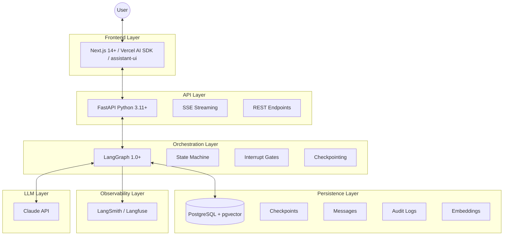
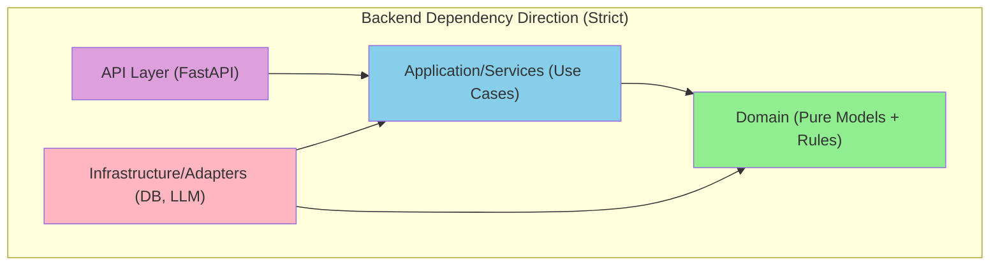
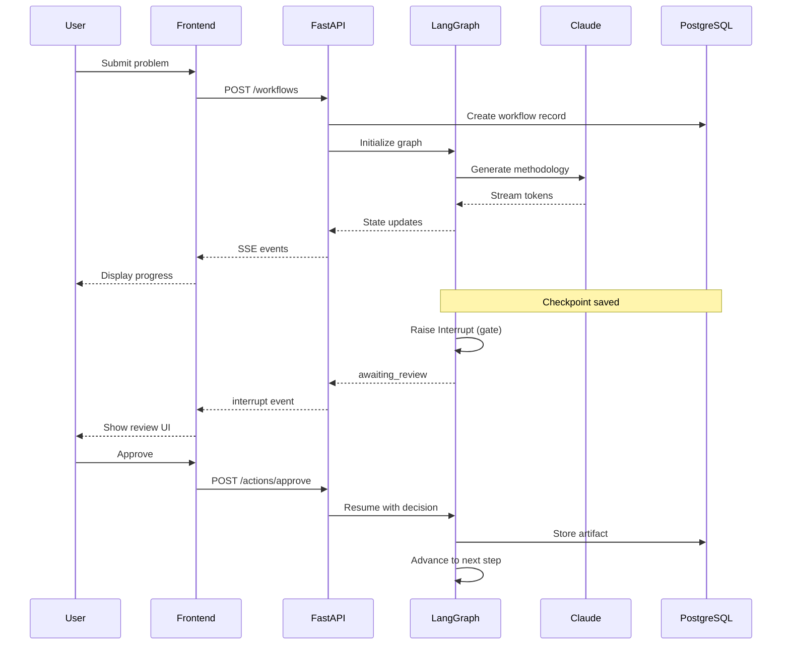
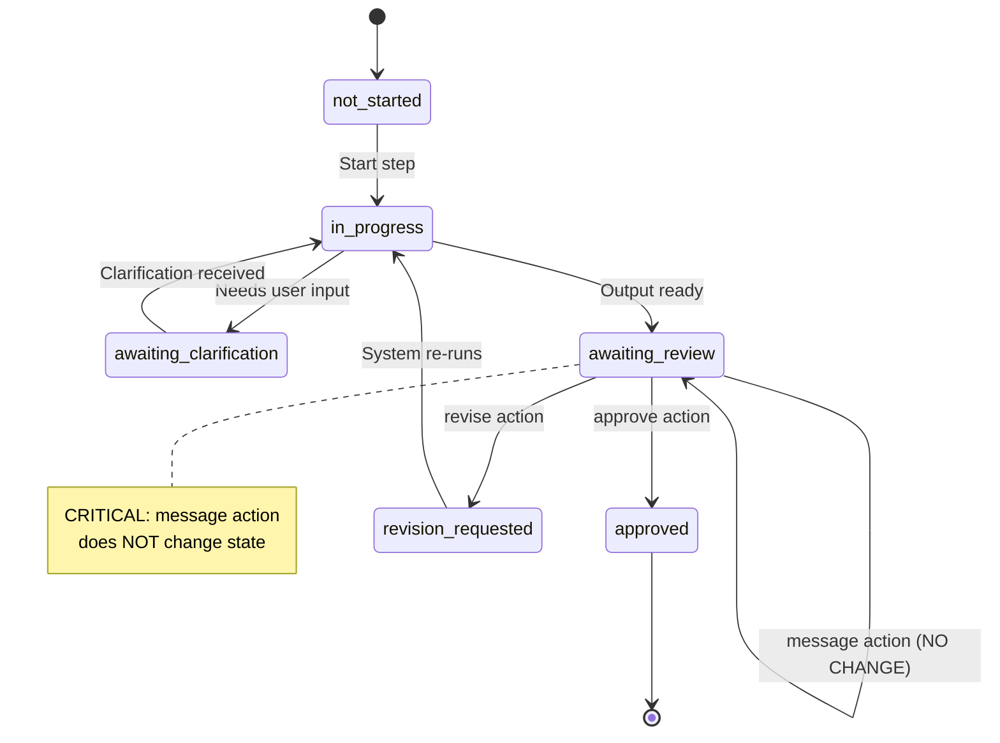
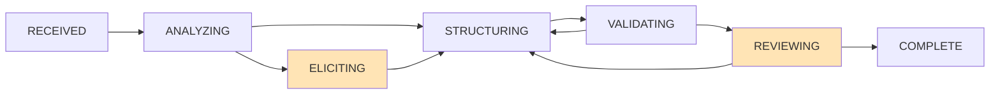
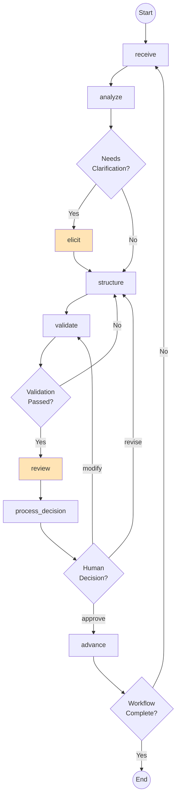

# SOLVER Technical Specification V2.8.4
## Consolidated Implementation Guide (Steps 1-3 MVP)

**Purpose:** Implementation-ready specification for building SOLVER, merging contract definitions with executable code.

**Target Audience:** AI coding agents and developers implementing the system.

**Entry Point:** For project orientation, start with `README.md` (or `SOLVER-README-v1.0.md`).

---

## 0. Why V2.8.4 (Changes from V2.8.3)

V2.8.4 captures post-freeze governance updates:

1. **C.2 completion timestamp** — `completed_at` reintroduced to WorkflowResponse (additive, backward-compatible) per DECISIONS.md P7.1-DEV-001; other reserved fields remain removed (`pass_1_gate_policy`, `created_by`, `last_actor_id`).
2. **Governance status** — Spec unfrozen for Phase 7 work; freeze will be re-applied at package closure.

### V2.8.3 Changes (Preserved)

V2.8.3 is a spec-implementation alignment release resolving C.2 schema discrepancies:

1. **C.2 workflow_id field** — Changed from `id` to `workflow_id` for consistency with C.3 Progress Response
2. **C.2 original_problem field** — Changed from `problem` to `original_problem` to match implementation (clarifies unmodified input)
3. **C.2 backward-compatibility fields** — Documented `current_pass`, `current_step`, `current_step_number` fields that mirror `position` for legacy clients
4. **C.2 step_state field** — Documented optional `step_state` object for detailed step information
5. **C.3 endpoint path** — Changed `{id}` to `{workflow_id}` for consistency

### V2.8.2 Changes (Preserved)

V2.8.2 is a schema remediation release addressing review findings:

1. **§9.3 message exception** — Added exception clause: message endpoint returns minimal `{message_id, status}` without position wrapper
2. **§9.4 staleness schema alignment** — Updated inline dataclasses to match Appendix C.5 schema (renamed `stale_links` → `stale_trace_links`, added `has_stale_artifacts`, `blocking_reasons`, per-artifact `blocking`)
3. **C.3 progress schema clarification** — Changed `current_step` to string (step name) with separate `current_step_number` (integer) to match implementation
4. **C.5 can_complete semantics** — Documented that stale trace links also block completion (not just blocking artifacts)

### V2.8.1 Changes (Preserved)

V2.8.1 resolves internal schema inconsistencies and aligns Appendix C with implementation:

1. **Progress schema unification** (§9.1, Appendix C.3) — Unified §9.1 and C.3 to single canonical schema with `artifact_id`, `artifact_revision`, `is_stale`, `has_artifact`, `started_at`, `completed_at`, `updated_at`
2. **Staleness schema completion** (Appendix C.5) — Added `has_stale_artifacts`, `position`, `blocking_reasons`; per-artifact `artifact_type` and `blocking` fields; renamed `stale_links` → `stale_trace_links`
3. **Message response clarification** (§16.7) — Confirmed minimal `{message_id, status}` response shape

### V2.8.0 Changes (Preserved)

V2.8.0 adds a normative methodology reference appendix:

1. **Methodology reference** (Appendix D) — Two-pass model, four document types, V1→V2→V3 iteration, "considering" rules, V3 completeness requirements, instance hierarchy

### V2.7.3 Changes (Preserved)

V2.7.3 adds canonical reference artifacts for implementation alignment:

1. **Event-state mutation matrix** (§9.2.1) — Authoritative table: event type → state_version mutation → audit row → actor source → UI invalidation
2. **Error contracts** (§9.7) — Complete error response table: 409/400/422/503 with shapes, client actions, and code patterns
3. **Canonical payload schemas** (Appendix C) — JSON examples for SSE envelope, workflow state, progress, artifacts, staleness, action requests

### V2.7.2 Changes (Preserved)

V2.7 strengthens contract boundaries and adds explicit constraints:

1. **Workflow status clarification** — Clarified that "paused-ness" is derived from `position.status` (e.g., `awaiting_review`), not from `workflow_status`. The `workflow_status` enum remains lifecycle-only: `{active, completed, abandoned}`.
2. **Progress endpoint schema** — Added explicit response schema with `state_version` for consistency with canonical refetch bundle.
3. **Artifact versioning constraints** — Added uniqueness constraint for "latest" per logical artifact lineage; `supersedes` must reference same lineage keys; `revision` increment enforced by `create_artifact_revision()` function.

### V2.6 Changes (Preserved)

V2.6 fixes contract-boundary issues identified in final review:

1. **Artifact versioning** — Changed from update-in-place to insert-per-revision model; preserves history for replay/diff (Gate F)
2. **step_status enum** — Added `pending` status with documented semantics
3. **workflow_status enum** — Removed `paused` to match frontend contract (`active`, `completed`, `abandoned` only)
4. **Progress endpoint** — Added `GET /workflows/{id}/progress` with full specification
5. **Sequence allocation** — Removed unsafe `next_event_sequence()` function; pointed to correct approach in §16.2
6. **Naming: reject → revise** — Fixed all remaining references in enums, diagrams, and prose

### V2.5 Changes (Preserved)

1. **Concurrency-safe sequence allocation** — Uses `pg_advisory_xact_lock` instead of naive MAX+1
2. **Broadcast after commit** — SSE broadcast happens after transaction commits, not inside
3. **SSE framing standardized** — Uses `sse-starlette` with consistent dict format
4. **Naming consistency** — `REJECT` → `REVISE` everywhere
5. **Message role/events fixed** — Uses `user` role, `message.created` event type
6. **Staleness endpoints state-mutating** — `acknowledge-stale` and `re-execute` require `expected_state_version`
7. **Revision model clarified** — Update-in-place with revision bump, trigger documented
8. **Audit actor attribution fixed** — Uses session variable `solver.current_actor_id`
9. **Content non-null for methodology** — DB constraint ensures Gate A is enforceable

### V2.4 Changes (Preserved)

1. **Optimistic Concurrency** — `state_version` field, 409 conflict responses
2. **Event Log for SSE Replay** — `workflow_events` table with monotonic sequences
3. **Runner Lease Management** — `workflow_execution_locks` table with time-bounded leases
4. **Contract Implementation Items** — Section 16 addresses Architectural Contract requirements

**Reference Documents:**
- `SOLVER-Design-Intent-v1.1.md` (Why² — design rationale and first principles)
- `SOLVER-Architectural-Contract-v3.4.md` (Why — unified architecture + contracts)

### V2.3 Changes (Preserved)

1. **Staleness Propagation** — Artifact and trace link staleness tracking
2. **Position Wrapper** — All API responses include workflow position
3. **New API Endpoints** — Staleness, replay, and diff operations
4. **Orchestration Primitives** — Appendix B formalizes Replay, Diff, Trust Boundary, Validator

### V2.2 Changes (Preserved)
- Executive Summary — Problem/Solution/Stakeholders orientation
- Mermaid Diagrams — Renderable architecture and state machine diagrams
- Test Scenario Format — Acceptance gates as executable test sequences
- Execution Roadmap — 4-phase build order for the coding agent

All technical specifications from V2.1 and V2.2 are preserved.

---

## 0.5 Executive Summary

### The Problem

The **Structured Reasoning Workflow** (Instance 0) defines a rigorous 10-step, 2-pass methodology for high-stakes problem solving. It specifies:

- Methodology generation before execution (Pass 1 → Pass 2)
- Mandatory human approval gates at every Pass 2 step
- Full traceability from problem → requirements → objectives
- V1 → V2 → V3 document iteration for methodology refinement

However, this methodology currently exists only as **abstract specification**. There is no executable software artifact that:

- Enforces the strict state transitions
- Manages the V1 → V3 document iteration
- Physically imposes the mandatory human approval gates
- Persists state for recovery and audit

### The Solution

**SOLVER** is the concrete software implementation of Instance 0. It is a **Reasoning Engine** that:

- Orchestrates an LLM (Claude) through the 10-step workflow
- Enforces that no step advances without explicit human validation
- Persists all state, artifacts, and decisions for full auditability
- Provides real-time streaming UI for human oversight

### Core Stakeholders

| Stakeholder | Role | Primary Concern |
|-------------|------|-----------------|
| **Operator (Human)** | Provides problem, makes Go/No-Go decisions | Control and oversight |
| **Agent (LLM)** | Executes reasoning, generates artifacts | Clear methodology and context |
| **Architect (SOLVER)** | Enforces Instance 0 constraints | Correctness and recoverability |

### Success Definition

SOLVER is successful when:

1. A human can start a workflow with a problem statement
2. The system generates Pass 1 methodology (V1 → V2 → V3)
3. The system generates Pass 2 artifacts with mandatory human gates
4. The human can approve, revise, or request modification at each gate
5. All state survives system restart
6. Full audit trail is reconstructable

---

## 1. MVP Scope (Steps 1-3 Only)

### 1.1 In Scope

| Component | Description |
|-----------|-------------|
| Step 1 | Problem Definition — complete implementation |
| Step 2 | Requirements — complete implementation |
| Step 3 | Objectives — complete implementation |
| Pass 1 | Methodology generation (V1→V2→V3, 4 docs per step) |
| Pass 2 | Artifact production with human approval gates |
| Persistence | Full state recovery, audit trail, traceability |
| API | REST + SSE for interactive review flow |

### 1.2 Out of Scope (This Version)

| Component | Status |
|-----------|--------|
| Steps 4-10 | Scaffolded as stubs, not implemented |
| External actions | No autonomous real-world actions |
| Auth/SSO/billing | Deferred (identity hooks exist) |
| Multi-tenant | Deferred |
| Model training | Not applicable |

### 1.2.1 Authorization Boundaries (MVP)

> **Note:** Full auth is deferred, but the MVP establishes the identity plumbing that future auth builds on.

**Unit of Access Control:** Workflow

In MVP, all access control is per-workflow. A user who can access a workflow can:
- View all artifacts and events in that workflow
- Perform actions (approve, revise, message) on that workflow
- View the full audit trail for that workflow

**Actor Identity Derivation (end-to-end):**

```
┌─────────────┐    ┌─────────────┐    ┌─────────────┐    ┌─────────────┐
│   Client    │    │   Session   │    │   Request   │    │   Database  │
│  (Browser)  │───►│  (Cookie)   │───►│  (Header)   │───►│  (Audit)    │
└─────────────┘    └─────────────┘    └─────────────┘    └─────────────┘
     │                   │                   │                   │
     │ User clicks       │ Session ID        │ X-Actor-ID        │ actor_id
     │ "Approve"         │ in cookie         │ from middleware   │ in audit_log
     │                   │                   │                   │
     ▼                   ▼                   ▼                   ▼
  User intent      Session lookup      Actor extraction     Durable record
```

**MVP Implementation:**

```python
# Middleware extracts actor from session (MVP uses simple session ID)
@app.middleware("http")
async def actor_extraction_middleware(request: Request, call_next):
    # MVP: actor_id from header or session cookie
    request.state.actor_id = (
        request.headers.get("X-Actor-ID") or
        request.cookies.get("session_id") or
        "anonymous"
    )
    return await call_next(request)

# Handler uses actor in transaction
async def approve_step(workflow_id: str, request: ApproveRequest):
    async with db.transaction():
        await with_actor_context(db, request.state.actor_id)
        # ... action logic ...
        # Audit trigger captures actor_id via session variable
```

**Future Auth Integration Points:**

| Hook | Location | Purpose |
|------|----------|---------|
| `get_current_user()` | Middleware | Replace session lookup with SSO/JWT validation |
| `check_workflow_access()` | Route guards | Add per-workflow permission checks |
| `tenant_id` column | Database schema | Enable multi-tenant isolation |
| `X-Tenant-ID` header | Request context | Propagate tenant through system |

**The invariant:** Every state-changing action MUST have an `actor_id` recorded in the audit log. This is enforced by the `step_audit_trigger` which reads from `solver.current_actor_id` session variable.

### 1.3 Acceptance Gates (MVP Exit Criteria)

| Gate | Criterion |
|------|-----------|
| **A** | Step 1-3 Pass 1 methodology exists (V1/V2/V3, all 4 docs per step) |
| **B** | Step 1-3 Pass 2 produces stored packages with correct schema keys and trace links |
| **C** | Pass 2 cannot advance without `approve`; `revise` loops work; `message` doesn't bypass gating |
| **D** | Restart + resume works mid-step and at `awaiting_review` with no lost artifacts |
| **E** | REST endpoints + SSE streaming support the full interactive review flow |
| **F** | Audit log reconstructs the full run timeline; artifacts are versioned deterministically |

---

## 2. Architecture Overview

### 2.1 Technology Stack (Committed)



### 2.2 Clean Architecture Layers



**Rule:** Domain models never import from infrastructure. Infrastructure adapts to domain interfaces.

### 2.3 Request Flow



---

## 3. Instance Model (0 / 1 / N)

### 3.1 Instance Definitions

| Instance | Name | Role | Created |
|----------|------|------|---------|
| 0 | Universal Method | Defines schemas, contracts, gates, validation rules, 4-doc methodology | Once |
| 1 | SOLVER Software | Implements Instance 0 as executable system | Once |
| N (N≥2) | Domain Specialization | Extends Instance 0 with domain schemas/templates/checks | Per domain |

### 3.2 Instance Pack Mechanism

An **InstancePack** is a versioned bundle containing:

```yaml
InstancePack:
  manifest:
    name: string                    # e.g., "healthcare-clinical-trials"
    version: string                 # Semantic version
    core_schema_version: string     # Compatible SOLVER version
    parent_instance: 0 | 1
    
  schemas:
    step_1_extensions: JSONSchema   # Additional fields for Problem Definition
    step_2_extensions: JSONSchema   # Additional requirement categories
    step_3_extensions: JSONSchema   # Additional objective categories
    
  templates:
    methodology_seeds: map          # Pre-built document templates
    checklists: map                 # Domain-specific checklists
    
  validators:
    custom_rules: list              # Domain-specific validation rules
    
  ui_hints:                         # Optional
    step_labels: map
    field_descriptions: map
```

**Compatibility Rule:** Extensions may add optional fields, never remove or rename core fields.

### 3.3 Instance 0 Seed Pack

Instance 0 methodology ships with SOLVER:

```
packages/instance_packs/instance_0/
├── manifest.yaml
├── schemas/
│   ├── problem_definition_package.json
│   ├── requirements_package.json
│   └── objectives_package.json
├── templates/
│   ├── data_sheet_template.md
│   ├── todo_list_template.md
│   ├── guidance_template.md
│   └── detailed_procedure_template.md
└── validators/
    └── core_validation_rules.yaml
```

---

## 4. Workflow Model

### 4.1 Pass Types

| Pass | Name | Mode | Output | Gate |
|------|------|------|--------|------|
| `definition` | Pass 1 | Configurable | Methodology V1→V2→V3 | Policy-based |
| `execution` | Pass 2 | Supervised | Artifact package | Human required |

### 4.2 Step Numbers (MVP)

| Step | Name | Pass 2 Artifact | Status |
|------|------|-----------------|--------|
| 1 | Problem Definition | `ProblemDefinitionPackage` | Implemented |
| 2 | Requirements | `RequirementsPackage` | Implemented |
| 3 | Objectives | `ObjectivesPackage` | Implemented |
| 4-10 | (Reserved) | — | Scaffolded only |

### 4.3 Methodology Documents (Pass 1)

Each step produces 4 documents, each iterated V1→V2→V3:

| Document | Purpose |
|----------|---------|
| DataSheet | Input/output contracts, schemas, validation rules |
| ToDoList | Phased tasks, checkpoints, validation hooks |
| Guidance | Context, principles, anti-patterns, quality criteria |
| DetailedProcedure | State machine, algorithms, decision logic, gates |

### 4.4 Gate Policies

```yaml
GatePolicies:
  pass_2_gates: always_required    # HARD REQUIREMENT: Cannot advance without approval
  
  pass_1_gate_policy:
    type: enum
    values: [none, per_step, end_of_pass]
    default: per_step              # Recommended for interactive mode
    
  policy_behaviors:
    none: "Fully autonomous, no gates"
    per_step: "Human approval after each step's V3"
    end_of_pass: "Human approval only after Step 10 Pass 1"
```

---

## 5. Artifact Schemas (Step 1-3 Packages)

### 5.1 Step 1: ProblemDefinitionPackage

```yaml
ProblemDefinitionPackage:
  # Metadata
  package_id: string              # UUID
  workflow_id: string
  instance_id: string
  step_number: 1
  version: integer                # Revision number
  created_at: datetime
  
  # Staleness tracking (V2.3)
  stale: boolean                  # True if upstream changed after this was approved
  stale_reason: string | null     # e.g., "upstream_step_revised", "manual_invalidation"
  stale_since: datetime | null    # When staleness was detected
  
  # Core content
  title: string
  
  canonical_problem_definition:
    statement: string
    interpretation_notes: [string]
    
  background: [string]
  
  stakeholders:
    - id: string                  # SH-001, SH-002, ...
      name_or_group: string
      role: string
      needs: [string]
      concerns: [string]
      impact: string
      
  constraints:
    hard:
      - id: string                # HC-001, HC-002, ...
        statement: string
        rationale: string
    soft:
      - id: string                # SC-001, SC-002, ...
        statement: string
        rationale: string
        
  scope:
    in:
      - id: string                # IN-001, IN-002, ...
        item: string
    out:
      - id: string                # OUT-001, OUT-002, ...
        item: string
        rationale: string
        
  success_criteria:
    - id: string                  # CRT-001, CRT-002, ...
      metric_or_signal: string
      target: string
      how_verified: string
      
  assumptions:
    - id: string                  # ASM-001, ASM-002, ...
      statement: string
      rationale: string
      risk_if_wrong: string
      
  open_questions:
    required_to_proceed:
      - id: string                # OQ-001, OQ-002, ...
        question: string
    nice_to_have: [string]
    
  integration_points:
    - id: string                  # IP-001, IP-002, ...
      description: string
      components: [string]
      
  # Instance 1 software-specific extension
  software_extension:
    baseline_commitments: [string]
    system_actors: [string]
    execution_semantics: [string]
    state_model_notes: [string]
    interfaces: [string]
    persistence_observability: [string]
    
  # Handoff to Step 2
  step2_handoff:
    requirement_themes: [string]
    nfr_watchouts: [string]
    dependencies_to_capture: [string]
```

### 5.2 Step 2: RequirementsPackage

```yaml
RequirementsPackage:
  # Metadata
  package_id: string
  workflow_id: string
  instance_id: string
  step_number: 2
  version: integer
  created_at: datetime
  
  # Staleness tracking (V2.3)
  stale: boolean                  # True if upstream changed after this was approved
  stale_reason: string | null     # e.g., "upstream_step_1_revised"
  stale_since: datetime | null    # When staleness was detected
  
  # Overview
  overview:
    summary: string
    boundaries: [string]
    total_requirements: integer
    priority_distribution:
      must: integer
      should: integer
      could: integer
      
  # Requirements
  requirements:
    - id: string                  # FR-001, NFR-001, CR-001, IR-001
      category: FR | NFR | CR | IR
      priority: must | should | could
      statement: string
      rationale: string
      
      source:
        type: stakeholder | constraint | scope | success_criterion | assumption | integration_point
        id: string                # Reference to Step 1 element
        aspect: string            # need, concern, item, etc.
        
      component: [string]         # Affected technology components
      
      testability:
        method: demonstration | test | inspection | analysis
        description: string
        
      trace:
        stakeholders: [string]    # SH-xxx IDs
        constraints: [string]     # HC-xxx, SC-xxx IDs
        scope_in: [string]        # IN-xxx IDs
        success_criteria: [string] # CRT-xxx IDs
        integration_points: [string] # IP-xxx IDs
        
  # Coverage map (Step 1 → Step 2 traceability)
  coverage_map:
    - source_type: string         # stakeholder, constraint, scope, etc.
      source_id: string
      requirement_ids: [string]
      coverage_note: string
      
  # Conflicts and tradeoffs
  conflicts_tradeoffs:
    - conflict: string
      impacted_requirement_ids: [string]
      proposed_resolution: string
      
  # Open questions
  open_questions:
    required_to_finalize: [string]
    deferred: [string]
    
  # Handoff to Step 3
  step3_handoff:
    objective_mapping_rules: [string]
    objective_seeds:
      primary_from_must: [string]
      secondary_from_should: [string]
      tertiary_from_could: [string]
```

### 5.3 Step 3: ObjectivesPackage

```yaml
ObjectivesPackage:
  # Metadata
  package_id: string
  workflow_id: string
  instance_id: string
  step_number: 3
  version: integer
  created_at: datetime
  
  # Staleness tracking (V2.3)
  stale: boolean                  # True if upstream changed after this was approved
  stale_reason: string | null     # e.g., "upstream_step_2_revised"
  stale_since: datetime | null    # When staleness was detected
  
  # Overview
  overview:
    intent: string
    measurement_principles: [string]
    boundaries: [string]
    total_objectives: integer
    consolidation_ratio: float    # requirements / objectives
    
  # Objectives
  objectives:
    - id: string                  # CAP-001, QUAL-001, COMP-001, INTF-001
      category: CAP | QUAL | COMP | INTF
      tier: primary | secondary | tertiary
      statement: string           # "X is achieved"
      rationale: string
      owner_type: process | user | system
      
      linked_requirements: [string]  # FR-xxx, NFR-xxx, etc.
      consolidated: boolean
      
      success_criteria:
        definition: string
        verification:
          method: demonstration | test | inspection | analysis
          description: string
          evidence_artifacts: [string]
        metric: string | null
        threshold: string | null
        
      component: [string]
      acceptance_criteria: [string]  # CRT-xxx links
      
  # Success framework
  success_framework:
    minimum_viable:
      description: "Must achieve for system to be viable"
      objectives: [string]        # Primary objective IDs
      requirement_coverage: [string]
      
    target:
      description: "Expected full success state"
      objectives: [string]        # Primary + secondary IDs
      requirement_coverage: [string]
      
    aspirational:
      description: "Exceeds expectations"
      objectives: [string]        # All objective IDs
      requirement_coverage: [string]
      
  # Trace map (Step 2 → Step 3 traceability)
  trace_map:
    - objective_id: string
      requirement_ids: [string]
      consolidated: boolean
      
  # Backward traceability (requirement → objective)
  backward_trace:
    - requirement_id: string
      objective_id: string
      
  # Risks and tradeoffs
  risks_tradeoffs:
    - risk: string
      related_objectives: [string]
      related_requirements: [string]
      monitoring_signal: string
      mitigation_hint: string
      
  # Open questions
  open_questions:
    required_to_finalize: [string]
    deferred: [string]
    
  # Handoff to Step 4
  step4_handoff:
    sequencing_notes: [string]
    acceptance_gates: [string]
    dependencies_to_plan: [string]
```

---

## 6. State Machine

### 6.1 Step Status (Coarse-Grained, External)

```python
class StepStatus(str, Enum):
    NOT_STARTED = "not_started"
    IN_PROGRESS = "in_progress"
    AWAITING_CLARIFICATION = "awaiting_clarification"
    AWAITING_REVIEW = "awaiting_review"
    APPROVED = "approved"
    REVISION_REQUESTED = "revision_requested"
```

### 6.2 Step Phase (Fine-Grained, Internal)

```python
class StepPhase(str, Enum):
    RECEIVED = "received"
    ANALYZING = "analyzing"
    ELICITING = "eliciting"
    STRUCTURING = "structuring"
    VALIDATING = "validating"
    REVIEWING = "reviewing"
    COMPLETE = "complete"
```

### 6.3 Status Transitions



### 6.4 Phase Flow



### 6.5 Critical Rule: Message Does Not Unpause

**HARD REQUIREMENT:** If status is `awaiting_review`, a `message` action:
- Records the message in conversation history
- Does NOT change the status
- Does NOT resume graph execution
- Human must explicitly `approve`, `revise`, or `modify` to change state

### 6.6 Phase-to-Status Mapping

| Phase | Status |
|-------|--------|
| `received` | `in_progress` |
| `analyzing` | `in_progress` |
| `eliciting` | `awaiting_clarification` |
| `structuring` | `in_progress` |
| `validating` | `in_progress` |
| `reviewing` | `awaiting_review` |
| `complete` | `approved` |

---

## 7. Database Schema (PostgreSQL)

> **Trigger and Function Requirements:** The following database objects are critical for correctness. Do NOT optimize them away without understanding the invariant they protect.

| Object | Type | Required? | Invariant Protected | Optimization Notes |
|--------|------|-----------|---------------------|-------------------|
| `pg_advisory_xact_lock` | Built-in | **REQUIRED** | Event sequences are gap-free | Cannot be replaced with application-level locking |
| `step_audit_trigger` | Trigger | **REQUIRED** | Every state change has actor attribution | Must fire AFTER state changes |
| `get_current_actor()` | Function | **REQUIRED** | Audit captures transaction-scoped actor | Used by trigger, cannot be inlined |
| `propagate_staleness()` | Trigger | **REQUIRED** | Downstream artifacts marked stale on upstream revision | Must fire on artifact INSERT |
| `artifact_staleness_trigger` | Trigger | **REQUIRED** | Staleness propagation is automatic | Cannot be moved to application layer (transaction boundary) |
| `create_artifact_revision()` | Function | **REQUIRED** | Revision numbering is correct, supersedes chain valid | Enforces uniqueness of "latest" |
| `latest_artifacts` | View | Recommended | Simple query pattern for current artifacts | Can be replaced with WHERE clause but increases complexity |
| Unique constraints | Constraint | **REQUIRED** | No duplicate sequences, no orphan revisions | Database-enforced, cannot be application-only |

**Why triggers, not application code?**

Triggers fire inside the same transaction as the triggering statement. This guarantees atomicity that application code cannot:

```
Application-layer staleness (WRONG):
  1. Insert new artifact revision  ───► Transaction 1 commits
  2. Update downstream artifacts   ───► Transaction 2 commits
                                        ^ Window where downstream is NOT stale but should be
                                        
Trigger-based staleness (CORRECT):
  1. Insert new artifact revision  ─┐
  2. Trigger fires, updates downstream ├──► Single transaction commits
                                    ─┘   No window of inconsistency
```

**Advisory locks vs application locks:**

Advisory locks are held only for the transaction duration and are automatically released on commit/rollback. Application-level locks (Redis, flags) cannot guarantee this and create deadlock/leak risks.

### 7.1 Extensions

```sql
CREATE EXTENSION IF NOT EXISTS "uuid-ossp";
CREATE EXTENSION IF NOT EXISTS "pgcrypto";
CREATE EXTENSION IF NOT EXISTS "vector";
```

### 7.2 Enums

```sql
CREATE TYPE pass_type AS ENUM ('definition', 'execution');

CREATE TYPE step_name AS ENUM (
    'problem_definition',
    'requirements',
    'objectives',
    'verification_design',
    'validation_design',
    'evaluation_criteria',
    'assessment_protocol',
    'implementation',
    'reflection',
    'resolution'
);

CREATE TYPE step_status AS ENUM (
    'not_started',      -- Initial state, never executed
    'pending',          -- Queued for (re-)execution (e.g., after re-execute request)
    'in_progress',      -- Currently executing
    'awaiting_clarification',  -- Blocked on human clarification
    'awaiting_review',  -- Blocked on human review/approval
    'approved',         -- Human approved, ready to advance
    'revision_requested'  -- Human requested revision
);

CREATE TYPE step_phase AS ENUM (
    'received',
    'analyzing',
    'eliciting',
    'structuring',
    'validating',
    'reviewing',
    'complete'
);

-- Note: 'paused' intentionally omitted from workflow_status. The concept of "not currently
-- advancing" is derived from position.status (e.g., awaiting_review, awaiting_clarification),
-- not from a workflow-level pause flag. This keeps workflow_status strictly lifecycle-focused.
-- Frontend contract requires workflow_status ∈ {active, completed, abandoned}.
--
-- DERIVATION RULE: A workflow is "paused" (not advancing) when any of:
--   - position.status = 'awaiting_review' (blocked on human approval)
--   - position.status = 'awaiting_clarification' (blocked on human input)
--   - position.status = 'revision_requested' (blocked until re-execution starts)
-- The workflow remains 'active' during these states; it advances when the blocking condition resolves.
CREATE TYPE workflow_status AS ENUM ('active', 'completed', 'abandoned');

CREATE TYPE instance_type AS ENUM ('universal', 'implementation', 'domain');

CREATE TYPE gate_policy AS ENUM ('none', 'per_step', 'end_of_pass');

CREATE TYPE document_type AS ENUM ('data_sheet', 'todo_list', 'guidance', 'detailed_procedure');

CREATE TYPE document_version AS ENUM ('v1', 'v2', 'v3');

CREATE TYPE message_role AS ENUM ('user', 'assistant', 'system');

CREATE TYPE human_action AS ENUM ('approve', 'revise', 'modify', 'message');

CREATE TYPE requirement_category AS ENUM ('FR', 'NFR', 'CR', 'IR');

CREATE TYPE objective_category AS ENUM ('CAP', 'QUAL', 'COMP', 'INTF');
```

### 7.3 Core Tables

```sql
-- ============================================================================
-- INSTANCES: Instance 0/1/N hierarchy
-- ============================================================================
CREATE TABLE instances (
    id                  UUID PRIMARY KEY DEFAULT uuid_generate_v4(),
    instance_number     INTEGER NOT NULL UNIQUE,
    instance_type       instance_type NOT NULL,
    parent_instance_id  UUID REFERENCES instances(id),
    name                VARCHAR(255) NOT NULL,
    description         TEXT,
    pass_1_gate_policy  gate_policy NOT NULL DEFAULT 'per_step',
    pack_manifest       JSONB,                    -- InstancePack manifest
    created_at          TIMESTAMPTZ NOT NULL DEFAULT NOW(),
    
    CONSTRAINT valid_instance_hierarchy CHECK (
        (instance_number = 0 AND instance_type = 'universal' AND parent_instance_id IS NULL) OR
        (instance_number = 1 AND instance_type = 'implementation') OR
        (instance_number >= 2 AND instance_type = 'domain')
    )
);

-- Seed Instance 0
INSERT INTO instances (instance_number, instance_type, name, description)
VALUES (0, 'universal', 'Universal Methodology', 'Domain-agnostic structured reasoning protocol');

-- ============================================================================
-- WORKFLOWS: Master workflow record
-- ============================================================================
CREATE TABLE workflows (
    id                  UUID PRIMARY KEY DEFAULT uuid_generate_v4(),
    workflow_id         VARCHAR(255) UNIQUE NOT NULL,
    thread_id           VARCHAR(255) UNIQUE NOT NULL,
    instance_id         UUID NOT NULL REFERENCES instances(id),
    
    original_problem    TEXT NOT NULL,
    domain              VARCHAR(255),
    
    current_pass        pass_type NOT NULL DEFAULT 'definition',
    current_step        step_name NOT NULL DEFAULT 'problem_definition',
    current_step_number INTEGER NOT NULL DEFAULT 1,
    status              workflow_status NOT NULL DEFAULT 'active',
    
    pass_1_gate_policy  gate_policy NOT NULL DEFAULT 'per_step',
    
    -- Optimistic concurrency control (see Section 16: Architecture Contract Items)
    state_version       INTEGER NOT NULL DEFAULT 1,
    
    created_by          VARCHAR(255) NOT NULL,
    last_actor_id       VARCHAR(255) NOT NULL,
    created_at          TIMESTAMPTZ NOT NULL DEFAULT NOW(),
    updated_at          TIMESTAMPTZ NOT NULL DEFAULT NOW(),
    completed_at        TIMESTAMPTZ
);

CREATE INDEX idx_workflows_thread ON workflows(thread_id);
CREATE INDEX idx_workflows_instance ON workflows(instance_id);
CREATE INDEX idx_workflows_status ON workflows(status);

-- ============================================================================
-- STATE_VERSION INCREMENT RULES
-- ============================================================================
-- 
-- state_version MUST increment on every accepted state transition that affects
-- correctness or action eligibility. This is critical for optimistic concurrency.
--
-- MUST INCREMENT:
--   - Position changes: current_pass, current_step, current_step_number
--   - Status changes: step_status, workflow status
--   - Gate transitions: entering/exiting awaiting_review, awaiting_clarification
--   - Artifact state changes: new revision created, staleness propagated
--   - Action acceptance: approve, revise, acknowledge-stale, re-execute
--
-- MUST NOT INCREMENT:
--   - Timestamp-only updates: updated_at changes without other field changes
--   - Telemetry updates: token counts, turn counts (unless they affect gating)
--   - Read operations: queries, fetches
--
-- ATOMIC REQUIREMENT:
--   state_version increment MUST be atomic with the state change that triggers it.
--   Never increment in a separate transaction.
--
-- IMPLEMENTATION:
--   Use increment_state_version() function within the same transaction as state change.
--   The function returns the new version for inclusion in response.
--
-- ============================================================================

-- ============================================================================
-- STEP_EXECUTIONS: Per-step state
-- ============================================================================
CREATE TABLE step_executions (
    id                  UUID PRIMARY KEY DEFAULT uuid_generate_v4(),
    workflow_id         UUID NOT NULL REFERENCES workflows(id) ON DELETE CASCADE,
    
    pass_type           pass_type NOT NULL,
    step_name           step_name NOT NULL,
    step_number         INTEGER NOT NULL,
    
    status              step_status NOT NULL DEFAULT 'not_started',
    phase               step_phase NOT NULL DEFAULT 'received',
    
    latest_artifact_id  UUID,                     -- References artifacts.id
    human_feedback      TEXT,
    clarification_request JSONB,
    
    validation_status   VARCHAR(20),
    validation_errors   JSONB DEFAULT '[]',
    validation_warnings JSONB DEFAULT '[]',
    
    started_at          TIMESTAMPTZ,
    completed_at        TIMESTAMPTZ,
    
    turn_count          INTEGER NOT NULL DEFAULT 0,
    total_tokens        INTEGER NOT NULL DEFAULT 0,
    
    UNIQUE(workflow_id, pass_type, step_name)
);

CREATE INDEX idx_steps_workflow ON step_executions(workflow_id);
CREATE INDEX idx_steps_status ON step_executions(status);

-- ============================================================================
-- ARTIFACTS: Pass 1 methodology + Pass 2 packages (Insert-Per-Revision Model)
-- ============================================================================
-- 
-- VERSIONING STRATEGY: Insert-per-revision (NOT update-in-place)
-- 
-- Each revision creates a NEW ROW with a new artifact_id. This preserves:
-- - Full history for replay (Gate F)
-- - Diff between any two versions (/diff/{other_artifact_id})
-- - Deterministic version provenance
-- 
-- The `supersedes` field links revisions: revision 2 supersedes revision 1.
-- The `latest_artifacts` view provides the current version for each step.
-- ============================================================================

CREATE TABLE artifacts (
    id                  UUID PRIMARY KEY DEFAULT uuid_generate_v4(),
    workflow_id         UUID NOT NULL REFERENCES workflows(id) ON DELETE CASCADE,
    
    pass_type           pass_type NOT NULL,
    step_name           step_name NOT NULL,
    step_number         INTEGER NOT NULL,
    
    artifact_type       VARCHAR(50) NOT NULL,     -- 'methodology_doc' or 'step_package'
    revision            INTEGER NOT NULL DEFAULT 1,
    supersedes          UUID REFERENCES artifacts(id),  -- Previous revision (NULL for revision 1)
    superseded_by       UUID REFERENCES artifacts(id),  -- Next revision (NULL if current)
    
    -- For methodology docs
    document_type       document_type,
    document_version    document_version,
    content_markdown    TEXT,
    
    -- For step packages
    package_type        VARCHAR(50),              -- 'ProblemDefinitionPackage', etc.
    content_jsonb       JSONB,
    
    -- Schema validation
    schema_version      VARCHAR(20),
    validation_status   VARCHAR(20),
    
    -- Staleness tracking (V2.3)
    stale               BOOLEAN NOT NULL DEFAULT FALSE,
    stale_reason        VARCHAR(100),             -- 'upstream_step_N_revised', 'manual_invalidation'
    stale_since         TIMESTAMPTZ,
    
    created_at          TIMESTAMPTZ NOT NULL DEFAULT NOW(),
    created_by          VARCHAR(255),
    
    CONSTRAINT valid_artifact_type CHECK (
        (artifact_type = 'methodology_doc' AND document_type IS NOT NULL AND document_version IS NOT NULL AND content_markdown IS NOT NULL) OR
        (artifact_type = 'step_package' AND package_type IS NOT NULL AND content_jsonb IS NOT NULL)
    ),
    CONSTRAINT valid_revision_chain CHECK (
        (revision = 1 AND supersedes IS NULL) OR
        (revision > 1 AND supersedes IS NOT NULL)
    )
);

-- ============================================================================
-- ARTIFACT VERSIONING CONSTRAINTS (V2.7)
-- ============================================================================
-- These constraints ensure the insert-per-revision model maintains data integrity:
--
-- 1. UNIQUENESS: Exactly one "latest" (superseded_by IS NULL) artifact per logical lineage
-- 2. LINEAGE CONSISTENCY: supersedes must reference an artifact with same lineage keys
-- 3. REVISION INCREMENT: enforced by create_artifact_revision() function, not by constraint
--
-- A "logical artifact lineage" is defined by:
--   - For methodology_doc: (workflow_id, pass_type, step_number, document_type, document_version)
--   - For step_package: (workflow_id, pass_type, step_number, package_type)
-- ============================================================================

-- Unique constraint: only one "latest" per methodology document lineage
CREATE UNIQUE INDEX idx_artifacts_latest_methodology ON artifacts (
    workflow_id, pass_type, step_number, document_type, document_version
) WHERE artifact_type = 'methodology_doc' AND superseded_by IS NULL;

-- Unique constraint: only one "latest" per package lineage  
CREATE UNIQUE INDEX idx_artifacts_latest_package ON artifacts (
    workflow_id, pass_type, step_number, package_type
) WHERE artifact_type = 'step_package' AND superseded_by IS NULL;

CREATE INDEX idx_artifacts_workflow ON artifacts(workflow_id);
CREATE INDEX idx_artifacts_step ON artifacts(step_name);
CREATE INDEX idx_artifacts_stale ON artifacts(workflow_id, stale) WHERE stale = TRUE;
CREATE INDEX idx_artifacts_supersedes ON artifacts(supersedes);
CREATE INDEX idx_artifacts_latest ON artifacts(workflow_id, step_number, pass_type) 
    WHERE superseded_by IS NULL;

-- View for latest (current) artifact per step
CREATE VIEW latest_artifacts AS
SELECT * FROM artifacts WHERE superseded_by IS NULL;

-- Function to create new revision
-- 
-- INVARIANTS ENFORCED:
-- 1. Previous artifact must exist and not already be superseded
-- 2. New revision = old.revision + 1 (enforced here, not by caller)
-- 3. Lineage keys preserved (workflow_id, pass_type, step_number, artifact_type, etc.)
-- 4. supersedes references same lineage (implicit via copying keys)
--
CREATE OR REPLACE FUNCTION create_artifact_revision(
    p_previous_artifact_id UUID,
    p_content_markdown TEXT DEFAULT NULL,
    p_content_jsonb JSONB DEFAULT NULL,
    p_created_by VARCHAR(255) DEFAULT 'system'
) RETURNS UUID AS $$
DECLARE
    v_new_id UUID;
    v_prev RECORD;
    v_expected_revision INTEGER;
BEGIN
    -- Get previous artifact
    SELECT * INTO v_prev FROM artifacts WHERE id = p_previous_artifact_id;
    IF NOT FOUND THEN
        RAISE EXCEPTION 'Previous artifact not found: %', p_previous_artifact_id;
    END IF;
    IF v_prev.superseded_by IS NOT NULL THEN
        RAISE EXCEPTION 'Cannot revise already-superseded artifact: %', p_previous_artifact_id;
    END IF;
    
    -- INVARIANT: revision must be exactly prev.revision + 1
    -- This is enforced here, NOT by application code
    v_expected_revision := v_prev.revision + 1;
    
    -- Insert new revision (lineage keys copied from previous)
    INSERT INTO artifacts (
        workflow_id, pass_type, step_name, step_number, artifact_type, revision,
        supersedes, document_type, document_version, content_markdown,
        package_type, content_jsonb, schema_version, created_by
    ) VALUES (
        v_prev.workflow_id, v_prev.pass_type, v_prev.step_name, v_prev.step_number,
        v_prev.artifact_type, v_expected_revision, p_previous_artifact_id,
        v_prev.document_type, v_prev.document_version,
        COALESCE(p_content_markdown, v_prev.content_markdown),
        v_prev.package_type,
        COALESCE(p_content_jsonb, v_prev.content_jsonb),
        v_prev.schema_version, p_created_by
    ) RETURNING id INTO v_new_id;
    
    -- Mark previous as superseded
    UPDATE artifacts SET superseded_by = v_new_id WHERE id = p_previous_artifact_id;
    
    RETURN v_new_id;
END;
$$ LANGUAGE plpgsql;

-- ============================================================================
-- TRACEABILITY_LINKS: Forward/backward trace relationships
-- ============================================================================
CREATE TABLE traceability_links (
    id                  UUID PRIMARY KEY DEFAULT uuid_generate_v4(),
    workflow_id         UUID NOT NULL REFERENCES workflows(id) ON DELETE CASCADE,
    
    from_step           INTEGER NOT NULL,
    from_type           VARCHAR(50) NOT NULL,     -- 'stakeholder', 'requirement', etc.
    from_id             VARCHAR(20) NOT NULL,     -- SH-001, FR-001, etc.
    
    to_step             INTEGER NOT NULL,
    to_type             VARCHAR(50) NOT NULL,
    to_id               VARCHAR(20) NOT NULL,
    
    link_type           VARCHAR(50) NOT NULL,     -- 'derives', 'achieves', 'traces_to'
    consolidated        BOOLEAN NOT NULL DEFAULT FALSE,
    
    -- Staleness tracking (V2.3)
    validated_at        TIMESTAMPTZ,              -- When link was last validated
    stale               BOOLEAN NOT NULL DEFAULT FALSE,
    stale_reason        VARCHAR(100),
    
    created_at          TIMESTAMPTZ NOT NULL DEFAULT NOW(),
    
    UNIQUE(workflow_id, from_id, to_id, link_type)
);

CREATE INDEX idx_trace_workflow ON traceability_links(workflow_id);
CREATE INDEX idx_trace_from ON traceability_links(from_id);
CREATE INDEX idx_trace_to ON traceability_links(to_id);
CREATE INDEX idx_trace_stale ON traceability_links(workflow_id, stale) WHERE stale = TRUE;

-- ============================================================================
-- WORKFLOW_EVENTS: SSE event log for replay (see Section 16)
-- ============================================================================
CREATE TABLE workflow_events (
    id                  UUID PRIMARY KEY DEFAULT uuid_generate_v4(),
    workflow_id         UUID NOT NULL REFERENCES workflows(id) ON DELETE CASCADE,
    
    sequence            INTEGER NOT NULL,             -- Monotonic per workflow
    event_type          VARCHAR(50) NOT NULL,
    payload             JSONB NOT NULL,
    
    created_at          TIMESTAMPTZ NOT NULL DEFAULT NOW(),
    
    UNIQUE(workflow_id, sequence)
);

CREATE INDEX idx_events_workflow_seq ON workflow_events(workflow_id, sequence);
CREATE INDEX idx_events_created ON workflow_events(created_at);

-- ============================================================================
-- SEQUENCE ALLOCATION WARNING
-- ============================================================================
-- DO NOT use a naive MAX(sequence)+1 function for sequence allocation.
-- It is NOT concurrency-safe and will produce duplicate sequences under load.
--
-- Correct approach (see Section 16.2):
-- Use pg_advisory_xact_lock(hashtext(workflow_id::text)) within a transaction
-- to serialize sequence allocation per workflow, THEN compute MAX+1.
--
-- The application layer (emit_and_persist_event) handles this correctly.
-- ============================================================================

-- ============================================================================
-- WORKFLOW_EXECUTION_LOCKS: Runner lease management (see Section 16)
-- ============================================================================
CREATE TABLE workflow_execution_locks (
    workflow_id         UUID PRIMARY KEY REFERENCES workflows(id) ON DELETE CASCADE,
    
    locked_by           VARCHAR(255) NOT NULL,        -- Runner/process identifier
    locked_at           TIMESTAMPTZ NOT NULL DEFAULT NOW(),
    expires_at          TIMESTAMPTZ NOT NULL,         -- Lease expiry
    
    CONSTRAINT valid_expiry CHECK (expires_at > locked_at)
);

CREATE INDEX idx_locks_expiry ON workflow_execution_locks(expires_at);

-- ============================================================================
-- MESSAGES: Conversation history
-- ============================================================================
CREATE TABLE messages (
    id                  UUID PRIMARY KEY DEFAULT uuid_generate_v4(),
    workflow_id         UUID NOT NULL REFERENCES workflows(id) ON DELETE CASCADE,
    step_execution_id   UUID NOT NULL REFERENCES step_executions(id) ON DELETE CASCADE,
    
    role                message_role NOT NULL,
    content             TEXT NOT NULL,
    metadata            JSONB NOT NULL DEFAULT '{}',
    
    input_tokens        INTEGER,
    output_tokens       INTEGER,
    
    created_at          TIMESTAMPTZ NOT NULL DEFAULT NOW(),
    embedding           vector(1536)
);

CREATE INDEX idx_messages_workflow ON messages(workflow_id);
CREATE INDEX idx_messages_step ON messages(step_execution_id);
CREATE INDEX idx_messages_embedding ON messages USING ivfflat (embedding vector_cosine_ops) WITH (lists = 100);

-- ============================================================================
-- AUDIT_LOG: Immutable event record
-- ============================================================================
CREATE TABLE audit_log (
    id                  UUID PRIMARY KEY DEFAULT uuid_generate_v4(),
    workflow_id         UUID NOT NULL REFERENCES workflows(id) ON DELETE CASCADE,
    
    event_type          VARCHAR(50) NOT NULL,
    actor_id            VARCHAR(255) NOT NULL,
    
    pass_type           pass_type,
    step_name           step_name,
    step_number         INTEGER,
    
    from_status         step_status,
    to_status           step_status,
    from_phase          step_phase,
    to_phase            step_phase,
    
    artifact_id         UUID,
    details             JSONB NOT NULL DEFAULT '{}',
    
    created_at          TIMESTAMPTZ NOT NULL DEFAULT NOW()
);

CREATE INDEX idx_audit_workflow ON audit_log(workflow_id);
CREATE INDEX idx_audit_event ON audit_log(event_type);
CREATE INDEX idx_audit_created ON audit_log(created_at);

-- ============================================================================
-- CHECKPOINTS: LangGraph state persistence
-- ============================================================================
CREATE TABLE checkpoints (
    thread_id           VARCHAR(255) NOT NULL,
    checkpoint_id       VARCHAR(255) NOT NULL,
    parent_checkpoint_id VARCHAR(255),
    checkpoint          JSONB NOT NULL,
    metadata            JSONB NOT NULL DEFAULT '{}',
    created_at          TIMESTAMPTZ NOT NULL DEFAULT NOW(),
    PRIMARY KEY (thread_id, checkpoint_id)
);

CREATE INDEX idx_checkpoints_thread ON checkpoints(thread_id);

CREATE TABLE checkpoint_writes (
    thread_id           VARCHAR(255) NOT NULL,
    checkpoint_id       VARCHAR(255) NOT NULL,
    task_id             VARCHAR(255) NOT NULL,
    idx                 INTEGER NOT NULL,
    channel             VARCHAR(255) NOT NULL,
    value               JSONB,
    PRIMARY KEY (thread_id, checkpoint_id, task_id, idx)
);
```

### 7.4 Audit Trigger

```sql
-- ============================================================================
-- Audit Actor Attribution (Fixed for Correctness)
-- ============================================================================
-- 
-- PROBLEM: Pulling last_actor_id from workflows at trigger time can attribute
-- the wrong actor if the workflow row isn't updated in the same transaction.
--
-- SOLUTION: Use PostgreSQL session variables set by the application layer.
-- Before any state-changing operation, the application sets:
--   SET LOCAL solver.current_actor_id = 'user-123';
-- The trigger reads this value atomically within the transaction.
-- ============================================================================

CREATE OR REPLACE FUNCTION get_current_actor() 
RETURNS VARCHAR(255) AS $$
BEGIN
    RETURN COALESCE(
        current_setting('solver.current_actor_id', true),
        'system'
    );
END;
$$ LANGUAGE plpgsql;

CREATE OR REPLACE FUNCTION record_step_audit()
RETURNS TRIGGER AS $$
BEGIN
    IF OLD.status IS DISTINCT FROM NEW.status OR OLD.phase IS DISTINCT FROM NEW.phase THEN
        INSERT INTO audit_log (
            workflow_id, event_type, actor_id,
            pass_type, step_name, step_number,
            from_status, to_status, from_phase, to_phase
        )
        VALUES (
            NEW.workflow_id, 'state_change',
            get_current_actor(),  -- Uses session variable, not workflow row
            NEW.pass_type, NEW.step_name, NEW.step_number,
            OLD.status, NEW.status, OLD.phase, NEW.phase
        );
    END IF;
    RETURN NEW;
END;
$$ LANGUAGE plpgsql;

CREATE TRIGGER step_audit_trigger
AFTER UPDATE ON step_executions
FOR EACH ROW EXECUTE FUNCTION record_step_audit();
```

**Application layer pattern:**

```python
async def with_actor_context(db, actor_id: str):
    """Set actor context for audit logging within transaction."""
    await db.execute("SET LOCAL solver.current_actor_id = $1", actor_id)

# Usage in action endpoints:
async with db.transaction():
    await with_actor_context(db, request.actor_id)
    # ... perform updates ...
    # Audit trigger will now correctly attribute to request.actor_id
```

-- ============================================================================
-- Staleness Propagation Trigger (V2.6 - Insert-Per-Revision Model)
-- ============================================================================
-- 
-- VERSIONING STRATEGY: Insert-per-revision
-- 
-- When a new artifact revision is inserted (supersedes IS NOT NULL),
-- mark downstream artifacts as stale. We mark the LATEST versions of
-- downstream artifacts (where superseded_by IS NULL).
-- ============================================================================

CREATE OR REPLACE FUNCTION propagate_staleness()
RETURNS TRIGGER AS $$
BEGIN
    -- Only propagate if this is a new revision (not first creation)
    IF NEW.supersedes IS NOT NULL THEN
        -- Mark downstream latest artifacts as stale
        UPDATE artifacts 
        SET stale = TRUE,
            stale_reason = 'upstream_step_' || NEW.step_number || '_revised',
            stale_since = NOW()
        WHERE workflow_id = NEW.workflow_id
          AND step_number > NEW.step_number
          AND superseded_by IS NULL  -- Only mark latest versions
          AND stale = FALSE;
        
        -- Also mark affected traceability links
        UPDATE traceability_links
        SET stale = TRUE,
            stale_reason = 'source_step_' || NEW.step_number || '_revised'
        WHERE workflow_id = NEW.workflow_id
          AND from_step = NEW.step_number
          AND stale = FALSE;
    END IF;
    RETURN NEW;
END;
$$ LANGUAGE plpgsql;

-- Trigger fires on INSERT when supersedes IS NOT NULL (new revision)
CREATE TRIGGER artifact_staleness_trigger
AFTER INSERT ON artifacts
FOR EACH ROW 
WHEN (NEW.supersedes IS NOT NULL)
EXECUTE FUNCTION propagate_staleness();

-- ============================================================================
-- Artifact Re-execution Pattern (Insert-Per-Revision)
-- ============================================================================
-- When re-executing a step:
-- 1. UPDATE step_executions SET status = 'pending', phase = 'received'
-- 2. Runner generates new content
-- 3. Call create_artifact_revision(prev_id, new_content)
--    - Inserts new row with revision = prev.revision + 1
--    - Sets supersedes = prev_id
--    - Updates prev row: superseded_by = new_id
-- 4. INSERT trigger fires, marks downstream latest artifacts as stale
--
-- To get current artifact for a step:
--   SELECT * FROM latest_artifacts WHERE workflow_id = $1 AND step_number = $2
--
-- To diff two versions:
--   Both artifact IDs are valid and content is preserved
-- ============================================================================
```

---

## 8. LangGraph Implementation

### 8.1 State Models

```python
# backend/domain/state.py
"""Domain models - no external dependencies."""

from enum import Enum
from typing import Optional, Dict, List, Any
from dataclasses import dataclass, field
from datetime import datetime

class PassType(str, Enum):
    DEFINITION = "definition"
    EXECUTION = "execution"

class StepName(str, Enum):
    PROBLEM_DEFINITION = "problem_definition"
    REQUIREMENTS = "requirements"
    OBJECTIVES = "objectives"
    # Steps 4-10 scaffolded but not implemented
    VERIFICATION_DESIGN = "verification_design"
    VALIDATION_DESIGN = "validation_design"
    EVALUATION_CRITERIA = "evaluation_criteria"
    ASSESSMENT_PROTOCOL = "assessment_protocol"
    IMPLEMENTATION = "implementation"
    REFLECTION = "reflection"
    RESOLUTION = "resolution"

class StepStatus(str, Enum):
    NOT_STARTED = "not_started"
    IN_PROGRESS = "in_progress"
    AWAITING_CLARIFICATION = "awaiting_clarification"
    AWAITING_REVIEW = "awaiting_review"
    APPROVED = "approved"
    REVISION_REQUESTED = "revision_requested"

class StepPhase(str, Enum):
    RECEIVED = "received"
    ANALYZING = "analyzing"
    ELICITING = "eliciting"
    STRUCTURING = "structuring"
    VALIDATING = "validating"
    REVIEWING = "reviewing"
    COMPLETE = "complete"

class HumanAction(str, Enum):
    APPROVE = "approve"
    REVISE = "revise"
    MODIFY = "modify"
    MESSAGE = "message"

class GatePolicy(str, Enum):
    NONE = "none"
    PER_STEP = "per_step"
    END_OF_PASS = "end_of_pass"

STEP_NUMBERS = {
    StepName.PROBLEM_DEFINITION: 1,
    StepName.REQUIREMENTS: 2,
    StepName.OBJECTIVES: 3,
    StepName.VERIFICATION_DESIGN: 4,
    StepName.VALIDATION_DESIGN: 5,
    StepName.EVALUATION_CRITERIA: 6,
    StepName.ASSESSMENT_PROTOCOL: 7,
    StepName.IMPLEMENTATION: 8,
    StepName.REFLECTION: 9,
    StepName.RESOLUTION: 10,
}

@dataclass
class ClarificationQuestion:
    question: str
    context: str
    impact_if_unresolved: str

@dataclass
class ValidationResult:
    passed: bool
    errors: List[Dict[str, Any]] = field(default_factory=list)
    warnings: List[Dict[str, Any]] = field(default_factory=list)

@dataclass
class StepState:
    step_name: StepName
    step_number: int
    pass_type: PassType
    status: StepStatus = StepStatus.NOT_STARTED
    phase: StepPhase = StepPhase.RECEIVED
    
    output: Optional[Dict[str, Any]] = None
    human_feedback: Optional[str] = None
    clarification_request: Optional[List[ClarificationQuestion]] = None
    clarification_response: Optional[Dict[str, str]] = None
    validation_result: Optional[ValidationResult] = None
    
    started_at: Optional[datetime] = None
    completed_at: Optional[datetime] = None

@dataclass
class WorkflowState:
    """LangGraph state object."""
    workflow_id: str
    thread_id: str
    instance_id: str
    instance_number: int
    
    gate_policy: GatePolicy
    
    current_pass: PassType
    current_step: StepName
    
    original_problem: str
    domain: Optional[str] = None
    
    step_state: StepState = None
    
    methodology: Dict[str, Dict[str, Any]] = field(default_factory=dict)
    artifacts: Dict[str, Dict[str, Any]] = field(default_factory=dict)
    
    messages: List[Dict[str, Any]] = field(default_factory=list)
    
    human_decision: Optional[HumanAction] = None
    human_feedback: Optional[str] = None
    human_modifications: Optional[Dict[str, Any]] = None
    
    last_actor_id: str = "system"
    created_at: datetime = field(default_factory=datetime.utcnow)
    updated_at: datetime = field(default_factory=datetime.utcnow)
```

### 8.2 Graph Definition

```python
# backend/orchestration/graph.py
"""LangGraph workflow definition."""

from typing import Literal
from langgraph.graph import StateGraph, END
from langgraph.checkpoint.postgres import PostgresSaver
from langgraph.types import interrupt

from domain.state import (
    WorkflowState, StepPhase, StepStatus, PassType, StepName,
    HumanAction, GatePolicy, STEP_NUMBERS
)

def create_graph(checkpointer: PostgresSaver) -> StateGraph:
    """Create the SOLVER workflow graph."""
    
    graph = StateGraph(WorkflowState)
    
    # Add nodes
    graph.add_node("receive", receive_node)
    graph.add_node("analyze", analyze_node)
    graph.add_node("elicit", elicit_node)
    graph.add_node("structure", structure_node)
    graph.add_node("validate", validate_node)
    graph.add_node("review", review_node)
    graph.add_node("process_decision", process_decision_node)
    graph.add_node("advance", advance_node)
    
    # Entry point
    graph.set_entry_point("receive")
    
    # Edges
    graph.add_edge("receive", "analyze")
    
    graph.add_conditional_edges(
        "analyze",
        lambda s: "elicit" if s.step_state.phase == StepPhase.ELICITING else "structure",
        {"elicit": "elicit", "structure": "structure"}
    )
    
    graph.add_edge("elicit", "structure")
    graph.add_edge("structure", "validate")
    
    graph.add_conditional_edges(
        "validate",
        lambda s: "review" if s.step_state.validation_result.passed else "structure",
        {"review": "review", "structure": "structure"}
    )
    
    graph.add_edge("review", "process_decision")
    
    graph.add_conditional_edges(
        "process_decision",
        route_after_decision,
        {"advance": "advance", "structure": "structure", "validate": "validate", "end": END}
    )
    
    graph.add_conditional_edges(
        "advance",
        lambda s: "end" if is_workflow_complete(s) else "receive",
        {"end": END, "receive": "receive"}
    )
    
    return graph.compile(checkpointer=checkpointer)

def route_after_decision(state: WorkflowState) -> Literal["advance", "structure", "validate", "end"]:
    if state.human_decision == HumanAction.APPROVE:
        return "advance"
    elif state.human_decision == HumanAction.REVISE:
        return "structure"
    elif state.human_decision == HumanAction.MODIFY:
        return "validate"
    return "end"

def is_workflow_complete(state: WorkflowState) -> bool:
    # MVP: Complete after Step 3 Pass 2
    return (
        state.current_pass == PassType.EXECUTION and
        state.current_step == StepName.OBJECTIVES and
        state.step_state.status == StepStatus.APPROVED
    )
```

### 8.3 Graph Visualization



### 8.4 Node Implementations

```python
# backend/orchestration/nodes.py
"""LangGraph node implementations."""

from datetime import datetime
from langgraph.types import interrupt
from domain.state import (
    WorkflowState, StepPhase, StepStatus, PassType, StepName,
    HumanAction, GatePolicy, STEP_NUMBERS, StepState
)

async def receive_node(state: WorkflowState) -> WorkflowState:
    state.step_state.phase = StepPhase.RECEIVED
    state.step_state.status = StepStatus.IN_PROGRESS
    state.step_state.started_at = datetime.utcnow()
    return state

async def analyze_node(state: WorkflowState) -> WorkflowState:
    state.step_state.phase = StepPhase.ANALYZING
    
    # Check if clarification needed (implementation calls LLM)
    needs_clarification = await check_sufficiency(state)
    
    if needs_clarification:
        state.step_state.phase = StepPhase.ELICITING
        state.step_state.status = StepStatus.AWAITING_CLARIFICATION
    else:
        state.step_state.phase = StepPhase.STRUCTURING
    
    return state

async def elicit_node(state: WorkflowState) -> WorkflowState:
    """Raise interrupt for clarification."""
    interrupt({
        "gate_type": "clarification",
        "questions": [q.__dict__ for q in state.step_state.clarification_request],
        "step_name": state.current_step.value,
        "pass_type": state.current_pass.value
    })
    
    # Resumed after clarification received
    state.step_state.phase = StepPhase.STRUCTURING
    state.step_state.status = StepStatus.IN_PROGRESS
    return state

async def structure_node(state: WorkflowState) -> WorkflowState:
    state.step_state.phase = StepPhase.STRUCTURING
    
    # Generate output (implementation calls LLM with methodology)
    output = await generate_step_output(state)
    state.step_state.output = output
    
    state.step_state.phase = StepPhase.VALIDATING
    return state

async def validate_node(state: WorkflowState) -> WorkflowState:
    state.step_state.phase = StepPhase.VALIDATING
    
    result = await validate_output(state.current_step, state.step_state.output)
    state.step_state.validation_result = result
    
    if result.passed:
        state.step_state.phase = StepPhase.REVIEWING
        state.step_state.status = StepStatus.AWAITING_REVIEW
    else:
        state.step_state.phase = StepPhase.STRUCTURING
    
    return state

async def review_node(state: WorkflowState) -> WorkflowState:
    """Raise interrupt for human review."""
    
    # Check gate policy for Pass 1
    if state.current_pass == PassType.DEFINITION:
        if state.gate_policy == GatePolicy.NONE:
            state.human_decision = HumanAction.APPROVE
            return state
        elif state.gate_policy == GatePolicy.END_OF_PASS:
            if STEP_NUMBERS[state.current_step] < 10:
                state.human_decision = HumanAction.APPROVE
                return state
    
    # Pass 2 always requires human approval
    interrupt({
        "gate_type": "review",
        "output": state.step_state.output,
        "validation": state.step_state.validation_result.__dict__ if state.step_state.validation_result else None,
        "step_name": state.current_step.value,
        "pass_type": state.current_pass.value
    })
    
    return state

async def process_decision_node(state: WorkflowState) -> WorkflowState:
    if state.human_decision == HumanAction.APPROVE:
        state.step_state.status = StepStatus.APPROVED
        state.step_state.phase = StepPhase.COMPLETE
        state.step_state.completed_at = datetime.utcnow()
        
    elif state.human_decision == HumanAction.REVISE:
        state.step_state.status = StepStatus.REVISION_REQUESTED
        state.step_state.human_feedback = state.human_feedback
        state.step_state.phase = StepPhase.STRUCTURING
        
    elif state.human_decision == HumanAction.MODIFY:
        if state.human_modifications:
            state.step_state.output.update(state.human_modifications)
        state.step_state.phase = StepPhase.VALIDATING
    
    # Clear for next iteration
    state.human_decision = None
    state.human_feedback = None
    state.human_modifications = None
    
    return state

async def advance_node(state: WorkflowState) -> WorkflowState:
    """Advance to next step."""
    # Store artifact
    step_key = state.current_step.value
    if state.current_pass == PassType.DEFINITION:
        state.methodology[step_key] = state.step_state.output
    else:
        state.artifacts[step_key] = state.step_state.output
    
    # Determine next position
    current_num = STEP_NUMBERS[state.current_step]
    
    # MVP: Only Steps 1-3
    if current_num < 3:
        next_step = [k for k, v in STEP_NUMBERS.items() if v == current_num + 1][0]
        state.current_step = next_step
    elif state.current_pass == PassType.DEFINITION:
        # End of Pass 1 Step 3 -> Pass 2 Step 1
        state.current_pass = PassType.EXECUTION
        state.current_step = StepName.PROBLEM_DEFINITION
    # else: workflow complete (handled by conditional edge)
    
    # Reset step state
    state.step_state = StepState(
        step_name=state.current_step,
        step_number=STEP_NUMBERS[state.current_step],
        pass_type=state.current_pass
    )
    
    state.updated_at = datetime.utcnow()
    return state
```

---

## 9. API Endpoints

### 9.1 REST Routes

All endpoints under `/api/v1`.

```python
# backend/api/routes/workflows.py
from fastapi import APIRouter, HTTPException, Depends
from fastapi.responses import StreamingResponse

router = APIRouter(prefix="/api/v1/workflows", tags=["workflows"])

# ─────────────────────────────────────────────────────────────────────────────
# Workflow Lifecycle
# ─────────────────────────────────────────────────────────────────────────────

@router.post("")
async def create_workflow(request: CreateWorkflowRequest):
    """Create new workflow with problem and instance selection."""
    pass

@router.get("/{workflow_id}")
async def get_workflow(workflow_id: str):
    """Get current workflow state and position."""
    pass

@router.get("/{workflow_id}/progress")
async def get_progress(workflow_id: str) -> ProgressResponse:
    """
    Get step completion status for all steps.
    
    Part of canonical refetch set (workflow + progress + staleness).
    Called after artifact.final events to update UI.
    
    Returns per-step status for both passes:
    - Pass 1 (definition): methodology document completion
    - Pass 2 (execution): artifact approval status
    
    CANONICAL REFETCH CONSISTENCY: This endpoint returns `state_version` to ensure
    the progress data is consistent with the workflow and staleness endpoints.
    Clients should verify all three endpoints return the same (or compatible)
    `state_version` before entering 'connected' state.
    """
    workflow = await get_workflow_by_id(workflow_id)
    steps = await get_all_step_executions(workflow_id)
    
    return ProgressResponse(
        workflow_id=workflow_id,
        state_version=workflow.state_version,  # REQUIRED for canonical consistency
        current_pass=workflow.current_pass,
        current_step=workflow.current_step_number,
        steps=[
            StepProgress(
                pass_type=s.pass_type,
                step_number=s.step_number,
                step_name=s.step_name,
                status=s.status,
                phase=s.phase,
                has_artifact=s.latest_artifact_id is not None,
                artifact_id=s.latest_artifact_id,
                artifact_revision=await get_artifact_revision(s.latest_artifact_id) if s.latest_artifact_id else None,
                is_stale=await is_artifact_stale(s.latest_artifact_id) if s.latest_artifact_id else False,
                started_at=s.started_at,
                completed_at=s.completed_at,
                updated_at=s.updated_at
            )
            for s in steps
        ]
    )

@dataclass
class StepProgress:
    """Per-step progress information (V2.8.1 unified schema)."""
    pass_type: PassType              # 'definition' or 'execution'
    step_number: int                 # 1-10
    step_name: str                   # Canonical step name
    status: StepStatus               # 'not_started' | 'pending' | 'in_progress' | 'awaiting_review' | ...
    phase: StepPhase                 # Fine-grained internal phase
    has_artifact: bool               # True if artifact exists for this step
    artifact_id: Optional[str]       # UUID of current artifact (if any)
    artifact_revision: Optional[int] # Revision number of current artifact
    is_stale: bool                   # Is the current artifact stale?
    started_at: Optional[datetime]   # When step execution started
    completed_at: Optional[datetime] # When step reached terminal status
    updated_at: datetime             # Last status change timestamp

@dataclass
class ProgressResponse:
    """
    Progress endpoint response.
    
    Part of canonical refetch bundle: {workflow, progress, staleness}
    All three must be fetched together after reconnect/resync.
    state_version enables consistency verification across endpoints.
    """
    workflow_id: str
    state_version: int               # REQUIRED: must match workflow.state_version
    current_pass: PassType
    current_step: int
    steps: List[StepProgress]

@router.post("/{workflow_id}/resume")
async def resume_workflow(workflow_id: str):
    """Resume execution from persisted state (after restart)."""
    pass

# ─────────────────────────────────────────────────────────────────────────────
# Human Actions
# ─────────────────────────────────────────────────────────────────────────────

@router.post("/{workflow_id}/actions/approve")
async def approve_step(workflow_id: str, request: ApproveRequest):
    """
    Approve current step output.
    
    Gate C: Pass 2 requires this to advance.
    """
    pass

@router.post("/{workflow_id}/actions/revise")
async def revise_step(workflow_id: str, request: ReviseRequest):
    """
    Request revision with feedback.
    
    Gate C: Must work for revise loops.
    """
    pass

@router.post("/{workflow_id}/actions/message")
async def send_message(workflow_id: str, request: MessageRequest):
    """
    Send message without state transition.
    
    Gate C: Must NOT bypass gating.
    """
    pass

@router.post("/{workflow_id}/actions/clarify")
async def submit_clarification(workflow_id: str, request: ClarifyRequest):
    """Submit answers to clarification questions."""
    pass

# ─────────────────────────────────────────────────────────────────────────────
# History and Audit
# ─────────────────────────────────────────────────────────────────────────────

@router.get("/{workflow_id}/history")
async def get_history(workflow_id: str):
    """
    Get full workflow history: artifacts + audit trail.
    
    Gate F: Must reconstruct full timeline.
    """
    pass

@router.get("/{workflow_id}/traceability")
async def get_traceability(workflow_id: str):
    """Get traceability links across steps."""
    pass

# ─────────────────────────────────────────────────────────────────────────────
# SSE Streaming
# ─────────────────────────────────────────────────────────────────────────────

@router.get("/{workflow_id}/stream")
async def stream_workflow(workflow_id: str):
    """
    SSE stream for real-time events.
    
    Gate E: Must support full interactive flow.
    """
    return StreamingResponse(
        event_generator(workflow_id),
        media_type="text/event-stream"
    )
```

### 9.2 SSE Event Types

```python
# Semantic event names
SSE_EVENTS = {
    "workflow.started": "Workflow execution began",
    "workflow.completed": "Workflow finished",
    "step.started": "Step execution began",
    "step.awaiting_clarification": "Step needs user input",
    "step.awaiting_review": "Step output ready for approval",
    "step.approved": "Step approved by human",
    "step.revision_requested": "Step revision requested",
    "artifact.delta": "Streaming output chunk",
    "artifact.final": "Final artifact ready",
    "artifact.stale": "Artifact marked stale",        # V2.3
    "error": "Error occurred",
}

# Position model (V2.3 - included in all responses)
@dataclass
class Position:
    """Current workflow position - included in ALL API responses and SSE events."""
    instance_number: int
    step_number: int
    step_name: str
    pass_type: str
    status: str
    phase: str

# Event payload schema
@dataclass
class SSEPayload:
    event_id: str
    event_type: str
    workflow_id: str
    instance_id: str
    timestamp: datetime
    
    # V2.3: Position always included
    position: Position
    
    # Optional fields
    artifact_id: Optional[str] = None
    data: Optional[Dict[str, Any]] = None
```

**Event Type → Actor Attribution Mapping:**

When reconstructing the timeline for audit (Gate F), each event type has a defined actor source:

| Event Type | Actor Source | Notes |
|------------|--------------|-------|
| `workflow.started` | `workflow.created_by` | User who created the workflow |
| `workflow.completed` | `system` | System marks completion |
| `step.started` | `system` or `runner_id` | Automatic advancement |
| `step.awaiting_clarification` | `system` | System requests clarification |
| `step.awaiting_review` | `system` | Generation complete |
| `step.approved` | `audit_log.actor_id` | User who clicked Approve |
| `step.revision_requested` | `audit_log.actor_id` | User who clicked Revise |
| `step.reexecute_started` | `audit_log.actor_id` | User who triggered re-execution |
| `artifact.delta` | `system` | LLM streaming output |
| `artifact.final` | `system` | LLM generation complete |
| `artifact.stale` | `system` | Triggered by upstream revision |
| `artifact.stale_cleared` | `audit_log.actor_id` | User who acknowledged/re-executed |
| `message.created` | `payload.actor_id` | User or system who sent message |
| `message.delta` / `message.final` | `system` | LLM response streaming |
| `error` | `system` | Error originator |

**Implementation note:** For user-initiated events, store `actor_id` in both the event payload AND the audit_log. This enables reconstruction from either source.

### 9.2.1 Canonical Event-State Mutation Matrix

> **This is the authoritative reference** for what each event means for state management. Frontend invalidation logic, replay reconstruction, and audit all depend on this matrix.

| Event Type | Mutates `state_version`? | Creates Audit Row? | Actor Source | UI Must Invalidate |
|------------|--------------------------|-------------------|--------------|-------------------|
| `workflow.started` | **YES** | YES | `created_by` | workflow, progress |
| `workflow.completed` | **YES** | YES | `system` | workflow, progress |
| `step.started` | **YES** | YES | `system` | workflow, progress |
| `step.awaiting_clarification` | **YES** | YES | `system` | workflow, progress |
| `step.awaiting_review` | **YES** | YES | `system` | workflow, progress, artifacts |
| `step.approved` | **YES** | YES | `audit_log` | workflow, progress |
| `step.revision_requested` | **YES** | YES | `audit_log` | workflow, progress |
| `step.reexecute_started` | **YES** | YES | `audit_log` | workflow, progress, staleness |
| `artifact.delta` | NO | NO | `system` | (streaming UI only) |
| `artifact.final` | **YES** | YES | `system` | artifacts |
| `artifact.stale` | **YES** | NO | `system` | staleness, artifacts |
| `artifact.stale_cleared` | **YES** | YES | `audit_log` | staleness, artifacts |
| `staleness_acknowledged` | **YES** | YES | `audit_log` | staleness |
| `message.created` | NO | NO | `payload` | messages |
| `message.delta` | NO | NO | `system` | (streaming UI only) |
| `message.final` | NO | NO | `system` | messages |
| `error` | NO | YES | `system` | (error UI) |
| `heartbeat` | NO | NO | `system` | (none — keepalive only) |

**Reading this matrix:**

- **Mutates `state_version`?** — If YES, the event represents a state transition that affects action eligibility. Clients receiving this event should expect their cached `state_version` to be stale.
- **Creates Audit Row?** — If YES, the event is recorded in `audit_log` for timeline reconstruction. If NO, the event is ephemeral (streaming chunks, heartbeats).
- **Actor Source** — Where to find the actor for this event during replay. `audit_log` means join on workflow_id + timestamp range; `payload` means it's in the event itself; `created_by` means it's on the workflow record.
- **UI Must Invalidate** — Which TanStack Query keys should be invalidated when this event is received. This ensures the UI reflects the new state.

**Invariants this matrix encodes:**

1. Every event that changes `state_version` MUST create an audit row (except staleness propagation, which is system-triggered)
2. User-initiated events (`step.approved`, `step.revision_requested`, etc.) MUST have actor in audit_log
3. Streaming events (`artifact.delta`, `message.delta`) MUST NOT mutate state
4. `message.created` is the only user-initiated event that doesn't mutate `state_version`

### 9.3 API Response Wrapper (V2.3)

All API responses include position for consistent state tracking.

**Exception (V2.8.2):** The message endpoint (`/actions/message`) returns a minimal `{message_id, status}` response per §16.7 without the position wrapper, since messages are non-state-mutating.

```python
@dataclass
class APIResponse:
    """Base response wrapper - position always included."""
    position: Position
    data: Any
    timestamp: datetime

# Example usage
@router.post("/{workflow_id}/actions/approve")
async def approve_step(workflow_id: str, request: ApproveRequest) -> APIResponse:
    result = await do_approve(workflow_id, request)
    return APIResponse(
        position=await get_current_position(workflow_id),
        data=result,
        timestamp=datetime.utcnow()
    )
```

### 9.4 Staleness Endpoints (V2.3)

```python
# ─────────────────────────────────────────────────────────────────────────────
# Staleness Management
# ─────────────────────────────────────────────────────────────────────────────

@router.get("/{workflow_id}/staleness")
async def get_staleness_report(workflow_id: str) -> StalenessReport:
    """
    Get staleness status for all artifacts in workflow.

    Returns:
        - List of stale artifacts with reasons and blocking status
        - List of stale traceability links
        - Whether workflow can complete (blocked if stale artifacts with blocking=True OR stale trace links exist)
    """
    pass

@dataclass
class StalenessReport:
    """V2.8.2: Aligned with Appendix C.5 schema."""
    workflow_id: str
    state_version: int
    position: Position
    has_stale_artifacts: bool
    can_complete: bool
    blocking_reasons: List[str]
    stale_artifacts: List[StaleArtifact]
    stale_trace_links: List[StaleLink]  # V2.8.2: renamed from stale_links

@dataclass
class StaleArtifact:
    """V2.8.2: Added pass_type and blocking per C.5."""
    artifact_id: str
    step_number: int
    step_name: str
    pass_type: str
    artifact_type: str
    stale_reason: str
    stale_since: datetime
    blocking: bool  # V2.8.2: determines can_complete

@dataclass
class StaleLink:
    """V2.8.2: Added link_type per C.5."""
    link_id: str
    from_step: str
    to_step: str
    link_type: str  # V2.8.2: e.g., "derives_from"
    reason: str
    stale_since: datetime

@router.post("/{workflow_id}/artifacts/{artifact_id}/acknowledge-stale")
async def acknowledge_stale(
    workflow_id: str, 
    artifact_id: str,
    request: AcknowledgeStaleRequest
) -> AcknowledgeStaleResponse:
    """
    Acknowledge that a stale artifact has been reviewed and is still valid.
    Clears staleness flag without re-execution.
    
    This is STATE-MUTATING: affects can_complete, requires expected_state_version.
    
    Use case: Human reviews stale artifact and confirms it's still correct
    despite upstream changes.
    """
    workflow = await get_workflow(workflow_id)
    
    # Validate expected state (optimistic concurrency)
    if workflow.state_version != request.expected_state_version:
        raise HTTPException(
            status_code=409,
            detail=StateConflictResponse(
                message="State version mismatch",
                current_position=workflow.position,
                current_state_version=workflow.state_version
            ).dict()
        )
    
    async with db.transaction():
        # Clear staleness
        await db.execute("""
            UPDATE artifacts 
            SET stale = FALSE, stale_reason = NULL, stale_since = NULL
            WHERE id = $1 AND workflow_id = $2
        """, artifact_id, workflow_id)
        
        # Bump state version
        new_version = await increment_state_version(workflow_id)
        
        # Audit log
        await audit_log.record(
            event_type="staleness_acknowledged",
            workflow_id=workflow_id,
            artifact_id=artifact_id,
            actor_id=request.reviewer_id,
            details={"justification": request.justification}
        )
    
    # Emit event (after transaction)
    await emit_and_persist_event(
        workflow_id=workflow_id,
        event_type="artifact.stale_cleared",
        payload={
            "artifact_id": artifact_id,
            "cleared_by": request.reviewer_id,
            "method": "acknowledged"
        }
    )
    
    return AcknowledgeStaleResponse(
        artifact_id=artifact_id,
        state_version=new_version
    )

@dataclass
class AcknowledgeStaleRequest:
    reviewer_id: str
    justification: str              # Why artifact is still valid
    expected_state_version: int     # Optimistic concurrency

@dataclass
class AcknowledgeStaleResponse:
    artifact_id: str
    state_version: int

@router.post("/{workflow_id}/steps/{step_number}/re-execute")
async def re_execute_step(
    workflow_id: str, 
    step_number: int,
    request: ReExecuteRequest
) -> ReExecuteResponse:
    """
    Re-execute a step to refresh stale artifacts.
    
    This is STATE-MUTATING: changes workflow position, requires expected_state_version.
    
    Behavior:
    - Validates current state matches expected
    - Marks current step artifact as superseded
    - Sets workflow position to re-execute this step
    - Marks downstream artifacts as stale
    - Triggers runner to begin re-execution
    """
    workflow = await get_workflow(workflow_id)
    
    # Validate expected state
    if workflow.state_version != request.expected_state_version:
        raise HTTPException(
            status_code=409,
            detail=StateConflictResponse(
                message="State version mismatch",
                current_position=workflow.position,
                current_state_version=workflow.state_version
            ).dict()
        )
    
    async with db.transaction():
        # Update workflow position to this step
        await db.execute("""
            UPDATE workflows 
            SET current_step_number = $1,
                last_actor_id = $2,
                updated_at = NOW()
            WHERE id = $3
        """, step_number, request.actor_id, workflow_id)
        
        # Mark step for re-execution
        await db.execute("""
            UPDATE step_executions 
            SET status = 'pending',
                phase = 'received',
                human_feedback = CASE WHEN $1 THEN human_feedback ELSE NULL END
            WHERE workflow_id = $2 AND step_number = $3
        """, request.preserve_feedback, workflow_id, step_number)
        
        # Bump state version
        new_version = await increment_state_version(workflow_id)
        
        # Propagate staleness to downstream (trigger handles this)
        
        # Audit log
        await audit_log.record(
            event_type="step_reexecute_requested",
            workflow_id=workflow_id,
            actor_id=request.actor_id,
            details={"step_number": step_number, "reason": request.reason}
        )
    
    # Emit event (after transaction)
    await emit_and_persist_event(
        workflow_id=workflow_id,
        event_type="step.reexecute_started",
        payload={
            "step_number": step_number,
            "reason": request.reason,
            "actor_id": request.actor_id
        }
    )
    
    # Trigger runner to process
    await trigger_workflow_advancement(workflow_id)
    
    return ReExecuteResponse(
        step_number=step_number,
        state_version=new_version
    )

@dataclass
class ReExecuteRequest:
    actor_id: str
    reason: str                     # Why re-execution is needed
    preserve_feedback: bool = True  # Keep human feedback from previous run
    expected_state_version: int     # Optimistic concurrency

@dataclass
class ReExecuteResponse:
    step_number: int
    state_version: int
```

### 9.5 Replay and Diff Endpoints (V2.3)

```python
# ─────────────────────────────────────────────────────────────────────────────
# Replay and Diff (Orchestration Primitives)
# ─────────────────────────────────────────────────────────────────────────────

@router.get("/{workflow_id}/replay")
async def replay_workflow(workflow_id: str) -> ReplayTrace:
    """
    Reconstruct workflow execution from artifacts + decisions.
    
    Use cases:
    - Audit for compliance
    - Debug unexpected outcomes
    - Compare across runs
    - Reproduce issues
    """
    pass

@dataclass
class ReplayTrace:
    workflow_id: str
    events: List[ReplayEvent]
    snapshots: Dict[str, Any]   # artifact_id -> artifact content
    decisions: List[Decision]
    trace_hash: str             # Deterministic hash for comparison

@dataclass
class ReplayEvent:
    sequence: int
    timestamp: datetime
    event_type: str
    position: Position
    artifact_id: Optional[str]
    decision_id: Optional[str]
    data: Dict[str, Any]

@router.get("/{workflow_id}/artifacts/{artifact_id}/diff/{other_artifact_id}")
async def diff_artifacts(
    workflow_id: str,
    artifact_id: str,
    other_artifact_id: str
) -> ArtifactDiff:
    """
    Compare two artifact versions.
    
    Use cases:
    - V1 vs V3 comparison (methodology iteration)
    - Pre-revise vs post-revise comparison
    - Staleness impact assessment
    """
    pass

@dataclass
class ArtifactDiff:
    artifact_a_id: str
    artifact_b_id: str
    added: Dict[str, Any]       # New fields/items
    removed: Dict[str, Any]     # Deleted fields/items
    changed: List[FieldChange]  # Modified values
    change_count: int
    material_change: bool       # Would this invalidate downstream?

@dataclass
class FieldChange:
    path: str                   # e.g., "stakeholders[0].needs[2]"
    old_value: Any
    new_value: Any
    change_type: str            # 'modified', 'type_changed'
```

### 9.6 Endpoint Summary

| Method | Endpoint | Purpose | Gate |
|--------|----------|---------|------|
| POST | `/workflows` | Create workflow | — |
| GET | `/workflows/{id}` | Get state | — |
| GET | `/workflows/{id}/progress` | Get step completion status | — |
| POST | `/workflows/{id}/resume` | Resume from checkpoint | D |
| POST | `/workflows/{id}/actions/approve` | Approve step | C |
| POST | `/workflows/{id}/actions/revise` | Request revision | C |
| POST | `/workflows/{id}/actions/message` | Send message (no state change) | C |
| POST | `/workflows/{id}/actions/clarify` | Submit clarification | — |
| GET | `/workflows/{id}/history` | Get history | F |
| GET | `/workflows/{id}/traceability` | Get trace links | B |
| GET | `/workflows/{id}/stream` | SSE stream | E |
| GET | `/workflows/{id}/staleness` | Get staleness report | — |
| POST | `/workflows/{id}/artifacts/{aid}/acknowledge-stale` | Acknowledge stale artifact (state-mutating) | — |
| POST | `/workflows/{id}/steps/{n}/re-execute` | Re-execute step (state-mutating) | — |
| GET | `/workflows/{id}/replay` | Replay workflow | F |
| GET | `/workflows/{id}/artifacts/{aid}/diff/{bid}` | Diff artifacts | — |

### 9.7 Error Contracts

> **This is the authoritative reference** for error responses. Clients fail most often on error semantics, not happy paths.

| Code | Name | When | Response Shape | Client Action |
|------|------|------|----------------|---------------|
| **409** | Conflict | `expected_state_version` doesn't match | `StateConflictResponse` | Refetch canonical bundle, update local state, retry or show conflict UI |
| **400** | Bad Request | Malformed request, missing required fields | `ValidationErrorResponse` | Show validation errors, do not retry |
| **422** | Unprocessable | Valid syntax but invalid semantics (e.g., approve when not `awaiting_review`) | `SemanticErrorResponse` | Refetch state, update UI to reflect actual status |
| **404** | Not Found | Workflow/artifact doesn't exist | `NotFoundResponse` | Navigate away, show "not found" UI |
| **503** | Service Unavailable | SSE unavailable, database degraded | `ServiceDegradedResponse` | Enter degraded mode, poll for recovery, show user notice |

**Canonical Response Schemas:**

```python
# 409 Conflict - Optimistic concurrency failure
class StateConflictResponse(BaseModel):
    error_code: Literal["STATE_CONFLICT"] = "STATE_CONFLICT"
    message: str  # Human-readable explanation
    current_state_version: int  # REQUIRED - what client should update to
    current_position: Position  # REQUIRED - current workflow position
    
# Example:
{
    "error_code": "STATE_CONFLICT",
    "message": "Workflow state has changed since your last fetch.",
    "current_state_version": 7,
    "current_position": {
        "pass_type": "execution",
        "step_number": 2,
        "step_name": "requirements",
        "status": "in_progress",
        "phase": "processing"
    }
}

# 400/422 Validation - Request invalid
class ValidationErrorResponse(BaseModel):
    error_code: Literal["VALIDATION_ERROR"] = "VALIDATION_ERROR"
    message: str
    errors: List[FieldError]  # Per-field errors
    
class FieldError(BaseModel):
    field: str      # JSON path to field, e.g., "expected_state_version"
    code: str       # Error code, e.g., "REQUIRED", "INVALID_TYPE"
    message: str    # Human-readable error
    
# Example:
{
    "error_code": "VALIDATION_ERROR",
    "message": "Request validation failed",
    "errors": [
        {"field": "expected_state_version", "code": "REQUIRED", "message": "Field is required"},
        {"field": "feedback", "code": "MAX_LENGTH", "message": "Feedback exceeds 10000 characters"}
    ]
}

# 422 Semantic - Valid request, invalid state
class SemanticErrorResponse(BaseModel):
    error_code: str  # e.g., "INVALID_STATUS", "ALREADY_APPROVED", "STALE_BLOCKING"
    message: str
    current_position: Position  # Help client understand actual state
    detail: Optional[Dict[str, Any]] = None  # Additional context
    
# Example:
{
    "error_code": "INVALID_STATUS",
    "message": "Cannot approve: step is not awaiting review",
    "current_position": {
        "pass_type": "definition",
        "step_number": 1,
        "status": "in_progress",
        "phase": "processing"
    },
    "detail": {"actual_status": "in_progress", "required_status": "awaiting_review"}
}

# 503 Service Degraded
class ServiceDegradedResponse(BaseModel):
    error_code: Literal["SERVICE_DEGRADED"] = "SERVICE_DEGRADED"
    message: str
    degraded_services: List[str]  # e.g., ["sse", "database"]
    retry_after_seconds: Optional[int] = None
    
# Example:
{
    "error_code": "SERVICE_DEGRADED",
    "message": "SSE streaming temporarily unavailable",
    "degraded_services": ["sse"],
    "retry_after_seconds": 30
}
```

**Client Error Handling Patterns:**

```typescript
// Frontend error handler
async function handleActionError(error: ApiError, refetch: () => Promise<void>) {
  switch (error.status) {
    case 409:
      // Optimistic concurrency conflict
      await refetch();  // Get fresh state
      // Either auto-retry or show conflict UI
      if (canAutoRetry(error)) {
        return retry();
      } else {
        showConflictDialog(error.body.current_position);
      }
      break;
      
    case 422:
      // State doesn't allow this action
      await refetch();  // Sync local state with server
      showToast(`Cannot perform action: ${error.body.message}`);
      break;
      
    case 503:
      // Service degraded
      enterDegradedMode(error.body.degraded_services);
      scheduleRecoveryPoll(error.body.retry_after_seconds);
      break;
      
    default:
      showErrorDialog(error);
  }
}
```

**Invariants:**

1. **409 MUST include `current_state_version`** — Client needs this to update its cache
2. **409 MUST include `current_position`** — Client needs this to update UI
3. **422 MUST NOT be retryable without state change** — The request is semantically invalid given current state
4. **503 SHOULD include `retry_after_seconds`** — Helps client implement backoff

---

## 10. Observability

### 10.1 Requirements

| Requirement | Description |
|-------------|-------------|
| Correlation | All traces correlated to `workflow_id` and `step_number` |
| Timing | Record duration of each phase and node |
| Errors | Capture and categorize all errors |
| Tokens | Track input/output tokens and cost |
| Links | Store observability trace IDs in artifacts and audit log |

### 10.2 Adapter Interface

```python
# backend/infrastructure/observability.py
from abc import ABC, abstractmethod

class ObservabilityAdapter(ABC):
    @abstractmethod
    async def start_trace(self, workflow_id: str, step_number: int) -> str:
        """Start a trace, return trace_id."""
        pass
    
    @abstractmethod
    async def end_trace(self, trace_id: str, success: bool):
        """End a trace."""
        pass
    
    @abstractmethod
    async def log_event(self, trace_id: str, event_type: str, data: dict):
        """Log an event within a trace."""
        pass
    
    @abstractmethod
    async def log_error(self, trace_id: str, error: Exception):
        """Log an error."""
        pass

class LangSmithAdapter(ObservabilityAdapter):
    """LangSmith implementation."""
    pass

class LangfuseAdapter(ObservabilityAdapter):
    """Langfuse implementation."""
    pass
```

---

## 11. Repository Structure

```
solver/
├── apps/
│   ├── web/                          # Next.js frontend
│   │   ├── app/
│   │   │   ├── layout.tsx
│   │   │   ├── page.tsx
│   │   │   └── workflow/[id]/
│   │   ├── components/
│   │   │   ├── WorkflowStatus.tsx
│   │   │   ├── StepOutput.tsx
│   │   │   ├── ReviewDialog.tsx
│   │   │   ├── ClarificationDialog.tsx
│   │   │   └── StreamingContent.tsx
│   │   └── lib/
│   │       ├── api.ts
│   │       └── sse.ts
│   │
│   └── api/                          # FastAPI backend
│       ├── main.py
│       ├── dependencies.py
│       ├── routes/
│       │   ├── workflows.py
│       │   └── health.py
│       ├── domain/                   # Pure domain models
│       │   ├── state.py
│       │   ├── artifacts.py
│       │   └── validation.py
│       ├── application/              # Use cases
│       │   ├── workflow_service.py
│       │   ├── artifact_service.py
│       │   └── traceability_service.py
│       ├── infrastructure/           # Adapters
│       │   ├── postgres.py
│       │   ├── llm.py
│       │   └── observability.py
│       └── orchestration/            # LangGraph
│           ├── graph.py
│           ├── nodes.py
│           └── prompts/
│               ├── step_1.py
│               ├── step_2.py
│               └── step_3.py
│
├── packages/
│   ├── contracts/                    # Shared schemas
│   │   ├── problem_definition.schema.json
│   │   ├── requirements.schema.json
│   │   └── objectives.schema.json
│   │
│   ├── instance_packs/
│   │   ├── instance_0/               # Universal methodology
│   │   │   ├── manifest.yaml
│   │   │   ├── schemas/
│   │   │   └── templates/
│   │   └── instance_n_examples/      # Example domain packs
│   │
│   └── shared/                       # Common utilities
│       └── types.py
│
├── infra/
│   ├── db/
│   │   ├── migrations/
│   │   └── seed.sql
│   └── docker/
│       └── docker-compose.yml
│
├── tests/
│   ├── unit/
│   ├── integration/
│   └── e2e/
│
├── pyproject.toml
└── README.md
```

**Dependency Rule:** `packages/contracts` is shared. Domain logic lives in `apps/api/domain`, not in `apps/web`.

---

## 12. Configuration

```python
# apps/api/config.py
from pydantic_settings import BaseSettings
from typing import Optional

class Settings(BaseSettings):
    # PostgreSQL
    postgres_host: str = "localhost"
    postgres_port: int = 5432
    postgres_user: str = "solver"
    postgres_password: str = "solver"
    postgres_db: str = "solver"
    
    @property
    def postgres_url(self) -> str:
        return f"postgresql+asyncpg://{self.postgres_user}:{self.postgres_password}@{self.postgres_host}:{self.postgres_port}/{self.postgres_db}"
    
    # Anthropic
    anthropic_api_key: str
    anthropic_model: str = "claude-sonnet-4-20250514"
    
    # Observability
    observability_provider: Optional[str] = None  # "langsmith" or "langfuse"
    langsmith_api_key: Optional[str] = None
    langfuse_public_key: Optional[str] = None
    langfuse_secret_key: Optional[str] = None
    
    # Workflow defaults
    default_gate_policy: str = "per_step"
    
    # Environment
    environment: str = "development"
    log_level: str = "INFO"
    
    class Config:
        env_file = ".env"

settings = Settings()
```

---

## 13. Docker Compose

```yaml
version: '3.8'

services:
  postgres:
    image: pgvector/pgvector:pg16
    environment:
      POSTGRES_USER: solver
      POSTGRES_PASSWORD: solver
      POSTGRES_DB: solver
    ports:
      - "5432:5432"
    volumes:
      - postgres_data:/var/lib/postgresql/data
      - ./infra/db/seed.sql:/docker-entrypoint-initdb.d/seed.sql
    healthcheck:
      test: ["CMD-SHELL", "pg_isready -U solver"]
      interval: 5s
      timeout: 5s
      retries: 5

  api:
    build:
      context: ./apps/api
    environment:
      POSTGRES_HOST: postgres
      ANTHROPIC_API_KEY: ${ANTHROPIC_API_KEY}
    ports:
      - "8000:8000"
    depends_on:
      postgres:
        condition: service_healthy
    volumes:
      - ./packages:/app/packages:ro

  web:
    build:
      context: ./apps/web
    environment:
      NEXT_PUBLIC_API_URL: http://localhost:8000
    ports:
      - "3000:3000"
    depends_on:
      - api

volumes:
  postgres_data:
```

---

## 14. Deferred Decisions (Explicit Non-Scope)

These items are intentionally NOT addressed in this MVP:

| Item | Status | Notes |
|------|--------|-------|
| Auth/SSO | Deferred | Identity hooks exist (`created_by`, `actor_id`) |
| Multi-tenant | Deferred | Single-tenant for MVP |
| Steps 4-10 | Scaffolded | Enums defined, nodes stubbed |
| Scaling | Deferred | No performance targets |
| Retention/compliance | Deferred | Audit log exists but no retention policy |
| Multi-LLM | Deferred | Claude only; adapter interface supports expansion |

---

## 15. Execution Roadmap

### Build Order for AI Coding Agent

```mermaid
gantt
    title SOLVER MVP Build Phases
    dateFormat  X
    axisFormat %s
    
    section Phase 1
    Skeleton Setup           :p1, 0, 1
    
    section Phase 2
    Orchestration            :p2, after p1, 2
    
    section Phase 3
    API Implementation       :p3, after p2, 2
    
    section Phase 4
    Verification             :p4, after p3, 1
```



### Phase 1: Skeleton (Foundation)

**Goal:** Runnable backend with database connectivity and basic models.

**Tasks:**
1. Initialize FastAPI project structure per Section 11
2. Set up PostgreSQL with Docker Compose (Section 13)
3. Run database migrations (Section 7)
4. Implement Pydantic state models (Section 8.1)
5. Verify: `docker-compose up` succeeds, `/health` returns 200

**Exit Criteria:**
```bash
curl http://localhost:8000/health
# Returns: {"status": "ok", "database": "connected"}
```

### Phase 2: Orchestration (Core Logic)

**Goal:** LangGraph state machine with interrupt gates.

**Tasks:**
1. Implement `create_graph()` function (Section 8.2)
2. Implement all node functions (Section 8.4)
3. Configure PostgresSaver for checkpointing
4. Implement mock LLM adapter (returns canned responses)
5. Verify: Graph can execute Step 1 and pause at review gate

**Exit Criteria:**
```python
# Graph reaches awaiting_review and stops
state = await graph.ainvoke(initial_state)
assert state.step_state.status == StepStatus.AWAITING_REVIEW
```

### Phase 3: API Implementation (Interface)

**Goal:** Full REST + SSE API for human interaction.

**Tasks:**
1. Implement workflow CRUD endpoints (Section 9.1)
2. Implement human action endpoints (`approve`, `revise`, `message`)
3. Implement SSE streaming with semantic events (Section 9.2)
4. Wire API to LangGraph (resume from interrupt)
5. Verify: Full interactive flow via curl/httpie

**Exit Criteria:**
```bash
# Create workflow
curl -X POST http://localhost:8000/api/v1/workflows \
  -H "Content-Type: application/json" \
  -d '{"problem": "Test problem", "created_by": "test"}'
# Returns workflow_id

# Stream events
curl http://localhost:8000/api/v1/workflows/{id}/stream
# Receives SSE events

# Approve step
curl -X POST http://localhost:8000/api/v1/workflows/{id}/actions/approve
# Workflow advances
```

### Phase 4: Verification (Acceptance)

**Goal:** All 6 acceptance gates pass.

**Tasks:**
1. Run Gate A test (methodology exists)
2. Run Gate B test (packages with traces)
3. Run Gate C test (gating enforcement)
4. Run Gate D test (restart/resume)
5. Run Gate E test (SSE flow)
6. Run Gate F test (audit trail)

**Exit Criteria:** All tests in Appendix A pass.

---

## 16. Architecture Contract Implementation

This section addresses implementation decisions required by the Architectural Contract. These items were intentionally left open at the contract level and are specified here.

**Reference Documents:**
- `SOLVER-Architectural-Contract-v3.4.md` — Unified architecture and reliability contracts (Frontend §13-14, Backend §9-12, §15)

### 16.1 State Version Rules

The `state_version` column on the `workflows` table enables optimistic concurrency control.

**Fields that MUST increment `state_version`:**

| Field | Reason |
|-------|--------|
| `current_pass` | Affects gating and UI state |
| `current_step` | Affects gating and UI state |
| `current_step_number` | Affects gating and UI state |
| `status` | Affects action eligibility |
| `current_gate` (via step_executions) | Determines what user is reviewing |
| Any change to `step_executions.status` | Affects action eligibility |

**Fields that MUST NOT increment `state_version`:**

| Field | Reason |
|-------|--------|
| `updated_at` | Cosmetic timestamp |
| `last_actor_id` | Informational only |
| Token counts, telemetry | Observability only |

**Implementation:**

```python
async def increment_state_version(workflow_id: str) -> int:
    """Atomically increment and return new state_version."""
    result = await db.fetchrow("""
        UPDATE workflows 
        SET state_version = state_version + 1, updated_at = NOW()
        WHERE id = $1
        RETURNING state_version
    """, workflow_id)
    return result['state_version']
```

### 16.2 Event Log and Sequence Storage

The `workflow_events` table stores SSE events for replay support.

> **CRITICAL: EMIT AFTER COMMIT**
> 
> Events MUST be persisted to the database BEFORE broadcast is attempted. This is a correctness requirement, not an optimization.
>
> **Why:** If broadcast happens inside the transaction and the transaction rolls back, clients receive events for state that doesn't exist. This violates the "database as authority" principle.
>
> **Pattern:** 
> 1. Begin transaction
> 2. Persist event to database
> 3. Commit transaction
> 4. Attempt broadcast (best-effort, may fail)
>
> **If broadcast fails:** The event still exists in the database. Clients recover via replay on reconnect. This is the designed recovery path.
>
> **NEVER DO:** Broadcast inside transaction, broadcast before commit, or make commit conditional on broadcast success.

**Concurrency-safe sequence assignment:**

The naive `MAX(sequence)+1` approach breaks under concurrent writes. Use advisory locking to serialize sequence allocation per workflow:

```python
async def emit_and_persist_event(
    workflow_id: str,
    event_type: str,
    payload: dict
) -> int:
    """
    Persist event with concurrency-safe sequence assignment.
    Broadcast happens AFTER commit (best-effort delivery).
    """
    sequence = None
    event_data = None
    
    async with db.transaction():
        # Serialize sequence allocation per workflow
        await db.execute(
            "SELECT pg_advisory_xact_lock(hashtext($1))", 
            str(workflow_id)
        )
        
        # Now safe to compute next sequence
        sequence = await db.fetchval("""
            SELECT COALESCE(MAX(sequence), 0) + 1 
            FROM workflow_events 
            WHERE workflow_id = $1
        """, workflow_id)
        
        await db.execute("""
            INSERT INTO workflow_events (workflow_id, sequence, event_type, payload)
            VALUES ($1, $2, $3, $4)
        """, workflow_id, sequence, event_type, payload)
        
        event_data = {
            "sequence": sequence,
            "event_type": event_type,
            "workflow_id": str(workflow_id),
            "timestamp": datetime.utcnow().isoformat(),
            **payload
        }
    
    # Broadcast AFTER transaction commits (best-effort, non-blocking)
    # If this fails, clients recover via replay
    try:
        await broadcast_to_subscribers(workflow_id, event_data)
    except Exception as e:
        logger.warning(f"Broadcast failed for {workflow_id}:{sequence}: {e}")
    
    return sequence
```

**Why advisory lock instead of FOR UPDATE:**
- No need for a separate counter table
- Lock is released automatically on transaction end
- `hashtext(workflow_id)` produces a stable integer for the lock key

**Replay query:**

```python
async def get_events_after(workflow_id: str, after_sequence: int) -> List[dict]:
    """Get all events with sequence > after_sequence, ordered."""
    rows = await db.fetch("""
        SELECT sequence, event_type, payload, created_at
        FROM workflow_events
        WHERE workflow_id = $1 AND sequence > $2
        ORDER BY sequence ASC
    """, workflow_id, after_sequence)
    return [dict(r) for r in rows]
```

### 16.3 Event Retention Policy

> **MVP Scope:** Event retention/compaction is explicitly OUT OF SCOPE for MVP. This section documents the constraints that any future implementation must respect.

**MVP Policy:** Retain all events for the lifetime of the workflow. No cleanup job runs in MVP.

**Why this matters:** Replay is the correctness backbone. The event log is the authoritative history. Any future retention strategy must preserve these invariants:

| Invariant | Consequence if Violated |
|-----------|------------------------|
| Active SSE connections can replay | Client loses ability to recover from gaps |
| Audit trail is complete (Gate F) | Timeline reconstruction fails |
| Sequences remain gap-free | Sequence guard reports false gaps |
| Snapshot is reconstructable from events | Divergence between snapshot and log |

**Future Retention Strategy (NOT MVP):**

When implementing retention, respect these constraints:

```python
# REQUIRED INVARIANTS for any retention/compaction strategy:

# 1. Never delete events for active workflows
assert workflow.status in ('completed', 'abandoned')

# 2. Never delete events within reconnection window
assert event.created_at < (now - SSE_RECONNECTION_WINDOW)

# 3. Never delete events that would create gaps
# (either delete none, or delete contiguous prefix only)
assert deleted_sequences == range(1, last_deleted + 1)

# 4. Snapshot must be taken BEFORE deletion
await take_workflow_snapshot(workflow_id)
await verify_snapshot_matches_events(workflow_id)
# THEN delete old events

# 5. Audit log is separate and has its own retention
# (may be longer than event log for compliance)
```

**Configuration hooks (for future use):**

```python
# config.py
EVENT_RETENTION_DAYS = int(os.getenv("EVENT_RETENTION_DAYS", "7"))
COMPLETED_WORKFLOW_RETENTION_DAYS = int(os.getenv("COMPLETED_WORKFLOW_RETENTION_DAYS", "30"))
AUDIT_RETENTION_DAYS = int(os.getenv("AUDIT_RETENTION_DAYS", "365"))

# Cleanup job (NOT ENABLED IN MVP)
async def cleanup_old_events():
    """
    WARNING: Only run after implementing snapshot verification.
    """
    cutoff = datetime.utcnow() - timedelta(days=EVENT_RETENTION_DAYS)
    await db.execute("""
        DELETE FROM workflow_events
        WHERE created_at < $1
          AND workflow_id IN (
            SELECT id FROM workflows WHERE status IN ('completed', 'abandoned')
          )
    """, cutoff)
```

### 16.4 SSE Reconnection Window

**Expected reconnection window:** 5 minutes

Clients should be able to reconnect with `from_sequence` and receive all missed events if reconnecting within 5 minutes of disconnection.

**Configuration:**

```python
# config.py
SSE_RECONNECTION_WINDOW_SECONDS = int(os.getenv("SSE_RECONNECTION_WINDOW", "300"))
```

**Server implementation:**

```python
from sse_starlette.sse import EventSourceResponse

@router.get("/{workflow_id}/stream")
async def stream_events(
    workflow_id: str,
    from_sequence: Optional[int] = Query(None, ge=0)
):
    """
    SSE endpoint with replay support.
    
    Uses sse-starlette for proper SSE framing.
    Generator yields dicts with 'event' and 'data' keys.
    """
    
    async def event_generator():
        # Replay missed events if from_sequence provided
        if from_sequence is not None:
            missed_events = await get_events_after(workflow_id, from_sequence)
            for event in missed_events:
                yield {
                    "event": event["event_type"],
                    "data": json.dumps({
                        "sequence": event["sequence"],
                        "event_type": event["event_type"],
                        "workflow_id": workflow_id,
                        "timestamp": event["created_at"].isoformat(),
                        **event["payload"]
                    })
                }
        
        # Then stream live events via subscription
        async for event in subscribe_to_workflow(workflow_id):
            yield {
                "event": event["event_type"],
                "data": json.dumps(event)
            }
    
    return EventSourceResponse(event_generator())
```

**SSE library:** Use `sse-starlette` which handles proper SSE framing (`event: ...\ndata: ...\n\n`).

```bash
pip install sse-starlette
```

### 16.4.1 SSE Operational Requirements

> **Production Pain Prevention:** SSE connections are where most real-world reliability issues hide. These operational requirements prevent common failures.

**1. Heartbeat / Keepalive**

The server MUST send periodic heartbeat events to prevent proxy/load balancer timeouts and detect dead connections:

```python
HEARTBEAT_INTERVAL_SECONDS = 30  # Must be < typical proxy timeout (60-120s)

async def event_generator():
    last_event_time = time.time()
    
    # Replay phase (omitted for brevity)...
    
    # Live phase with heartbeat
    async for event in subscribe_to_workflow(workflow_id):
        yield {"event": event["event_type"], "data": json.dumps(event)}
        last_event_time = time.time()
    
    # Heartbeat task runs concurrently
    async def heartbeat():
        while True:
            await asyncio.sleep(HEARTBEAT_INTERVAL_SECONDS)
            if time.time() - last_event_time > HEARTBEAT_INTERVAL_SECONDS:
                yield {"event": "heartbeat", "data": json.dumps({"ts": time.time()})}
```

**Client behavior:** Heartbeat events MUST be processed by sequence guard (they carry no sequence, so they're dropped but reset the idle timer).

**2. Proxy Buffering Expectations**

SSE responses MUST disable proxy buffering to ensure real-time delivery:

```python
@router.get("/{workflow_id}/stream")
async def stream_events(...):
    response = EventSourceResponse(event_generator())
    response.headers["Cache-Control"] = "no-cache"
    response.headers["X-Accel-Buffering"] = "no"  # Nginx
    return response
```

**Deployment note:** Ensure load balancers and reverse proxies are configured to:
- Disable response buffering for SSE endpoints
- Set appropriate timeout (> 5 minutes for reconnection window)
- Use sticky sessions or connection-aware routing

**3. Idle Connection Handling**

| Condition | Server Behavior | Client Behavior |
|-----------|-----------------|-----------------|
| No events for 30s | Send heartbeat | Reset idle timer on heartbeat |
| No heartbeat for 60s | (connection dead) | Transition to `reconnecting`, attempt reconnect |
| Reconnect fails 3x | (N/A) | Transition to `failed`, show user intervention prompt |

**4. Connection Timeout Configuration**

```python
# config.py
SSE_HEARTBEAT_INTERVAL = int(os.getenv("SSE_HEARTBEAT_INTERVAL", "30"))
SSE_CLIENT_TIMEOUT = int(os.getenv("SSE_CLIENT_TIMEOUT", "60"))  # 2x heartbeat
SSE_MAX_RECONNECT_ATTEMPTS = int(os.getenv("SSE_MAX_RECONNECT_ATTEMPTS", "3"))
```

**In-process broadcast implementation (MVP):**

```python
from asyncio import Queue
from typing import Dict, Set
from contextlib import asynccontextmanager

# Simple in-process pubsub for MVP
_subscribers: Dict[str, Set[Queue]] = {}

@asynccontextmanager
async def subscribe_to_workflow(workflow_id: str):
    """Subscribe to live events for a workflow."""
    queue: Queue = Queue()
    
    if workflow_id not in _subscribers:
        _subscribers[workflow_id] = set()
    _subscribers[workflow_id].add(queue)
    
    try:
        while True:
            event = await queue.get()
            yield event
    finally:
        _subscribers[workflow_id].discard(queue)
        if not _subscribers[workflow_id]:
            del _subscribers[workflow_id]

async def broadcast_to_subscribers(workflow_id: str, event: dict):
    """Broadcast event to all subscribers (non-blocking, best-effort)."""
    if workflow_id not in _subscribers:
        return
    
    for queue in list(_subscribers[workflow_id]):
        try:
            queue.put_nowait(event)
        except Exception:
            pass  # Queue full or closed, subscriber will recover via replay
```

### 16.5 Runner Lease Management

**Lease duration:** 60 seconds (renewable)

Runner processes must acquire a lease before advancing a workflow. Leases prevent concurrent execution and survive runner crashes.

**Acquire lease:**

```python
LEASE_DURATION_SECONDS = int(os.getenv("RUNNER_LEASE_DURATION", "60"))

async def acquire_workflow_lease(
    workflow_id: str, 
    runner_id: str
) -> bool:
    """Attempt to acquire exclusive lease. Returns True if acquired."""
    now = datetime.utcnow()
    expires_at = now + timedelta(seconds=LEASE_DURATION_SECONDS)
    
    try:
        # Try to insert new lease or take over expired lease
        await db.execute("""
            INSERT INTO workflow_execution_locks (workflow_id, locked_by, locked_at, expires_at)
            VALUES ($1, $2, $3, $4)
            ON CONFLICT (workflow_id) DO UPDATE
            SET locked_by = $2, locked_at = $3, expires_at = $4
            WHERE workflow_execution_locks.expires_at < $3
               OR workflow_execution_locks.locked_by = $2
        """, workflow_id, runner_id, now, expires_at)
        
        # Verify we hold the lease
        holder = await db.fetchval("""
            SELECT locked_by FROM workflow_execution_locks
            WHERE workflow_id = $1 AND expires_at > $3
        """, workflow_id, now)
        
        return holder == runner_id
    except Exception:
        return False

async def renew_workflow_lease(workflow_id: str, runner_id: str) -> bool:
    """Renew lease if we still hold it."""
    now = datetime.utcnow()
    expires_at = now + timedelta(seconds=LEASE_DURATION_SECONDS)
    
    result = await db.execute("""
        UPDATE workflow_execution_locks
        SET expires_at = $1
        WHERE workflow_id = $2 AND locked_by = $3 AND expires_at > $4
    """, expires_at, workflow_id, runner_id, now)
    
    return result.rowcount > 0

async def release_workflow_lease(workflow_id: str, runner_id: str):
    """Release lease after completion."""
    await db.execute("""
        DELETE FROM workflow_execution_locks
        WHERE workflow_id = $1 AND locked_by = $2
    """, workflow_id, runner_id)
```

### 16.6 Action Conflict Response (409)

When an action's `expected_state_version` or `expected_position` doesn't match current state, return 409 Conflict.

**Response schema:**

```python
class StateConflictResponse(BaseModel):
    error_code: Literal["STATE_CONFLICT"] = "STATE_CONFLICT"
    message: str
    current_position: Position
    current_state_version: int

# Example response
{
    "error_code": "STATE_CONFLICT",
    "message": "Workflow state has changed. Please refresh and retry.",
    "current_position": {
        "pass_type": "execution",
        "step_number": 2,
        "step_name": "requirements",
        "status": "in_progress"
    },
    "current_state_version": 5
}
```

**Implementation:**

```python
@router.post("/{workflow_id}/actions/approve")
async def approve_step(
    workflow_id: str,
    request: ApproveRequest
):
    workflow = await get_workflow(workflow_id)
    
    # Validate expected state
    if workflow.state_version != request.expected_state_version:
        raise HTTPException(
            status_code=409,
            detail=StateConflictResponse(
                message="State version mismatch",
                current_position=workflow.position,
                current_state_version=workflow.state_version
            ).dict()
        )
    
    if not positions_match(workflow.position, request.expected_position):
        raise HTTPException(
            status_code=409,
            detail=StateConflictResponse(
                message="Position has changed",
                current_position=workflow.position,
                current_state_version=workflow.state_version
            ).dict()
        )
    
    # Proceed with approval...
```

### 16.7 Message Endpoint Behavior

**Decision:** `/actions/message` is NOT state-mutating for gating purposes.

**Rationale:**
- Messages append to conversation thread
- Messages do not change `position`, `status`, or `current_gate`
- Messages do not require optimistic concurrency validation
- Frontend `canMessage` is separate from `canAct`

**However:** Messages that trigger system responses (e.g., clarification) may cause subsequent state changes via the runner, which will emit events and increment `state_version` through normal channels.

**Implementation:**

```python
@router.post("/{workflow_id}/actions/message")
async def send_message(
    workflow_id: str,
    request: MessageRequest
):
    """
    Send a message. Does NOT require expected_state_version.
    Does NOT increment state_version.
    """
    # Validate workflow exists and is in messageable state
    workflow = await get_workflow(workflow_id)
    if workflow.position.status not in ['awaiting_review', 'awaiting_clarification']:
        raise HTTPException(
            status_code=400,
            detail="Cannot send messages in current workflow state"
        )
    
    # Store message with correct role enum value
    message_id = await store_message(
        workflow_id=workflow_id,
        role="user",  # Must match message_role enum: user | assistant | system
        content=request.content,
        reply_to=request.reply_to_message_id
    )
    
    # Emit event (for SSE subscribers)
    # Use message.created for non-streaming messages
    await emit_and_persist_event(
        workflow_id=workflow_id,
        event_type="message.created",
        payload={
            "message_id": str(message_id), 
            "role": "user",
            "reply_to_message_id": request.reply_to_message_id
        }
    )
    
    # If system should respond, trigger async processing
    # Response will come via message.delta / message.final events
    if workflow.position.status == 'awaiting_clarification':
        await trigger_clarification_response(workflow_id, message_id)
    
    return {"message_id": str(message_id), "status": "sent"}
```

**Message Event Types:**

| Event | When Used | Payload |
|-------|-----------|---------|
| `message.created` | Non-streaming message stored | `message_id`, `role`, `reply_to_message_id` |
| `message.delta` | Streaming response chunk | `message_id`, `reply_to_message_id`, `chunk` |
| `message.final` | Streaming response complete | `message_id`, `reply_to_message_id`, `content` |

**Role Values:** Must match `message_role` enum: `user`, `assistant`, `system`

### 16.8 Idempotency Keys

**MVP Decision:** Not implemented for MVP.

**Rationale:** 
- `state_version` validation prevents duplicate state transitions
- If client retries an approve/revise after success, 409 is returned (state changed)
- If client retries after network failure before success, the retry succeeds correctly

**Future consideration:**

```python
# If needed later, add to request schema:
class ApproveRequest(BaseModel):
    actor_id: str
    expected_position: Position
    expected_state_version: int
    idempotency_key: Optional[str] = None  # Future: UUID

# Store in separate table:
CREATE TABLE idempotency_keys (
    key             VARCHAR(255) PRIMARY KEY,
    workflow_id     UUID NOT NULL,
    action_type     VARCHAR(50) NOT NULL,
    response        JSONB NOT NULL,
    created_at      TIMESTAMPTZ NOT NULL DEFAULT NOW(),
    expires_at      TIMESTAMPTZ NOT NULL
);
```

### 16.9 API Request/Response Updates

**ApproveRequest (updated):**

```python
class ApproveRequest(BaseModel):
    actor_id: str
    expected_position: ExpectedPosition
    expected_state_version: int

class ExpectedPosition(BaseModel):
    pass_type: PassType
    step_number: int
    status: StepStatus
```

**ReviseRequest (updated):**

```python
class ReviseRequest(BaseModel):
    actor_id: str
    feedback: str
    expected_position: ExpectedPosition
    expected_state_version: int
```

**WorkflowResponse (updated):**

```python
class WorkflowResponse(BaseModel):
    workflow_id: str
    thread_id: str
    position: Position
    status: WorkflowStatus
    state_version: int  # Required for client concurrency
    current_gate: Optional[ReviewUnit] = None
    # ... other fields
```

---

## Appendix A: Acceptance Gate Test Scenarios

### Gate A: Pass 1 Methodology Exists

**Scenario:** Verify all methodology documents are generated.

```
GIVEN a completed Pass 1 workflow
WHEN I query artifacts for methodology documents
THEN I find:
  - 3 steps × 4 document types × 3 versions = 36 documents
  - Each document has valid content
  - Versions are V1, V2, V3 in order
```

**Verification Query:**
```sql
SELECT step_name, document_type, document_version, COUNT(*)
FROM artifacts
WHERE workflow_id = $1 
  AND pass_type = 'definition'
  AND artifact_type = 'methodology_doc'
  AND step_number <= 3
GROUP BY step_name, document_type, document_version
HAVING COUNT(*) = 1;
-- Expected: 36 rows
```

### Gate B: Pass 2 Packages with Traces

**Scenario:** Verify step packages exist with traceability links.

```
GIVEN a completed Step 2 and Step 3 in Pass 2
WHEN I query artifacts and traceability_links
THEN I find:
  - ProblemDefinitionPackage for Step 1
  - RequirementsPackage for Step 2 with traces FROM Step 1 elements
  - ObjectivesPackage for Step 3 with traces FROM Step 2 requirements
  - All trace links are bidirectional queryable
```

**Verification Query:**
```sql
SELECT a.step_name, a.package_type, COUNT(t.id) as trace_count
FROM artifacts a
LEFT JOIN traceability_links t ON t.workflow_id = a.workflow_id 
  AND t.to_step = a.step_number
WHERE a.workflow_id = $1 
  AND a.pass_type = 'execution'
  AND a.artifact_type = 'step_package'
GROUP BY a.step_name, a.package_type;
-- Step 2 and 3 should have trace_count > 0
```

### Gate C: Gating Enforcement

**Scenario C1:** Message does not advance workflow.

```
GIVEN a workflow in awaiting_review status
WHEN I send a message via POST /actions/message
THEN:
  - Message is recorded in conversation history
  - Status remains awaiting_review
  - Workflow does NOT advance to next step
```

**Scenario C2:** Cannot advance without approve.

```
GIVEN a workflow in awaiting_review status
WHEN I attempt to advance without calling /actions/approve
THEN:
  - System rejects the attempt
  - Status remains awaiting_review
  - Error response indicates approval required
```

**Scenario C3:** Revise loops back correctly.

```
GIVEN a workflow in awaiting_review status
WHEN I call POST /actions/revise with feedback
THEN:
  - Status changes to revision_requested
  - Feedback is stored
  - System re-executes step with feedback context
  - Eventually returns to awaiting_review with revised output
```

**Test Code:**
```python
async def test_message_does_not_advance():
    # Setup: Get workflow in awaiting_review
    workflow = await get_workflow(workflow_id)
    assert workflow.step_state.status == StepStatus.AWAITING_REVIEW
    original_step = workflow.current_step
    
    # Action: Send message
    await send_message(workflow_id, "Can you explain this?")
    
    # Verify: Status unchanged, step unchanged
    workflow = await get_workflow(workflow_id)
    assert workflow.step_state.status == StepStatus.AWAITING_REVIEW
    assert workflow.current_step == original_step

async def test_revise_loop():
    # Setup: Get workflow in awaiting_review
    workflow = await get_workflow(workflow_id)
    assert workflow.step_state.status == StepStatus.AWAITING_REVIEW
    
    # Action: Request revision
    await revise_step(workflow_id, feedback="Please add more detail")
    
    # Verify: Status changes, eventually returns to review
    workflow = await get_workflow(workflow_id)
    assert workflow.step_state.status == StepStatus.REVISION_REQUESTED
    
    # Wait for re-execution...
    await wait_for_status(workflow_id, StepStatus.AWAITING_REVIEW)
    
    # Verify: Output is different
    workflow = await get_workflow(workflow_id)
    assert workflow.step_state.human_feedback == "Please add more detail"
```

### Gate D: Restart/Resume

**Scenario:** State survives backend restart.

```
GIVEN a workflow at Step 2 in awaiting_review status
  AND the workflow has artifacts from Step 1
WHEN I kill and restart the backend process
  AND I call POST /workflows/{id}/resume
THEN:
  - Workflow state is fully restored
  - Current step is still Step 2
  - Status is still awaiting_review
  - Step 1 artifacts are intact
  - Conversation history is preserved
```

**Test Code:**
```python
async def test_resume_from_checkpoint():
    # Setup: Create workflow, advance to Step 2
    workflow = await create_workflow(problem="Test")
    await advance_through_step_1(workflow.workflow_id)
    
    # Capture state before restart
    pre_restart = await get_workflow(workflow.workflow_id)
    assert pre_restart.current_step == StepName.REQUIREMENTS
    original_artifacts = pre_restart.artifacts.copy()
    
    # Simulate restart: Create new graph instance
    new_checkpointer = PostgresSaver.from_conn_string(DATABASE_URL)
    new_graph = create_graph(new_checkpointer)
    
    # Resume
    await resume_workflow(workflow.workflow_id)
    
    # Verify: State preserved
    post_restart = await get_workflow(workflow.workflow_id)
    assert post_restart.current_step == StepName.REQUIREMENTS
    assert post_restart.artifacts == original_artifacts
    assert post_restart.step_state.status == pre_restart.step_state.status
```

### Gate E: SSE Flow

**Scenario:** Full interactive flow via streaming.

```
GIVEN a new workflow
WHEN I connect to GET /workflows/{id}/stream
  AND the workflow executes Step 1
THEN I receive events in order:
  1. workflow.started
  2. step.started (step=1)
  3. artifact.delta (multiple, streaming output)
  4. artifact.final
  5. step.awaiting_review
  
WHEN I call POST /actions/approve
THEN I receive:
  6. step.approved
  7. step.started (step=2)
  ...
```

**Test Code:**
```python
async def test_sse_flow():
    workflow = await create_workflow(problem="Test")
    events = []
    
    async for event in stream_workflow(workflow.workflow_id):
        events.append(event)
        if event.event_type == "step.awaiting_review":
            break
    
    # Verify event sequence
    event_types = [e.event_type for e in events]
    assert event_types[0] == "workflow.started"
    assert "step.started" in event_types
    assert "artifact.delta" in event_types
    assert event_types[-1] == "step.awaiting_review"
    
    # Verify event payloads
    for event in events:
        assert event.workflow_id == workflow.workflow_id
        assert event.timestamp is not None
```

### Gate F: Audit Trail

**Scenario:** Full timeline is reconstructable.

```
GIVEN a completed workflow (all 3 steps approved)
WHEN I query the audit_log table
THEN I can reconstruct:
  - Every state transition (with timestamps)
  - Every human action (approve, revise, message)
  - Every actor (who did what)
  - Every artifact version
```

**Verification Query:**
```sql
SELECT 
    created_at,
    event_type,
    actor_id,
    step_name,
    from_status,
    to_status,
    artifact_id
FROM audit_log
WHERE workflow_id = $1
ORDER BY created_at;

-- Expected: Complete timeline showing:
-- 1. Step 1 transitions: not_started → in_progress → awaiting_review → approved
-- 2. Step 2 transitions: not_started → in_progress → awaiting_review → approved
-- 3. Step 3 transitions: not_started → in_progress → awaiting_review → approved
-- Each with actor_id and timestamp
```

**Test Code:**
```python
async def test_audit_trail_complete():
    # Complete full workflow
    workflow = await create_and_complete_workflow()
    
    # Query audit log
    audit_entries = await get_audit_log(workflow.workflow_id)
    
    # Verify completeness
    assert len(audit_entries) >= 12  # At least 4 transitions × 3 steps
    
    # Verify ordering
    timestamps = [e.created_at for e in audit_entries]
    assert timestamps == sorted(timestamps)
    
    # Verify all steps represented
    steps = set(e.step_name for e in audit_entries if e.step_name)
    assert StepName.PROBLEM_DEFINITION in steps
    assert StepName.REQUIREMENTS in steps
    assert StepName.OBJECTIVES in steps
    
    # Verify terminal states
    approved_events = [e for e in audit_entries if e.to_status == 'approved']
    assert len(approved_events) == 3  # One per step
```

---

## Appendix B: Orchestration Primitives (V2.3)

SOLVER implements these orchestration primitives for supervised agentic work:

### B.1 Primitive: Trust Boundary

The Trust Boundary separates what the LLM can influence from what it cannot.

```python
@dataclass
class TrustBoundary:
    """
    Formal definition of LLM capabilities and restrictions.
    
    Security property: Even if the LLM generates text claiming approval,
    the orchestration layer ignores it. State transitions require external
    API events from authenticated actors.
    """
    
    # LLM CAN influence (via generated content)
    llm_controllable: List[str] = field(default_factory=lambda: [
        "artifact_content",
        "reasoning_text", 
        "clarification_questions",
        "revision_attempts",
    ])
    
    # LLM CANNOT influence (requires external action)
    llm_uncontrollable: List[str] = field(default_factory=lambda: [
        "step_advancement",
        "gate_approval",
        "workflow_completion",
        "artifact_finalization",
        "status_transitions",
    ])
    
    def validate_transition(self, actor: str, action: str) -> bool:
        """
        Validate that a state transition comes from authorized source.
        
        Raises:
            TrustBoundaryViolation: If LLM attempts uncontrollable action
        """
        if actor == "llm" and action in self.llm_uncontrollable:
            raise TrustBoundaryViolation(
                f"LLM cannot perform {action}. Requires external actor."
            )
        return True

class TrustBoundaryViolation(Exception):
    """Raised when trust boundary is violated."""
    pass
```

**Enforced by:** LangGraph `interrupt()` creates physical pause. Resumption requires `POST /actions/approve` from authenticated actor.

### B.2 Primitive: Validator

Validators assert schema compliance and business rules.

```python
from typing import Protocol

class Validator(Protocol):
    """Validation function interface."""
    
    def validate(self, artifact: Artifact) -> ValidationResult:
        """
        Validate an artifact against its schema and business rules.
        
        Checks:
        - JSON Schema compliance
        - Required field presence
        - ID format (SH-001, FR-001, etc.)
        - Traceability coverage
        - Business rule compliance
        """
        ...

@dataclass
class ValidationResult:
    passed: bool
    errors: List[ValidationError]
    warnings: List[ValidationWarning]
    coverage: Optional[CoverageReport] = None

@dataclass
class ValidationError:
    path: str           # JSON path to error, e.g., "stakeholders[0].id"
    code: str           # Error code, e.g., "MISSING_REQUIRED"
    message: str

@dataclass  
class ValidationWarning:
    path: str
    code: str
    message: str

@dataclass
class CoverageReport:
    """Traceability coverage analysis."""
    total_source_elements: int      # e.g., total stakeholders
    covered_elements: int           # Elements with trace links
    coverage_percentage: float
    uncovered_elements: List[str]   # IDs of uncovered elements

# Implementation
class StepPackageValidator:
    """Validates step packages against schemas and business rules."""
    
    def __init__(self, schema_path: str):
        self.schema = load_json_schema(schema_path)
    
    def validate(self, artifact: Artifact) -> ValidationResult:
        errors = []
        warnings = []
        
        # 1. JSON Schema validation
        schema_errors = validate_json_schema(artifact.content_jsonb, self.schema)
        errors.extend(schema_errors)
        
        # 2. ID format validation
        id_errors = validate_id_formats(artifact.content_jsonb)
        errors.extend(id_errors)
        
        # 3. Traceability coverage (for Step 2+)
        coverage = None
        if artifact.step_number > 1:
            coverage = check_traceability_coverage(artifact)
            if coverage.coverage_percentage < 100:
                warnings.append(ValidationWarning(
                    path="trace_coverage",
                    code="INCOMPLETE_COVERAGE",
                    message=f"Only {coverage.coverage_percentage}% of upstream elements covered"
                ))
        
        return ValidationResult(
            passed=len(errors) == 0,
            errors=errors,
            warnings=warnings,
            coverage=coverage
        )
```

### B.3 Primitive: Staleness Propagation

Staleness propagation marks downstream artifacts when upstream changes.

```python
async def on_artifact_revised(
    workflow_id: str, 
    step_number: int, 
    artifact_id: str
) -> List[str]:
    """
    When an artifact is revised, mark downstream artifacts as stale.
    
    Returns:
        List of artifact IDs marked stale
    """
    marked_stale = []
    
    # Find all artifacts in later steps
    downstream_artifacts = await get_downstream_artifacts(workflow_id, step_number)
    
    for artifact in downstream_artifacts:
        await mark_artifact_stale(
            artifact_id=artifact.id,
            reason=f"upstream_step_{step_number}_revised",
            stale_since=datetime.utcnow()
        )
        marked_stale.append(artifact.id)
        
        # Emit SSE event
        await emit_event(SSEPayload(
            event_type="artifact.stale",
            workflow_id=workflow_id,
            artifact_id=artifact.id,
            data={"reason": f"upstream_step_{step_number}_revised"}
        ))
    
    # Mark affected traceability links
    affected_links = await get_links_from_step(workflow_id, step_number)
    for link in affected_links:
        await mark_link_stale(link.id, reason=f"source_step_{step_number}_revised")
    
    return marked_stale

async def can_workflow_complete(workflow_id: str) -> Tuple[bool, List[str]]:
    """
    Check if workflow can be marked complete.
    
    Returns:
        (can_complete, blocking_reasons)
    """
    stale_artifacts = await get_stale_artifacts(workflow_id)
    
    if stale_artifacts:
        reasons = [
            f"Artifact {a.id} (Step {a.step_number}) is stale: {a.stale_reason}" 
            for a in stale_artifacts
        ]
        return False, reasons
    
    return True, []

async def clear_staleness(artifact_id: str, cleared_by: str, justification: str):
    """
    Clear staleness flag after human review.
    
    Logged in audit trail for compliance.
    """
    await db.execute("""
        UPDATE artifacts 
        SET stale = FALSE, stale_reason = NULL, stale_since = NULL
        WHERE id = $1
    """, artifact_id)
    
    await audit_log.record(
        event_type="staleness_cleared",
        artifact_id=artifact_id,
        actor_id=cleared_by,
        details={"justification": justification}
    )
```

### B.4 Primitive: Replay

Replay reconstructs workflow execution from persisted state.

```python
async def replay_workflow(workflow_id: str) -> ReplayTrace:
    """
    Reconstruct workflow execution from artifacts + decisions.
    
    Properties:
    - Deterministic: Same input produces same trace_hash
    - Complete: All state changes represented
    - Auditable: Can verify against audit_log
    """
    # Get all audit events
    audit_events = await get_audit_log(workflow_id)
    
    # Get all artifacts (all versions)
    artifacts = await get_all_artifact_versions(workflow_id)
    
    # Get all decisions
    decisions = await get_all_decisions(workflow_id)
    
    # Reconstruct timeline
    events = []
    for audit in sorted(audit_events, key=lambda a: a.created_at):
        events.append(ReplayEvent(
            sequence=len(events),
            timestamp=audit.created_at,
            event_type=audit.event_type,
            position=Position(
                instance_number=1,  # From workflow
                step_number=audit.step_number,
                step_name=audit.step_name,
                pass_type=audit.pass_type,
                status=audit.to_status,
                phase=audit.to_phase
            ),
            artifact_id=audit.artifact_id,
            decision_id=None,
            data=audit.details
        ))
    
    # Compute deterministic hash
    trace_hash = compute_trace_hash(events, artifacts, decisions)
    
    return ReplayTrace(
        workflow_id=workflow_id,
        events=events,
        snapshots={a.id: a.content_jsonb for a in artifacts},
        decisions=decisions,
        trace_hash=trace_hash
    )

def compute_trace_hash(
    events: List[ReplayEvent], 
    artifacts: List[Artifact],
    decisions: List[Decision]
) -> str:
    """
    Compute deterministic hash of workflow trace.
    
    Used for:
    - Comparing runs
    - Detecting tampering
    - Audit verification
    """
    import hashlib
    import json
    
    # Normalize and serialize
    data = {
        "events": [asdict(e) for e in events],
        "artifact_ids": sorted([a.id for a in artifacts]),
        "decision_ids": sorted([d.decision_id for d in decisions])
    }
    
    serialized = json.dumps(data, sort_keys=True, default=str)
    return hashlib.sha256(serialized.encode()).hexdigest()
```

### B.5 Primitive: Diff

Diff compares artifact versions to assess change impact.

```python
async def diff_artifacts(
    artifact_id_a: str, 
    artifact_id_b: str
) -> ArtifactDiff:
    """
    Compare two artifact versions.
    
    Use cases:
    - V1 vs V3 methodology comparison
    - Pre-revise vs post-revise comparison
    - Staleness impact assessment
    """
    a = await get_artifact(artifact_id_a)
    b = await get_artifact(artifact_id_b)
    
    # Deep diff the JSONB content
    added, removed, changed = deep_diff(a.content_jsonb, b.content_jsonb)
    
    # Determine if change is material
    material_change = assess_materiality(changed, a.artifact_type)
    
    return ArtifactDiff(
        artifact_a_id=artifact_id_a,
        artifact_b_id=artifact_id_b,
        added=added,
        removed=removed,
        changed=changed,
        change_count=len(added) + len(removed) + len(changed),
        material_change=material_change
    )

def deep_diff(
    obj_a: Dict[str, Any], 
    obj_b: Dict[str, Any],
    path: str = ""
) -> Tuple[Dict, Dict, List[FieldChange]]:
    """
    Recursively diff two dictionaries.
    
    Returns:
        (added, removed, changed)
    """
    added = {}
    removed = {}
    changed = []
    
    all_keys = set(obj_a.keys()) | set(obj_b.keys())
    
    for key in all_keys:
        current_path = f"{path}.{key}" if path else key
        
        if key not in obj_a:
            added[current_path] = obj_b[key]
        elif key not in obj_b:
            removed[current_path] = obj_a[key]
        elif obj_a[key] != obj_b[key]:
            if isinstance(obj_a[key], dict) and isinstance(obj_b[key], dict):
                # Recurse
                sub_added, sub_removed, sub_changed = deep_diff(
                    obj_a[key], obj_b[key], current_path
                )
                added.update(sub_added)
                removed.update(sub_removed)
                changed.extend(sub_changed)
            else:
                changed.append(FieldChange(
                    path=current_path,
                    old_value=obj_a[key],
                    new_value=obj_b[key],
                    change_type="modified"
                ))
    
    return added, removed, changed

def assess_materiality(
    changes: List[FieldChange], 
    artifact_type: str
) -> bool:
    """
    Determine if changes would invalidate downstream artifacts.
    
    Material changes (require downstream review):
    - ID changes (SH-001 renamed)
    - Requirement statement changes
    - Constraint changes
    - Success criteria changes
    
    Non-material changes (cosmetic):
    - Rationale wording
    - Description improvements
    - Typo fixes
    """
    material_paths = [
        "id", "statement", "constraint", "success_criteria",
        "needs", "concerns", "priority", "category"
    ]
    
    for change in changes:
        for material_path in material_paths:
            if material_path in change.path:
                return True
    
    return False
```

---

*SOLVER Technical Specification V2.8.1*

*Consolidated from Instance 1 Steps 1-3 outputs with implementation code, test scenarios, orchestration primitives, and architecture contract implementation items.*

*MVP Scope: Steps 1-3 with full Pass 1 methodology and Pass 2 artifact production.*

*V2.8.1 adds: unified progress schema, complete staleness schema, message response clarification.*

---

## Appendix C: Canonical Payload Schemas

> **This appendix defines the authoritative JSON shapes** for API payloads, SSE events, and database records. Frontend and backend must agree on these schemas to prevent drift and "undefined field" bugs.

### C.1 SSE Event Envelope

All SSE events use this envelope structure:

```json
{
  "sequence": 42,
  "event_type": "step.awaiting_review",
  "workflow_id": "550e8400-e29b-41d4-a716-446655440000",
  "timestamp": "2025-01-04T12:34:56.789Z",
  "position": {
    "instance_number": 1,
    "step_number": 2,
    "step_name": "requirements",
    "pass_type": "definition",
    "status": "awaiting_review",
    "phase": "complete"
  },
  "actor_id": "user-123",
  "payload": {
    "artifact_id": "660e8400-e29b-41d4-a716-446655440001",
    "message": "Requirements document ready for review"
  }
}
```

**Required fields (all events):**

| Field | Type | Description |
|-------|------|-------------|
| `sequence` | integer | Monotonic per workflow, starts at 1 |
| `event_type` | string | Event discriminator (see §9.2) |
| `workflow_id` | UUID string | Workflow this event belongs to |
| `timestamp` | ISO 8601 string | Server timestamp when event was created |
| `position` | Position object | Current workflow position (see below) |

**Optional fields:**

| Field | Type | When Present |
|-------|------|--------------|
| `actor_id` | string | User-initiated events |
| `payload` | object | Event-specific data |
| `artifact_id` | UUID string | Artifact-related events |

**Position object (always present):**

```json
{
  "instance_number": 1,
  "step_number": 2,
  "step_name": "requirements",
  "pass_type": "definition",
  "status": "awaiting_review",
  "phase": "complete"
}
```

### C.2 Workflow State Response

Response from `GET /workflows/{workflow_id}`:

**V2.8.3 alignment:** Field names aligned with implementation. Uses `workflow_id` (consistent with C.3), `original_problem` (clarifies unmodified input). Backward-compatibility fields mirror `position` for legacy clients.

```json
{
  "workflow_id": "550e8400-e29b-41d4-a716-446655440000",
  "thread_id": "thread-abc",
  "instance_id": "inst-1",
  "original_problem": "Design a recommendation system for e-commerce",
  "domain": null,

  "position": {
    "instance_number": 1,
    "step_number": 2,
    "step_name": "requirements",
    "pass_type": "definition",
    "status": "awaiting_review",
    "phase": "complete"
  },

  "current_pass": "definition",
  "current_step": "requirements",
  "current_step_number": 2,

  "step_state": {
    "step_name": "requirements",
    "pass_type": "definition",
    "status": "awaiting_review",
    "phase": "complete"
  },

  "state_version": 7,
  "status": "active",

  "created_at": "2025-01-04T10:00:00.000Z",
  "updated_at": "2025-01-04T12:34:56.789Z",
  "completed_at": null
}
```

**Required fields:**

| Field | Type | Description |
|-------|------|-------------|
| `workflow_id` | string | Workflow identifier (consistent with C.3) |
| `thread_id` | string | LangGraph thread identifier |
| `instance_id` | UUID string | Workflow instance identifier |
| `original_problem` | string | Original problem statement (unmodified) |
| `position` | Position object | Current position (canonical) |
| `state_version` | integer | For optimistic concurrency |
| `status` | enum | `active`, `completed`, `abandoned` |
| `created_at` | ISO 8601 | Creation timestamp |
| `updated_at` | ISO 8601 | Last update timestamp |

**Optional fields:**

| Field | Type | Description |
|-------|------|-------------|
| `domain` | string | Optional domain classification |
| `step_state` | StepState object | Detailed current step info |
| `completed_at` | ISO 8601 | Completion timestamp (present when `status = completed`) |

**Note:** `completed_at` was reintroduced as an additive field (see DECISIONS.md entry P7.1-DEV-001) to expose workflow completion time.

**Backward-compatibility fields (mirror `position`):**

| Field | Type | Description |
|-------|------|-------------|
| `current_pass` | string | Same as `position.pass_type` |
| `current_step` | string | Same as `position.step_name` |
| `current_step_number` | integer | Same as `position.step_number` |

**Note:** New integrations should use the `position` object. Flat fields are retained for backward compatibility.

### C.3 Progress Response

Response from `GET /workflows/{workflow_id}/progress` (V2.8.2 unified schema):

**V2.8.2 clarification:** `current_step` is the step name (string), `current_step_number` is the 1-indexed position (integer).

```json
{
  "workflow_id": "550e8400-e29b-41d4-a716-446655440000",
  "state_version": 7,
  "current_pass": "definition",
  "current_step": "requirements",
  "current_step_number": 2,
  "steps": [
    {
      "step_number": 1,
      "step_name": "problem_definition",
      "pass_type": "definition",
      "status": "approved",
      "phase": "complete",
      "has_artifact": true,
      "artifact_id": "660e8400-e29b-41d4-a716-446655440001",
      "artifact_revision": 1,
      "is_stale": false,
      "started_at": "2025-01-04T10:00:00.000Z",
      "completed_at": "2025-01-04T10:30:00.000Z",
      "updated_at": "2025-01-04T10:30:00.000Z"
    },
    {
      "step_number": 2,
      "step_name": "requirements",
      "pass_type": "definition",
      "status": "awaiting_review",
      "phase": "complete",
      "has_artifact": true,
      "artifact_id": "660e8400-e29b-41d4-a716-446655440002",
      "artifact_revision": 1,
      "is_stale": false,
      "started_at": "2025-01-04T10:30:00.000Z",
      "completed_at": null,
      "updated_at": "2025-01-04T11:00:00.000Z"
    },
    {
      "step_number": 3,
      "step_name": "objectives",
      "pass_type": "definition",
      "status": "not_started",
      "phase": "received",
      "has_artifact": false,
      "artifact_id": null,
      "artifact_revision": null,
      "is_stale": false,
      "started_at": null,
      "completed_at": null,
      "updated_at": null
    }
  ]
}
```

**Consistency requirement:** `state_version` MUST match the value from `GET /workflows/{id}`. If they differ, client should refetch both.

### C.4 Artifact Record

Response from `GET /workflows/{id}/artifacts/{aid}`:

```json
{
  "id": "660e8400-e29b-41d4-a716-446655440001",
  "workflow_id": "550e8400-e29b-41d4-a716-446655440000",
  
  "pass_type": "definition",
  "step_name": "requirements",
  "step_number": 2,
  "artifact_type": "requirements",
  
  "revision": 2,
  "supersedes": "660e8400-e29b-41d4-a716-446655440000",
  "superseded_by": null,
  
  "content_jsonb": {
    "stakeholder_needs": [...],
    "functional_requirements": [...],
    "non_functional_requirements": [...]
  },
  
  "stale": false,
  "stale_reason": null,
  "stale_since": null,
  
  "trace_id": "trace-xyz",
  
  "created_at": "2025-01-04T12:00:00.000Z",
  "updated_at": "2025-01-04T12:00:00.000Z"
}
```

**Revision fields (insert-per-revision model):**

| Field | Type | Description |
|-------|------|-------------|
| `revision` | integer | 1-indexed version number |
| `supersedes` | UUID or null | Previous revision's ID (null for revision 1) |
| `superseded_by` | UUID or null | Next revision's ID (null if latest) |

**Invariant:** Exactly one artifact per lineage (workflow_id + step_number + artifact_type) has `superseded_by = null`.

**Staleness fields:**

| Field | Type | Description |
|-------|------|-------------|
| `stale` | boolean | True if upstream dependency changed |
| `stale_reason` | string or null | e.g., "upstream_step_1_revised" |
| `stale_since` | ISO 8601 or null | When staleness was detected |

### C.5 Staleness Report

Response from `GET /workflows/{id}/staleness` (V2.8.1 complete schema):

```json
{
  "workflow_id": "550e8400-e29b-41d4-a716-446655440000",
  "state_version": 7,
  "position": {
    "instance_number": 1,
    "step_number": 2,
    "step_name": "requirements",
    "pass_type": "definition",
    "status": "awaiting_review",
    "phase": "complete"
  },
  "has_stale_artifacts": true,
  "can_complete": false,
  "blocking_reasons": [
    "1 stale artifact(s) require re-execution"
  ],
  "stale_artifacts": [
    {
      "artifact_id": "770e8400-e29b-41d4-a716-446655440002",
      "step_number": 3,
      "step_name": "objectives",
      "pass_type": "definition",
      "artifact_type": "objectives",
      "stale_reason": "upstream_step_2_revised",
      "stale_since": "2025-01-04T12:30:00.000Z",
      "blocking": true
    }
  ],
  "stale_trace_links": [
    {
      "link_id": "880e8400-e29b-41d4-a716-446655440003",
      "from_step": "2",
      "to_step": "3",
      "link_type": "derives_from",
      "reason": "source_step_2_revised",
      "stale_since": "2025-01-04T12:30:00.000Z"
    }
  ]
}
```

**Gating field (V2.8.2):** `can_complete` is false if:
- Any stale artifact has `blocking: true`, OR
- Any stale trace links exist

This field drives `canAct` on the frontend.

**V2.8.1 additions:** `position`, `blocking_reasons`, per-artifact `pass_type`, expanded `stale_trace_links` fields.

### C.6 Action Request Schemas

**Approve Request:**

```json
{
  "expected_state_version": 7,
  "expected_position": {
    "step_number": 2,
    "status": "awaiting_review"
  },
  "feedback": "Looks good, approved."
}
```

**Revise Request:**

```json
{
  "expected_state_version": 7,
  "expected_position": {
    "step_number": 2,
    "status": "awaiting_review"
  },
  "feedback": "Please add more detail on NFR-003.",
  "revision_guidance": "Focus on performance requirements."
}
```

**Message Request:**

```json
{
  "content": "Can you explain the rationale for SH-002?",
  "actor_id": "user-123"
}
```

**Note:** Message does NOT require `expected_state_version` — it's not state-mutating.

### C.7 Schema Versioning

These schemas are versioned with the Technical Specification. If a field is added:

- **Optional field added:** Patch version bump (backward compatible)
- **Required field added:** Minor version bump (clients must update)
- **Field removed or type changed:** Major version bump (breaking)

Current schema version: **V2.8.1**

---

## Appendix D: Methodology Reference (Normative)

**Normative Status:** This appendix contains binding requirements for methodology generation and execution. Instance implementations MUST conform to these primitives.

### D.1 Two-Pass Execution Model

Each step MUST execute in two passes:

| Pass | Name | Gate Policy | Output | Human Gate |
|------|------|-------------|--------|------------|
| 1 | Definition | Policy-based (`none`, `per_step`, `end_of_pass`) | Methodology documents V1 -> V2 -> V3 | Per policy |
| 2 | Execution | Always required | Step package | MUST require approval |

**Pass 1 Gate Policy:** The `pass_1_gate_policy` configuration on the workflow/instance defines the gate behavior for Pass 1. Implementations MUST honor this policy.

### D.2 Four Document Types

Each step MUST produce exactly four methodology documents:

| Document | Key | Purpose |
|----------|-----|---------|
| Data Sheet | `data_sheet` | Input/output contract, schemas, validation rules |
| To Do List | `todo_list` | Task decomposition with validation hooks |
| Guidance Document | `guidance` | Context, principles, anti-patterns |
| Detailed Procedure | `detailed_procedure` | Algorithmic execution instructions |

**Requirement:** Schemas, validation checklists, templates, and quality criteria are subsections of the Data Sheet and MUST NOT be treated as additional documents.

### D.3 V1 -> V2 -> V3 Iteration

Each version MUST create documents in this order:
1. Data Sheet
2. To Do List
3. Guidance Document
4. Detailed Procedure

#### D.3.1 "Considering" Rules

When creating a document "considering" others, implementations MUST:
1. Read the referenced documents
2. Identify relevant insights
3. Incorporate those insights into the new document
4. Maintain consistency with referenced documents
5. Improve the document based on gaps discovered

#### D.3.2 Dependency Pattern by Version

V1:
- Data Sheet considers step purpose and previous step output contract.
- To Do List considers Data Sheet V1.
- Guidance Document considers problem context, Data Sheet V1, and To Do List V1.
- Detailed Procedure considers Data Sheet V1, To Do List V1, and Guidance Document V1.

V2/V3:
- Data Sheet considers Detailed Procedure (prior version), Guidance (prior version), and To Do List (prior version).
- To Do List considers updated Data Sheet plus prior Guidance and Detailed Procedure.
- Guidance Document considers updated Data Sheet, updated To Do List, and prior Detailed Procedure.
- Detailed Procedure considers updated Data Sheet, updated To Do List, and updated Guidance Document.

**Problem context:** For the first step, this is the user problem input. For later steps, this is the approved Step 1 output.

### D.4 V3 Completeness Requirements

V3 documents are executable specifications and MUST be complete and unambiguous:

- No ellipses ("...") to indicate missing content
- No placeholders; missing content MUST be explicitly marked
- No vague statements such as "handle appropriately"

If content cannot be specified, it MUST be declared as one of:
- `ASSUMPTION: ...`
- `OPEN QUESTION: ...`
- `DEFERRED TO INSTANCE N: ...`

### D.5 Instance Hierarchy and Seeding

| Instance | Level | Purpose |
|----------|-------|---------|
| 0 | Universal | Abstract methodology primitives (this appendix) |
| 1 | Implementation | SOLVER software implementation |
| N (N >= 2) | Domain | Domain-specific specialization |

Seeding rules:
- Instance 0 Pass 1 is seeded by the step purpose and previous step output contract.
- Instance 1 Pass 1 is seeded by Instance 0 V3 documents and the current problem context.
- Instance N Pass 1 is seeded by Instance 1 outputs and domain context.
